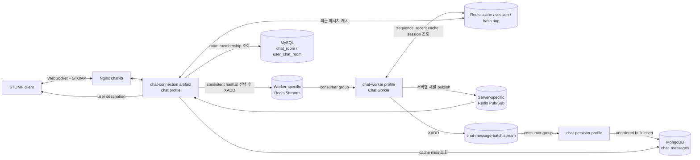
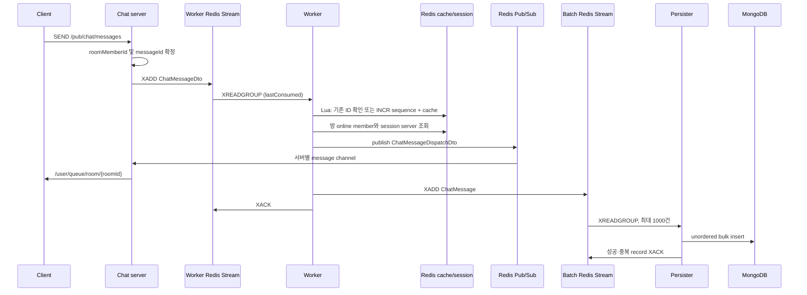

# 현재 채팅 시스템 구조

## 1. 문서 범위

이 문서는 현재 저장소의 실제 구현을 기준으로 채팅 메시지의 수신, 워커 처리, 실시간 전달, 영속화, 조회 및 세션 관리 구조를 정리한다. 개선안이나 목표 구조는 포함하지 않는다.

- Baseline Commit: `dcfd7e9c2a4db9d7989b91b6d0c7ad7ca77896ed`
- Status: Reviewed
- Structural Update: `TASK-001`의 `chat-connection`, `TASK-002`의 `chat-api`, `TASK-003`의 `chat-dispatcher` 물리 모듈 경계를 반영함 (2026-08-31)

확인 기준은 다음 세 실행 프로필이다.

| 프로필 | 역할 | 실행 형태 |
|---|---|---|
| `chat` | STOMP 연결, 메시지 수신·라우팅, REST 조회, 사용자에게 실시간 전달 | `chat-connection` executable artifact인 Web application. `chat-api` library와 root plain jar를 runtime dependency로 포함 |
| `chat-worker` | 워커별 Stream 소비, sequence 생성, 최근 메시지 캐시, 서버별 Pub/Sub 및 저장 Stream 발행 | `chat-dispatcher` executable artifact인 non-web application |
| `chat-persister` | 저장 Stream 소비, MongoDB 배치 저장, pending 재처리 | `web-application-type: none` |

`compose.yml`에는 채팅 서버 2개(`chat-1`, `chat-2`), 워커 3개(`chat-worker-1`~`3`), persister 1개(`chat-persister-1`)가 정의되어 있다. `chat-lb`는 Nginx `least_conn` 방식으로 두 채팅 서버에 WebSocket/HTTP 요청을 전달한다.

물리 build/run 경계는 다음과 같다.

- root project는 worker routing producer, shared cache/session/contract/infrastructure와 persistence를 유지하고 `webtoon-review-root-plain.jar`와 `webtoon-review-root.jar`를 생성한다.
- `chat-api` Gradle subproject는 message command/query와 현재 결합된 room API source를 가지는 library이며 `implementation project(':')`로 root plain jar에 임시 의존해 `webtoon-review-chat-api.jar`를 생성한다. 독립 executable은 만들지 않는다.
- `chat-connection` Gradle subproject는 root와 `chat-api`에 의존하고, 기존 `WebtoonReviewApplication`을 main class로 재사용해 `webtoon-review-chat-connection.jar`를 생성한다.
- `chat-dispatcher` Gradle subproject는 root에만 의존하고, 기존 `WebtoonReviewApplication`과 `chat-worker` profile을 재사용해 `webtoon-review-chat-dispatcher.jar`를 생성한다. worker Stream consume/fan-out/ACK와 lifecycle/recovery source 및 worker 전용 listener container/recovery executor를 소유한다.
- `chat-1`, `chat-2` Docker service는 `chat-connection-runtime` target과 connection artifact를 사용한다.
- `chat-worker-*` Docker service는 `chat-dispatcher-runtime` target과 dispatcher artifact를 사용하고, `chat-persister`는 `root-runtime` target과 root boot artifact를 계속 사용한다.
- root project는 child module에 의존하지 않는다. Gradle dependency는 `chat-connection -> chat-api -> root`, `chat-connection -> root`, `chat-dispatcher -> root`의 비순환 구조다. 다만 child module이 root 전체를 볼 수 있는 과도기 dependency는 남아 있다.

## 2. 전체 구성과 의존 관계



주요 의존 방향은 다음과 같다.

- `ChatController` → `ChatFacade` → `ChatService`, `ChatServerMessageIdService`, `ChatMessageRoutingService`
- `ChatMessageRoutingService` → `ChatWorkerLocalHashRing`, Redis Stream
- `ChatWorkerStreamListener` → `ChatMessageSequenceGenerator`, `ChatRecentMessageCacheService`, `ChatSessionService`, `UserChatRoomRepository`, Redis Pub/Sub, 저장용 Redis Stream
- `ChatMessageListener` → `SimpMessagingTemplate`
- `ChatRoomController` → `ChatFacade` → `ChatMessageQueryService` → 최근 메시지 Redis 캐시 또는 `ChatMessageRepository`(MongoDB)
- `ChatMessageBatchConsumer` → `ChatMessagePersistenceService` → Redis Stream, `MongoTemplate`

STOMP configuration/lifecycle, Redis-to-STOMP bridge와 chat server lifecycle composition의 production source는 `chat-connection/src/main/java/com/hymin/webtoon_review/chat/connection` 아래에 있다. `ChatController`, `ChatRoomController`, `ChatFacade`, `ChatService`, message ID/query/lock/metric production source는 `chat-api/src/main/java/com/hymin/webtoon_review/chat/server` 아래에 있다. worker listener/lifecycle/recovery production source는 기존 package를 유지한 채 `chat-dispatcher/src/main/java` 아래에 있다. `ChatMessageRoutingService`, hash ring, shared cache/session과 persistence 구현은 root source에 남아 있다.

## 3. 채팅 메시지 송신 흐름

### 3.1 STOMP 수신

클라이언트는 `/stomp-chat` WebSocket endpoint로 연결하고 `/pub/chat/messages`에 메시지를 보낸다. `StompConfig`가 application destination prefix를 `/pub`으로 설정했으므로 `ChatController.sendMessage()`의 `@MessageMapping("/chat/messages")`로 전달된다.

요청 DTO `ChatMessageRequest`는 다음 값을 가진다.

- `roomId`
- `clientMessageId`: `@NotBlank`, 최대 36자
- `messageBlocks`

`ChatController.sendMessage()`는 STOMP 세션 attribute의 `userId`, `nickname`을 읽어 `ChatFacade.sendMessage()`에 전달한다.

### 3.2 송신자와 메시지 ID 확정

`ChatFacade.sendMessage()`는 다음 순서로 처리한다.

1. 새 trace span을 만들고 `traceId`를 얻는다.
2. `ChatService.getRoomMemberId(userId, roomId)`로 MySQL의 `user_chat_room`에서 `roomMemberId`를 조회한다. 조회되지 않으면 `InvalidChatRoomAccessException`이 발생한다.
3. `ChatServerMessageIdService.getOrCreate()`로 서버 메시지 ID를 얻는다.
4. `ChatMapper.toChatMessageDto()`로 `ChatMessageDto`를 만든다.
5. `ChatMessageRoutingService.route()`에 전달한다.

서버 메시지 ID는 Redis key `chat:message:server-id:{roomId}:{userId}:{clientMessageId}`에 UUID 문자열로 저장된다. `SET NX`와 2시간 TTL을 사용한다. 같은 key가 이미 있거나 동시 요청이 먼저 등록한 경우 기존 UUID를 반환한다.

### 3.3 워커 Stream 선택과 발행

`ChatMessageRoutingService.route()`는 `ChatWorkerLocalHashRing.getTargetServerStreamKey(roomId)`로 대상 워커 Stream을 선택한다.

- 워커는 시작할 때 자신의 Stream key `chat-worker:stream:{serverName}`에 대응하는 가상 노드 100개를 만든다.
- 가상 노드 값은 `Murmur3_128(serverName + ":" + index)` hash를 score로 하여 Redis ZSET `chat-worker:hash-ring`에 저장된다.
- 채팅 서버의 `ChatWorkerLocalHashRing`은 ZSET을 로컬 `TreeMap<Long, String>`으로 복사한다.
- room ID를 Murmur3로 hash하고 ceiling entry를 선택하며, 없으면 ring의 첫 entry를 선택한다.
- 선택한 워커 Stream에 직렬화된 `ChatMessageDto`를 `XADD`한다. Spring Data의 `ObjectRecord`를 사용하므로 listener는 record의 `payload` field를 읽는다.

워커 노드의 시작·정상 종료·장애 감지는 Pub/Sub 채널 `chat:worker:events`에 이벤트를 발행한다. 각 채팅 서버의 `ChatWorkerEvenetMessageListener`는 이벤트 내용 자체를 분기하지 않고 hash ring 전체를 `refresh()`한다.

## 4. Worker 처리와 실시간 전달 흐름



### 4.1 워커 Stream 소비

`ChatWorkerServerNodeInitializer`는 application ready 시 다음 작업을 한다.

1. health ZSET `chat-worker:health`에 자신과 현재 epoch millisecond를 등록한다.
2. `StreamListenerManager.registerListener()`로 자신의 Stream을 구독한다.
3. hash ring 가상 노드 100개를 등록한다.
4. `chat:worker:events`에 `Joined: {serverName}`을 발행한다.

`StreamListenerManager`는 먼저 `RedisStreamGroupManager.createStreamAndGroup()`을 호출한다. 이 메서드는 `XGROUP CREATE {stream} chat-worker 0 MKSTREAM`을 실행하고 `BUSYGROUP` 오류만 이미 생성된 상태로 취급한다. 실제 listener는 consumer name으로 워커의 `serverName`을 사용하고 `ReadOffset.lastConsumed()`에서 읽는다. container 설정은 batch size 10, poll timeout 1초이다.

`ChatWorkerStreamListener.onMessage()`는 record의 `payload`를 `ChatMessageDto`로 역직렬화한다. `createdAt`은 DTO가 아니라 입력 Redis Stream record ID의 timestamp를 `Time.toString()`으로 변환해 만든다.

처리 순서는 다음과 같다.

1. `ChatMessageResponse` 생성
2. room별 sequence 생성과 최근 메시지 캐시 저장
3. 접속 중인 사용자의 채팅 서버로 Pub/Sub 발행
4. `chat-message-batch:stream`에 영속화용 메시지 발행
5. 입력 워커 Stream record ACK

예외가 발생하면 `onMessage()`는 실패 metric을 기록하고 예외를 다시 던진다. ACK는 위 단계가 모두 끝난 뒤 명시적으로 실행된다.

### 4.2 수신 채팅 서버 결정

워커의 `dispatchToServers()`는 다음 Redis/DB 정보를 사용한다.

- `chat:room:{roomId}:members`: 전체 방 참여자 user ID Set, 2시간 TTL. key가 없으면 `UserChatRoomRepository.findParticipantsByChatRoomId()`로 조회 후 저장한다.
- `chat:room:{roomId}:online:members`: 현재 방을 구독한 `{userId}_{clientId}` Set
- `user:{userId}:chat:session:{clientId}`: 해당 사용자/클라이언트 WebSocket이 연결된 채팅 서버 이름

online member별 session key를 `multiGet()`하여 채팅 서버 이름별로 `{userId}_{clientId}` principal 목록을 만든다. 이후 코드상 `serverNames.forEach`를 기준으로 `chat:{serverName}:message` 채널에 `ChatMessageDispatchDto`를 publish한다. DTO에는 응답 메시지, principal 문자열 목록, sender ID, trace ID가 들어간다.

전체 참여자 Set으로 `offlineMembers`도 계산하지만, 현재 메서드에서 그 결과를 후속 전송이나 저장에 사용하지는 않는다.

### 4.3 채팅 서버에서 STOMP 최종 전달

각 `chat` 서버는 시작 시 connection module의 `ChatMessageListener`로 자신의 `chat:{serverName}:message` 채널을 구독한다. listener는 `ChatMessageDispatchDto`를 역직렬화하고 각 principal에 대해 다음을 호출한다.

```text
SimpMessagingTemplate.convertAndSendToUser(
  "{userId}_{clientId}",
  "/queue/room/{roomId}",
  ChatMessageResponse
)
```

클라이언트 구독 주소는 `/user/queue/room/{roomId}`이다. simple broker의 destination은 `/sub`, `/queue`, user destination prefix는 `/user`이다.

## 5. WebSocket / STOMP 연결 및 세션 관리

### 5.1 연결 설정

connection module의 `StompConfig`는 `chat` 프로필에서만 활성화된다.

- endpoint: `/stomp-chat`
- allowed origin pattern: `*`
- inbound application prefix: `/pub`
- simple broker prefix: `/sub`, `/queue`
- user destination prefix: `/user`
- broker heartbeat: 송신/수신 각각 10초
- client inbound channel interceptor: `StompChannelInterceptor`

Nginx는 Upgrade/Connection header를 전달하며 upstream은 `least_conn`을 사용한다. WebSocket read/send timeout은 70초이다.

### 5.2 CONNECT

`StompChannelInterceptor.handleConnect()`는 STOMP native header에서 `Authorization`, `X-Client-Id`를 읽는다. `JwtService.parseJwt()`로 JWT를 파싱하고 claim의 `id`, `username`, `nickname`을 세션 attribute에 저장한다.

STOMP `Principal` 이름은 `{userId}_{clientId}`로 설정된다. 동시에 Redis에 다음 두 값을 저장한다.

- `user:{userId}:chat:session:{clientId}` = 현재 `serverName`
- `chat-server:{serverName}:connected-users` Set에 `{userId}_{clientId}` 추가

session mapping key에는 코드상 별도 TTL이 설정되지 않는다.

### 5.3 SUBSCRIBE / UNSUBSCRIBE / DISCONNECT

destination에 `/room`이 포함된 SUBSCRIBE만 방 구독으로 처리한다. destination 마지막 path segment를 `roomId`로 파싱하고, STOMP subscription ID → room ID를 WebSocket session attribute의 `subscriptionMap`에 보관한다. 이어 Redis에 다음 값을 추가한다.

- `chat:room:{roomId}:online:members` Set에 `{userId}_{clientId}`
- `user:{userId}:chat:joined-room:{clientId}` Set에 `roomId`

이 SUBSCRIBE 처리 경로에서는 `ChatService`나 repository를 호출하지 않으며, 방 참여 여부를 별도로 조회하는 코드는 확인되지 않았다. 반면 메시지 SEND와 REST 메시지 조회 경로는 `ChatService.getRoomMemberId()`로 방 참여 여부를 확인한다.

UNSUBSCRIBE 시 subscription ID로 room ID를 찾아 두 Set에서 제거한다. `SessionDisconnectEvent`에서는 세션의 모든 구독 방에서 online member를 제거한 뒤 session mapping과 서버의 connected user Set 항목을 제거한다. CONNECT가 끝나기 전에 종료되어 `userId` 또는 `clientId`가 없으면 Redis 정리를 호출하지 않는다.

채팅 서버가 정상 종료되면 connection module로 통째로 이동한 `ChatServerNodeInitializer.removeSessionData()`가 서버 connected user Set을 SCAN하고 pipeline으로 각 사용자의 joined room, online member, session mapping을 정리한 뒤 connected user Set을 삭제한다. 이 initializer는 현재 worker hash ring과 worker event 구독도 유지하는 temporary mixed boundary다.

`UserChatRoom.isConnected`를 변경하는 `ChatService.connect()`/`disconnect()`는 존재하지만, 현재 `src/main/java`에서 호출하는 코드는 확인되지 않았다. STOMP 구독 상태는 위 Redis Set들로 관리된다.

## 6. Redis Stream 사용 위치와 역할

| Stream | 생산자 | 소비자 / group | 역할 | ACK 위치 |
|---|---|---|---|---|
| `chat-worker:stream:{workerName}` | `ChatMessageRoutingService` | 해당 `ChatWorkerStreamListener` / `chat-worker` | room hash로 선택된 워커에 수신 메시지 전달 | 캐시, Pub/Sub 발행, 저장 Stream 발행이 끝난 뒤 워커가 ACK |
| `chat-message-batch:stream` | `ChatWorkerStreamListener` | `ChatMessagePersistenceService` / `chat-message-batch` | MongoDB 비동기 배치 저장 | 성공 및 Mongo duplicate record는 ACK, 기타 bulk error record는 미ACK |

두 Stream/group 모두 `RedisStreamGroupManager`가 `XGROUP CREATE ... 0 MKSTREAM`으로 만든다. 워커 Stream은 워커별로 생성되고, 저장 Stream은 persister 시작 시 `ChatMessageBatchStreamInitializer`가 생성한다.

정상 처리 코드에서 Stream trim 또는 처리 완료 record 삭제는 확인되지 않았다. 장애 워커 복구가 완료된 경우에는 해당 장애 워커의 Stream key를 삭제한다.

## 7. Redis Pub/Sub 사용 위치와 역할

| 채널 | 생산자 | 소비자 | 역할 |
|---|---|---|---|
| `chat:{chatServerName}:message` | `ChatWorkerStreamListener` | 대상 서버의 `ChatMessageListener` | 해당 서버에 연결된 principal들로 실시간 메시지 전달 |
| `chat:worker:events` | 워커 initializer, 워커 recovery | 모든 채팅 서버의 `ChatWorkerEvenetMessageListener` | 워커 합류·종료·장애 시 채팅 서버의 로컬 hash ring refresh |
| `chat:events` | `ChatServerNodeInitializer` | 현재 저장소에서 listener가 확인되지 않음 | 채팅 서버 시작/종료 이벤트 발행 |

구독 등록과 해제는 connection module의 `MessageListenerManager`가 `RedisMessageListenerContainer`에 `ChannelTopic`을 추가·제거하는 방식으로 관리한다.

## 8. 메시지 sequence 생성 및 사용

sequence 생성은 `ChatMessageSequenceGenerator.generateAndCache()`가 `ChatRecentMessageCacheService.generateSequenceAndCache()`에 위임하여 수행한다. Redis Lua script 한 번으로 다음을 처리한다.

1. room sequence key `chat:room:{roomId}:seq`를 `PERSIST`한다.
2. 최근 메시지 ZSET에서 동일 `messageId`의 기존 score를 조회한다.
3. 기존 score가 있으면 그 값을 sequence로 반환한다.
4. 없으면 sequence key를 `INCR`한다.
5. message ID를 ZSET member, sequence를 score로 저장하고, 메시지 JSON은 별도 HASH에 저장한다.
6. 오래된 항목을 제거해 최근 300건만 유지한다.
7. ZSET과 HASH에 2시간 TTL을 설정한다.

따라서 sequence는 room별 Redis counter에서 생성된다. counter key에는 이 코드 경로에서 만료 시간이 남지 않도록 `PERSIST`가 호출된다. 중복된 서버 `messageId`가 최근 메시지 ZSET에 남아 있으면 새 sequence를 증가시키지 않고 기존 score를 재사용한다.

생성된 sequence는 다음 위치에 사용된다.

- `ChatMessageResponse.messageSequence`로 실시간 응답
- 최근 메시지 ZSET의 score
- 저장 Stream을 거쳐 `ChatMessage.messageSequence`로 MongoDB 저장
- `GET /chat/room/{roomId}/messages?messageSequence={n}`의 이후 메시지 조건
- `UserChatRoom.lastReadMessageSequence` 및 방 정보 projection의 필드

MongoDB `chat_messages`에는 `(roomId, messageSequence)` unique partial compound index가 선언되어 있다. 또한 `(roomId, senderId, clientMessageId)` unique compound index가 선언되어 있고, `messageId`는 MongoDB document의 `@Id`이다.

## 9. 메시지 저장 흐름

워커는 sequence가 포함된 `ChatMessageResponse`를 `ChatMapper.toChatMessage()`로 Mongo document 형태의 `ChatMessage`로 변환하여 `chat-message-batch:stream`에 발행한다. 입력 워커 Stream ACK는 이 발행이 성공한 다음 수행되며, MongoDB 저장 완료를 기다리지는 않는다.

`chat-persister` 프로필의 저장 흐름은 다음과 같다.

1. `ChatMessageBatchConsumer`가 `SmartLifecycle.start()`에서 전용 단일-thread executor로 연속 소비 loop를 시작한다.
2. `ChatMessagePersistenceService.processMessagesBatch()`가 group `chat-message-batch`, consumer `{persister serverName}`으로 `ReadOffset.lastConsumed()`를 읽는다.
3. 한 번에 최대 1,000건, 최대 1초 block한다.
4. record payload를 `ChatMessage`로 변환한다.
5. `MongoTemplate.bulkOps(UNORDERED).insert(messages).execute()`로 저장한다.
6. 정상 insert와 duplicate key 오류 record를 ACK한다. duplicate가 아닌 bulk write error의 record는 ACK 대상에서 제외한다.

`BulkOperationException`이 아닌 runtime exception은 상위 consumer loop까지 전파된다. loop는 오류를 기록하고 1초 대기 후 다시 새 메시지 소비를 호출한다. 해당 batch는 ACK되지 않은 상태로 consumer group pending에 남는다.

## 10. 메시지 조회 및 캐시 흐름

조회 endpoint는 다음과 같다.

```text
GET /chat/room/{roomId}/messages?messageSequence={n}
```

`ChatRoomController` → `ChatFacade.getMessagesAfter()` → `ChatMessageQueryService.getMessagesAfter()` 순서로 호출된다. facade는 먼저 `ChatService.getRoomMemberId()`를 호출해 요청 사용자가 방 참여자인지 확인한다.

### 10.1 최근 메시지 캐시 구조

room별 캐시는 두 key로 분리된다.

- ZSET `chat:room:{roomId}:recent-messages`: member = `messageId`, score = sequence
- HASH `chat:room:{roomId}:recent-message-contents`: field = `messageId`, value = sequence를 `null`로 만든 `ChatMessageResponse` JSON

두 key는 저장할 때마다 TTL 2시간으로 설정되며 최대 300건을 유지한다. 조회 시 ZSET score 순서로 ID를 읽고 HASH를 `multiGet()`한 뒤 ZSET score를 응답의 sequence로 복원한다. 요청 sequence보다 큰 메시지만 결과에 포함한다.

ZSET 항목과 HASH 값의 개수가 맞지 않거나 HASH 값/score가 없으면 두 캐시 key를 삭제하고 빈 결과를 반환한다.

### 10.2 캐시 miss와 DB 조회

`ChatMessageQueryService`는 다음 순서로 동작한다.

1. 최근 메시지 캐시에서 `messageSequence` 이후 메시지를 조회한다.
2. 비어 있지 않으면 그대로 반환한다.
3. 분산 lock이 비활성화되어 있으면 MongoDB를 바로 조회한다.
4. 활성화되어 있으면 room별 key `chat:room:{roomId}:message-cache:lock`에 UUID token을 `SET NX`, TTL 5초로 등록한다.
5. lock을 얻으면 캐시를 다시 확인하고, 여전히 비어 있으면 DB를 조회한다.
6. lock을 얻지 못하면 최대 5초 동안 10ms 간격으로 캐시를 재확인한다. 시간 내 결과가 없으면 DB를 직접 조회한다.
7. lock 해제는 Lua script로 token 일치 시에만 key를 삭제한다.

DB 조회는 `ChatMessageRepository.findByRoomIdAndMessageSequenceGreaterThanOrderByMessageSequenceAsc()`를 사용한다. 조회된 전체 결과를 응답으로 반환하고, 그중 마지막 최대 300건을 Redis에 다시 캐시한다. DB에서 캐시할 때도 ZSET/HASH 갱신 Lua script를 사용한다.

분산 lock의 기본 설정값은 `true`이고 compose 환경 변수 `CHAT_MESSAGE_QUERY_DISTRIBUTED_LOCK_ENABLED`로 변경할 수 있다.

## 11. Worker / Consumer 구조

### 11.1 채팅 워커

- 노드 등록: `ChatWorkerServerNodeInitializer`
- 입력 소비: Spring Data `StreamMessageListenerContainer`
- consumer: 워커 인스턴스 이름
- consumer group: 공통 group `chat-worker`
- 각 워커가 자기 이름의 독립 Stream 하나를 구독
- heartbeat: `ChatWorkerHeartbeatScheduler`, 10초 fixed rate로 health ZSET score 갱신
- 장애 검사: `ChatWorkerRecoveryMonitor`, 5초 fixed delay로 비동기 recovery 실행
- recovery executor: core 2, max 5, queue 50

### 11.2 저장 consumer

- Stream/group 초기화: `ChatMessageBatchStreamInitializer`
- 연속 새 메시지 소비: `ChatMessageBatchConsumer`, 단일-thread executor
- pending 검사: `ChatMessageBatchScheduler`, 30초 fixed delay
- pending 처리 메서드: `@Async("messagesBatchExecutor")`
- 새 메시지 batch 최대 크기: 1,000
- pending 한 번 조회 크기: 100

## 12. 재처리 및 장애 처리 방식

### 12.1 워커 장애 복구

`ChatWorkerRecoverService.runRecovery()`는 health ZSET에서 자기 다음 순서의 최대 3개 워커를 검사한다. 마지막 heartbeat가 현재보다 20초 넘게 오래되면 다음 절차를 수행한다.

1. `chat-worker:recover:lock:{targetServerName}`에 현재 서버 이름을 값으로 30초 Redis lock 획득
2. 장애 워커를 health ZSET에서 제거
3. 장애 워커의 가상 노드 100개를 hash ring ZSET에서 제거
4. `chat:worker:events`에 `Down: {targetServerName}` 발행
5. 장애 워커 Stream의 pending record를 조회하고 현재 복구 워커 consumer로 `XCLAIM`한 뒤 `ChatWorkerStreamListener.onMessage()`로 다시 처리
6. 같은 Stream의 아직 소비되지 않은 record를 `XREADGROUP`으로 반복 조회하여 같은 listener로 처리
7. 모두 처리한 뒤 장애 워커 Stream key 삭제
8. 값 일치 확인 Lua script로 recovery lock 해제

복구 listener도 정상 경로와 동일하게 sequence/cache, Pub/Sub, 저장 Stream 발행 후 ACK한다. `messageId`가 최근 ZSET에 존재하면 sequence 생성 Lua script가 기존 sequence를 반환한다.

### 12.2 저장 pending 재처리

`ChatMessagePersistenceService.processPendingMessagesBatch()`는 30초 스케줄러에서 실행되며 pending 최대 100건을 검사한다.

- delivery count가 5 이상이면 dead-letter 대상 ID 목록에 넣는다.
- 마지막 delivery 이후 20초를 초과하면 재처리 대상 ID 목록에 넣는다.
- dead-letter 대상은 recovery consumer로 claim한 뒤 즉시 ACK한다.
- 재처리 대상은 recovery consumer로 claim하고 MongoDB batch insert를 다시 수행한다.
- 재처리에서도 정상 및 duplicate는 ACK하고, duplicate 이외 bulk error는 pending으로 남긴다.

두 조건은 `if` 문 두 개로 독립 평가되므로 하나의 pending record가 두 ID 목록에 모두 포함될 수 있다.

코드에는 `moveToDeadLetterQueue(records)` 호출이 주석으로만 남아 있고 실제 dead-letter 저장 또는 별도 Stream 발행 구현은 확인되지 않았다.

## 13. 확인되지 않았거나 불명확한 부분

- `chat:events` 채널은 채팅 서버가 시작/종료 시 발행하지만, 현재 저장소에서 이를 구독하는 listener는 확인되지 않았다.
- `active-chat-servers:{serverName}` key는 채팅 서버 시작 시 30초 TTL로 등록되고 종료 시 삭제되지만, TTL을 갱신하거나 이 key를 읽는 코드가 현재 저장소에서 확인되지 않았다.
- `UserChatRoom.lastReadMessageSequence`를 갱신하는 메서드나 호출 경로가 현재 `src/main/java`에서 확인되지 않았다.
- `ChatService.connect()`와 `disconnect()` 및 이에 따른 `UserChatRoom.isConnected` 갱신 호출이 현재 `src/main/java`에서 확인되지 않았다.
- persister의 dead-letter 이동은 주석만 있고 실제 보관 위치나 후속 처리 경로가 확인되지 않았다.
- 정상 처리된 Redis Stream entry를 trim/delete하는 정책은 현재 코드에서 확인되지 않았다.
- 저장소 내부 설정에는 MongoDB database 이름이 명시되어 있지 않다. 실제 database 선택값은 외부 환경 또는 Spring 기본 동작까지 확인해야 확정할 수 있다.
- 현재 hash ring topology가 유지되는 동안 같은 room의 메시지는 consistent hash로 같은 워커 Stream에 라우팅된다. 다만 worker join/down 등으로 topology가 변경되면 해당 room의 대상 Stream이 변경될 수 있으며, 이 전환 구간을 포함한 end-to-end ordering 보장 범위는 현재 저장소의 설정·문서·테스트에서 명확히 확인되지 않았다.

## 14. 추가 확인이 필요한 부분

- 운영 환경에서 사용하는 실제 profile 조합, 인스턴스 수 및 compose 외 배포 설정
- Redis의 persistence, maxmemory, eviction 및 Stream retention 운영 설정
- MongoDB의 실제 database 이름과 운영 index 생성·검증 상태
- `chat:events` 및 `active-chat-servers:*`를 저장소 외부 컴포넌트가 사용하는지 여부
- 주석 처리된 dead-letter 처리의 외부 운영 절차 존재 여부
- Android 클라이언트의 실제 STOMP 구현 경로. 현재 AOS 소스 검색에서는 채팅 STOMP 연결 코드를 확인하지 못했고, 별도 `chat-test-client`에서만 현재 endpoint/header/destination 사용 예를 확인했다.

## Appendix A. 주요 컴포넌트와 메서드

다음 5개 production class는 `chat-connection` module의 `com.hymin.webtoon_review.chat.connection` 하위 package에 위치한다.

- `config.StompConfig`
- `interceptor.StompChannelInterceptor`
- `listener.ChatMessageListener`
- `manager.MessageListenerManager`
- `initializer.ChatServerNodeInitializer` (temporary mixed boundary)

표의 message command/query 컴포넌트는 `chat-api` module에, worker consume/lifecycle/recovery 컴포넌트는 `chat-dispatcher` module에 위치한다. worker routing producer, shared cache/session과 persistence 컴포넌트는 root project에 남아 있다. `ChatRoomController`, `ChatFacade`, `ChatService`와 dispatcher의 legacy worker transport 책임은 현재 결합을 보존하기 위한 temporary mixed boundary다.

| 영역 | 클래스 | 주요 메서드와 역할 |
|---|---|---|
| STOMP 설정 | `StompConfig` | `registerStompEndpoints()`, `configureMessageBroker()`, `configureClientInboundChannel()` |
| STOMP 세션 | `StompChannelInterceptor` | `preSend()`, `handleConnect()`, `handleSubscribe()`, `handleUnsubscribe()`, `handleDisconnect()` |
| 세션 Redis | `ChatSessionService` | session mapping, online member, joined room, 서버 종료 cleanup |
| 메시지 진입 | `ChatController` | `sendMessage()` |
| 송신 orchestration | `ChatFacade` | `sendMessage()`, `getMessagesAfter()` |
| 방 참여 확인 | `ChatService` | `getRoomMemberId()` |
| 서버 메시지 ID | `ChatServerMessageIdService` | `getOrCreate()` |
| 워커 라우팅 | `ChatMessageRoutingService` | `route()` |
| hash ring | `ChatWorkerLocalHashRing` | `refresh()`, `getTargetServerStreamKey()` |
| 워커 초기화 | `ChatWorkerServerNodeInitializer` | Stream 구독, health/hash ring 등록, 이벤트 발행 |
| Stream listener 등록 | `StreamListenerManager` | `registerListener()`, `removeListener()` |
| Stream/group 생성 | `RedisStreamGroupManager` | `createStreamAndGroup()` |
| 워커 처리 | `ChatWorkerStreamListener` | `onMessage()`, sequence/cache, 서버 dispatch, 저장 Stream 발행, ACK |
| sequence/최근 캐시 | `ChatMessageSequenceGenerator`, `ChatRecentMessageCacheService` | `generateAndCache()`, `generateSequenceAndCache()`, `cacheAll()`, `getMessagesAfter()` |
| 서버 실시간 전달 | `ChatMessageListener` | `onMessage()`, `convertAndSendToUser()` |
| 조회 | `ChatMessageQueryService` | `getMessagesAfter()`, `loadFromDatabase()` |
| 캐시 fill lock | `ChatMessageCacheLockService` | `tryLock()`, `unlock()` |
| 저장 연속 소비 | `ChatMessageBatchConsumer` | `start()`, `consumeContinuously()` |
| Mongo 저장/재처리 | `ChatMessagePersistenceService` | `processMessagesBatch()`, `processPendingMessagesBatch()`, `saveBatch()` |
| 워커 복구 | `ChatWorkerRecoverService` | `runRecovery()`, `tryRecover()`, pending/미소비 record 처리 |

## Appendix B. 확인한 주요 코드 및 파일 경로

### 설정과 배포

- `compose.yml`
- `nginx/chat.conf`
- `src/main/resources/application.yml`
- `src/main/resources/application-chat.yml`
- `chat-dispatcher/src/main/resources/application-chat-worker.yml`
- `src/main/resources/application-chat-persister.yml`
- `src/main/java/com/hymin/webtoon_review/WebtoonReviewApplication.java`
- `chat-connection/src/main/java/com/hymin/webtoon_review/chat/connection/config/StompConfig.java`
- `src/main/java/com/hymin/webtoon_review/global/config/RedisConfig.java`
- `src/main/java/com/hymin/webtoon_review/global/config/AsyncConfig.java`
- `chat-dispatcher/src/main/java/com/hymin/webtoon_review/chat/dispatcher/config/ChatDispatcherRedisConfig.java`
- `chat-dispatcher/src/main/java/com/hymin/webtoon_review/chat/dispatcher/config/ChatDispatcherAsyncConfig.java`

### 채팅 서버와 세션

- `chat-connection/src/main/java/com/hymin/webtoon_review/chat/connection/interceptor/StompChannelInterceptor.java`
- `src/main/java/com/hymin/webtoon_review/chat/common/service/ChatSessionService.java`
- `chat-api/src/main/java/com/hymin/webtoon_review/chat/server/controller/ChatController.java`
- `chat-api/src/main/java/com/hymin/webtoon_review/chat/server/controller/ChatRoomController.java`
- `chat-api/src/main/java/com/hymin/webtoon_review/chat/server/facade/ChatFacade.java`
- `chat-api/src/main/java/com/hymin/webtoon_review/chat/server/service/ChatService.java`
- `chat-api/src/main/java/com/hymin/webtoon_review/chat/server/service/ChatServerMessageIdService.java`
- `src/main/java/com/hymin/webtoon_review/chat/server/service/ChatMessageRoutingService.java`
- `src/main/java/com/hymin/webtoon_review/chat/server/route/ChatWorkerLocalHashRing.java`
- `chat-connection/src/main/java/com/hymin/webtoon_review/chat/connection/initializer/ChatServerNodeInitializer.java`
- `chat-connection/src/main/java/com/hymin/webtoon_review/chat/connection/listener/ChatMessageListener.java`
- `chat-connection/src/main/java/com/hymin/webtoon_review/chat/connection/manager/MessageListenerManager.java`
- `src/main/java/com/hymin/webtoon_review/chat/server/listener/ChatWorkerEvenetMessageListener.java`

### 워커, 캐시와 복구

- `chat-dispatcher/src/main/java/com/hymin/webtoon_review/chat/worker/initializer/ChatWorkerServerNodeInitializer.java`
- `chat-dispatcher/src/main/java/com/hymin/webtoon_review/chat/worker/listener/ChatWorkerStreamListener.java`
- `chat-dispatcher/src/main/java/com/hymin/webtoon_review/chat/worker/service/ChatMessageSequenceGenerator.java`
- `chat-dispatcher/src/main/java/com/hymin/webtoon_review/chat/worker/service/ChatWorkerRecoverService.java`
- `chat-dispatcher/src/main/java/com/hymin/webtoon_review/chat/worker/scheduler/ChatWorkerHeartbeatScheduler.java`
- `chat-dispatcher/src/main/java/com/hymin/webtoon_review/chat/worker/scheduler/ChatWorkerRecoveryMonitor.java`
- `chat-dispatcher/src/main/java/com/hymin/webtoon_review/global/manager/StreamListenerManager.java`
- `src/main/java/com/hymin/webtoon_review/chat/common/service/ChatRecentMessageCacheService.java`
- `chat-api/src/main/java/com/hymin/webtoon_review/chat/server/service/ChatMessageQueryService.java`
- `chat-api/src/main/java/com/hymin/webtoon_review/chat/server/service/ChatMessageCacheLockService.java`
- `chat-api/src/main/java/com/hymin/webtoon_review/chat/server/metrics/ChatMessageQueryMetrics.java`

### 저장과 데이터 모델

- `src/main/java/com/hymin/webtoon_review/chat/persister/consumer/ChatMessageBatchConsumer.java`
- `src/main/java/com/hymin/webtoon_review/chat/persister/service/ChatMessagePersistenceService.java`
- `src/main/java/com/hymin/webtoon_review/chat/persister/initializer/ChatMessageBatchStreamInitializer.java`
- `src/main/java/com/hymin/webtoon_review/chat/persister/scheduler/ChatMessageBatchScheduler.java`
- `src/main/java/com/hymin/webtoon_review/chat/common/entity/ChatMessage.java`
- `src/main/java/com/hymin/webtoon_review/chat/common/entity/ChatRoom.java`
- `src/main/java/com/hymin/webtoon_review/chat/common/entity/UserChatRoom.java`
- `src/main/java/com/hymin/webtoon_review/chat/common/repository/ChatMessageRepository.java`
- `src/main/java/com/hymin/webtoon_review/chat/common/repository/ChatRoomRepository.java`
- `src/main/java/com/hymin/webtoon_review/chat/common/repository/UserChatRoomRepository.java`
- `src/main/java/com/hymin/webtoon_review/chat/common/mapper/ChatMapper.java`
- `src/main/java/com/hymin/webtoon_review/global/constant/RedisKeys.java`
- `src/main/java/com/hymin/webtoon_review/global/constant/RedisStreamKeys.java`
- `src/main/java/com/hymin/webtoon_review/global/constant/RedisTopicNames.java`
- `src/main/java/com/hymin/webtoon_review/global/constant/RedisGroupNames.java`

### 동작 확인에 참고한 테스트

- `src/test/java/com/hymin/webtoon_review/chat/common/service/ChatRecentMessageCacheServiceTest.java`
- `chat-api/src/test/java/com/hymin/webtoon_review/chat/server/service/ChatMessageQueryServiceTest.java`
- `chat-api/src/test/java/com/hymin/webtoon_review/chat/server/service/ChatServerMessageIdServiceTest.java`
- `src/test/java/com/hymin/webtoon_review/chat/server/service/ChatMessageRoutingServiceTest.java`
- `src/test/java/com/hymin/webtoon_review/chat/persister/service/ChatMessagePersistenceServiceTest.java`
- `chat-connection/src/test/java/com/hymin/webtoon_review/chat/connection/interceptor/StompChannelInterceptorTest.java`
- `../chat-test-client/src/main/java/com/hymin/chattest/client/ChatTestClient.java`
