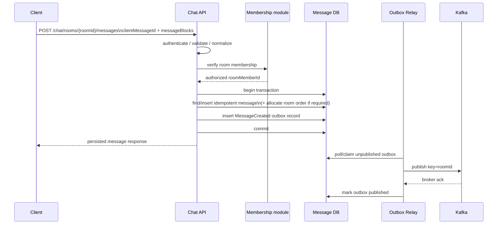
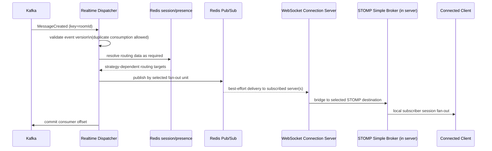
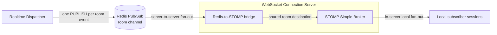
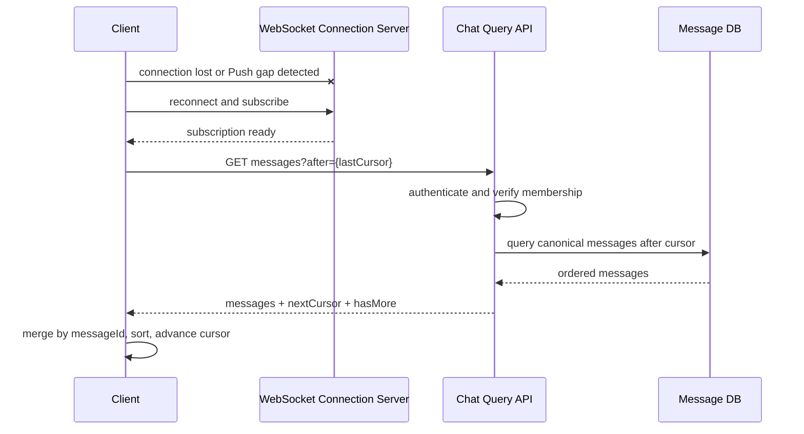

# 목표 채팅 시스템 아키텍처 초안

## 문서 상태와 읽는 방법

- Status: Draft / Proposed
- Current architecture reference: `docs/architecture/current-chat.md` (Baseline Commit `dcfd7e9c2a4db9d7989b91b6d0c7ad7ca77896ed`)
- 이 문서는 **현재 구현 설명이 아니라 목표 구조 제안**이다.
- `권고`는 현재 문제와 전환 가능성을 고려한 기본 방향이고, `후보`는 검증 후 선택할 수 있는 대안이며, `미결정`은 별도 의사결정이 필요한 항목이다.
- 이 문서에 등장하는 HTTP 송신 API, Transactional Outbox, Kafka, DB 기반 sequence 생성기는 현재 구현되어 있다고 가정하지 않는다.

현재 구현은 `current-chat.md`, 목표 구조는 이 문서를 기준으로 구분한다. 두 문서가 충돌하면 현재 동작에 관한 사실은 `current-chat.md`와 실제 코드로 확인해야 한다.

## 1. 목표와 범위

### 1.1 목표

현재 채팅 기능을 전면 교체하는 대신 다음 속성을 점진적으로 개선한다.

- 메시지 수락, 영속화, 이벤트 발행, 실시간 Push의 책임을 분리한다.
- 메시지의 Source of Truth를 DB로 명확히 하고 Redis 장애나 실시간 전달 실패가 데이터 유실로 이어지지 않게 한다.
- 클라이언트가 송신 성공의 의미를 명확히 알 수 있게 한다.
- 중복 처리, 순서 역전, 부분 실패, 재시도와 재연결을 명시적인 계약으로 다룬다.
- 독립 배포가 필요한 시점 전까지 책임 기반 모듈화를 우선하고, 향후 분리 가능한 경계를 만든다.

### 1.2 범위

이 문서는 다음을 다룬다.

- 메시지 송신 API와 영속화
- 메시지 이벤트 발행과 비동기 전달
- WebSocket 연결 및 실시간 Push
- 누락 메시지 조회와 재연결 복구
- ordering, idempotency, retry, failure recovery
- 현재 구조에서 목표 구조로의 단계적 전환 경계

다음은 직접 설계 범위에서 제외하되 연동 계약은 고려한다.

- 메시지 내용 검열, 첨부 파일 저장, 검색
- 알림, 읽음 처리, 안 읽은 메시지 수의 상세 구현
- 운영 인프라의 구체적인 용량 산정과 Kafka 토픽 수
- 즉시 MSA로 분리하거나 현재 프로필을 곧바로 폐기하는 작업

## 2. 현재 구조에서 해결하려는 문제

현재 구현의 상세 사실은 `current-chat.md`를 따른다. 목표 구조가 해결하려는 핵심 문제는 다음과 같다.

| 현재 특성 | 발생 가능한 문제 | 목표 방향 |
|---|---|---|
| STOMP SEND가 메시지 진입점 | 연결 관리와 command 처리가 같은 프로토콜/서버에 결합되고, 송신 성공의 의미를 HTTP 상태처럼 명확히 표현하기 어렵다 | HTTP command API와 WebSocket Push 분리 |
| worker가 실시간 발행과 저장 Stream 발행 후 입력을 ACK | MongoDB 저장 전에 사용자에게 보일 수 있고, 저장 완료 여부와 실시간 전달 결과가 분리된다 | persistence-first와 DB 기반 복구 |
| Redis Stream이 수신·저장 파이프라인의 핵심 내구 경로 | Redis 운영 정책과 장애가 메시지 내구성 및 복구 복잡도에 직접 영향을 준다 | DB를 SoT로 하고 durable event relay를 별도 책임으로 분리 |
| DB commit과 이벤트 발행이 하나의 원자적 작업이 아님 | DB에는 있지만 이벤트가 없거나, 이벤트는 전달됐지만 DB 저장이 실패할 수 있다 | Transactional Outbox |
| room sequence가 Redis에서 먼저 생성됨 | DB가 SoT여도 canonical ordering 값의 생성 책임은 Redis에 남는다 | sequence 필요성 재검토 후, 필요하면 DB 트랜잭션에서 생성 |
| Redis Pub/Sub이 최종 실시간 경로 | 구독 서버 장애나 순간 단절 시 재전송이 없다 | best-effort Push로 역할 제한하고 DB 조회로 복구 |
| worker hash ring과 장애 Stream 회수 로직 | topology 변경 시 ordering 경계와 복구 로직이 복잡하다 | roomId keyed durable event partitioning 검토 |

## 3. 설계 원칙

1. **Persist before publish**: 실시간 이벤트는 DB commit이 완료된 메시지만 대상으로 한다.
2. **DB is the Source of Truth**: 메시지 본문, 식별자, canonical order와 생성 시각의 최종 근거는 DB이다. Redis와 Kafka는 조회 원본이 아니다.
3. **명시적인 성공 계약**: HTTP 송신 성공은 message와 outbox의 원자적 DB commit 완료를 뜻한다. Kafka 발행 완료나 WebSocket 수신 완료를 뜻하지 않는다.
4. **At-least-once + idempotency**: 분산 exactly-once를 목표로 하지 않고, 중복 가능한 전달과 멱등 처리를 기본 계약으로 둔다.
5. **실시간은 최적화, 조회는 복구 경로**: Push 실패가 메시지 유실을 의미하지 않으며 클라이언트는 DB 기반 조회로 수렴한다.
6. **Ordering 범위를 좁혀 정의**: 전역 순서는 보장하지 않는다. 필요성이 확인된 경우에만 room 단위 canonical order를 제공한다.
7. **Redis 역할 제한**: 세션/접속 상태와 선택적 최근 조회 캐시에 사용하고, Redis Pub/Sub은 선택된 channel의 subscriber에게 메시지를 전달하는 best-effort transport로 제한한다. 서버 간 fan-out 대상을 결정하는 위치는 전략에 따라 Dispatcher 또는 Redis subscription 구조이며, 서버 내부 local session fan-out은 STOMP Simple Broker의 책임이다.
8. **책임 기반 모듈화 우선**: 하나의 코드베이스와 배포 단위에서도 포트와 이벤트 계약으로 경계를 만들고, 독립 확장·장애 격리가 필요할 때 분리한다.
9. **관측 가능성과 운영 복구를 설계에 포함**: lag, pending outbox, 중복, 재시도, DLQ, Push 실패와 복구 조회를 측정한다.

## 4. 목표 전체 아키텍처

### 4.1 권고 목표안

아래는 논리 컴포넌트 구조다. 초기에는 `Chat API`, `Outbox Relay`, `Realtime Dispatcher`, `WebSocket Connection Server`를 같은 저장소의 모듈/프로필로 유지할 수 있다.

```mermaid
flowchart LR
    Client[Client]
    API[Chat API module\nHTTP command/query]
    subgraph WCS[WebSocket Connection Server]
        WS[connection/subscription\nRedis-to-STOMP bridge]
        Broker[STOMP Simple Broker\nlocal session fan-out]
        WS -->|STOMP destination| Broker
    end
    DB[(Message DB\nmessages + outbox)]
    Cache[(Redis\nsession/presence/cache)]
    Relay[Outbox Relay]
    Kafka[(Kafka\nmessage-events)]
    Dispatch[Realtime Dispatcher]
    PubSub[(Redis Pub/Sub\nbest-effort fan-out\nstrategy TBD)]

    Client -->|POST message / GET messages| API
    API -->|atomic transaction| DB
    API -.->|optional cache read/fill| Cache
    DB -->|unpublished outbox rows| Relay
    Relay -->|key = roomId| Kafka
    Kafka -->|at-least-once consume| Dispatch
    Dispatch -->|strategy-dependent routing lookup| Cache
    Dispatch -->|selected fan-out unit| PubSub
    PubSub -->|subscribed Connection Server(s)| WS
    Broker -->|local session fan-out| Client
    Client <-->|connect/subscribe| WS
    Client -->|reconnect/gap recovery| API
```

### 4.2 Kafka 도입에 대한 판단

**권고**: 최종 목표에서는 outbox 이후의 durable event backbone으로 Kafka를 사용한다. `roomId`를 record key로 사용하면 같은 room 이벤트가 같은 partition으로 들어가고, 한 consumer group 안에서 partition 순서를 유지하기 쉽다. 소비자 추가, 장기 lag 흡수, replay, 처리량 확장에도 유리하다.

그러나 Kafka는 다음 비용을 추가한다.

- broker 운영, partition/retention/capacity 관리와 모니터링이 필요하다.
- Kafka partitioning은 **producer가 넣은 순서**만 보장한다. DB canonical order나 outbox relay의 발행 순서까지 자동으로 보장하지 않는다.
- Redis Pub/Sub까지 포함하면 이벤트 홉과 장애 지점이 늘어난다.
- 현재 처리량과 추가 소비자 요구가 작다면 과도한 복잡도일 수 있다.

따라서 Kafka는 첫 전환 단계의 필수 조건이 아니다. 먼저 `DurableMessageEventPublisher` 포트를 두고 기존 Redis Stream 또는 단순 outbox poller로 persistence-first와 outbox 경계를 검증할 수 있다. 다음 중 하나가 확인될 때 Kafka 전환의 효용이 커진다.

- 메시지 처리량이나 consumer lag을 독립적으로 흡수해야 한다.
- 실시간 전달 외에 알림, 분석, 검색 색인 등 독립 소비자가 늘어난다.
- room 단위 병렬 처리와 replay/retention이 운영 요구가 된다.
- Redis Stream의 복구·retention·확장 운영 부담이 한계에 도달한다.

## 5. 메시지 송신 및 영속화 흐름

### 5.1 HTTP command 계약 제안

예시 endpoint는 `POST /chat/rooms/{roomId}/messages`다. 실제 URI와 응답 코드는 API 규칙에 맞춰 별도 확정한다.

요청에는 최소한 `clientMessageId`, `messageBlocks`를 포함한다. `userId`는 인증 정보에서 얻고 request body를 신뢰하지 않는다.

- 성공 응답: 영속화된 `messageId`, canonical ordering 값(채택 시), `createdAt` 반환
- 같은 사용자·room·`clientMessageId` 재요청: 기존 메시지를 반환하는 멱등 성공
- 같은 idempotency key에 다른 payload 재요청: `409 Conflict` 후보
- 방 참여 권한 없음: `403 Forbidden` 후보
- 성공의 의미: DB의 message와 outbox가 함께 commit됨
- 성공이 의미하지 않는 것: Kafka 발행 완료, 상대방 WebSocket 수신 완료

### 5.2 권고 흐름



message와 outbox는 **같은 DB의 같은 원자적 트랜잭션**에 기록해야 한다. 현재 메시지 저장소인 MongoDB를 유지한다면 replica set 기반 multi-document transaction이 가능한지 운영 환경에서 검증해야 한다. `messages`와 `outbox` collection을 같은 transaction으로 묶는 방식이 후보이다. 이를 보장할 수 없다면 다음 대안을 ADR로 결정해야 한다.

- 메시지와 outbox를 원자적으로 저장할 수 있는 DB 구성으로 변경
- message document 안에 발행 상태를 포함하고 원자적 insert 한 건으로 처리하는 embedded outbox 패턴
- CDC(change data capture)로 committed message에서 이벤트 생성

DB commit 후 애플리케이션이 직접 Kafka에 발행하는 dual write는 권고하지 않는다.

## 6. 실시간 전달 흐름

이 문서에서는 연결 계층 컴포넌트를 **WebSocket Connection Server**라고 부른다. 이 서버는 command 처리나 메시지 영속화를 담당하지 않는다. WebSocket 연결 유지, STOMP CONNECT/SUBSCRIBE/UNSUBSCRIBE 처리, 인증과 room 구독 권한 검증, local session/subscription 상태 관리, 선택한 fan-out 전략에 필요한 Redis channel subscribe/unsubscribe 관리, Redis 메시지를 STOMP destination으로 전달하는 bridge에 집중한다. 서버 내부에서 destination을 구독한 local session들로 fan-out하는 책임은 STOMP Simple Broker에 있다.



### 6.1 전달 보장

- Kafka 구간: at-least-once를 전제로 한다.
- Dispatcher: 동일 `eventId` 또는 `messageId`의 중복 이벤트 소비와 그에 따른 중복 Redis Pub/Sub publish 및 중복 Push를 허용한다. Redis Pub/Sub publish 자체를 멱등 연산으로 간주하지 않는다.
- Redis Pub/Sub 및 WebSocket 구간: best-effort다. 최종 수신 보장을 제공하지 않는다.
- 클라이언트: 중복 Push를 수신할 수 있다는 계약에 따라 `messageId`로 중복을 제거하고, canonical ordering 값이 있으면 정렬 및 gap을 탐지한다.
- Push 실패 때문에 DB 메시지나 Kafka offset 처리를 무한히 막지 않는다. 필요한 재전송은 조회 기반 복구로 해결한다.

Kafka consumer offset을 언제 commit할지는 명시해야 한다. **권고**는 대상 Redis Pub/Sub publish 호출이 성공한 후 offset을 commit하되, publish와 offset commit 사이의 중복 가능성을 허용하는 것이다. Redis Pub/Sub subscriber의 실제 수신까지 확인할 수는 없으므로 end-to-end 전달 완료로 해석하지 않는다.

### 6.2 Redis Pub/Sub Fan-out 전략

Redis Pub/Sub의 fan-out 단위는 아직 결정하지 않는다. 비교에서 `U`는 메시지를 받을 online 사용자 수, `G`는 전체 WebSocket Connection Server 수, `Gᵣ`은 해당 room의 사용자가 연결된 Connection Server 수를 뜻한다. PUBLISH 호출 횟수와 Redis가 subscriber로 복제하는 횟수는 서로 다른 비용이다.

| 관점 | 사용자 단위 | WebSocket Connection Server 단위 | 채팅방 단위 |
|---|---|---|---|
| 메시지 1건당 Redis PUBLISH 횟수 | 대체로 `U`회 | 대상 Connection Server 수인 `Gᵣ`회 | 1회 |
| Redis subscriber fan-out 비용 | 사용자별 채널을 구독한 Connection Server들로 복제한다. 한 사용자가 여러 서버에 연결되면 한 publish가 여러 곳으로 전달될 수 있다 | 서버별 채널은 일반적으로 해당 Connection Server 하나가 구독하므로 publish당 fan-out은 작다 | room 채널을 구독한 `Gᵣ`개 Connection Server로 Redis가 내부 복제한다. PUBLISH 1회가 network 전송 1회를 뜻하지 않는다 |
| SUBSCRIBE / UNSUBSCRIBE 관리 비용 | 사용자 연결/해제에 따라 높은 cardinality의 Redis channel 구독을 관리한다 | Connection Server 시작/종료 시 서버 채널을 관리하므로 가장 안정적이고 낮다 | Connection Server에서 room의 첫 STOMP local subscription이 생기거나 마지막 subscription이 사라질 때 Redis room channel 구독을 변경하는 방식이 후보이며, active room 수와 churn의 영향을 받는다 |
| Dispatcher recipient/server routing 비용 | online recipient를 열거하고 사용자별 publish해야 한다. server grouping은 불필요할 수 있지만 recipient 계산은 남는다 | online recipient의 session 위치를 조회하고 Connection Server별로 grouping해야 하므로 가장 크다 | room 채널에 한 번 publish하므로 recipient/server 열거를 줄일 수 있다. membership과 구독 권한 책임은 별도로 유지한다 |
| 서버 내부 전달 / Simple Broker local fan-out 비용 | Connection Server가 사용자 STOMP destination으로 bridge하면 Simple Broker가 해당 서버의 local subscriber session들로 전달한다 | Dispatcher가 계산·grouping한 대상 정보를 Connection Server가 STOMP destination으로 bridge하고, Simple Broker가 local subscriber session들로 전달한다 | Connection Server가 받은 room 메시지를 shared room STOMP destination으로 한 번 bridge하고, Simple Broker가 해당 서버에서 그 destination을 구독한 local session들로 fan-out한다 |
| online 사용자 수 증가 시 영향 | PUBLISH 수와 recipient 계산이 대체로 선형 증가한다 | session lookup/grouping과 Simple Broker local fan-out이 증가하지만 PUBLISH 수 상한은 `Gᵣ`이다 | PUBLISH 수는 1회지만 `Gᵣ`, Redis 내부 복제량과 각 서버의 Simple Broker local fan-out이 증가한다 |
| room 수 증가 시 영향 | Redis 구독 수는 room 수보다 online 사용자 수의 영향을 더 받는다 | Redis 서버 채널 수는 Connection Server 수에 가깝게 유지된다 | Connection Server-room 구독 조합이 증가해 Redis subscription cardinality와 관리 상태가 커진다 |
| hot room 특성 | 많은 사용자에 대한 PUBLISH가 집중되어 불리하다 | `Gᵣ`회 publish와 대규모 recipient/session lookup이 Dispatcher에 집중된다 | PUBLISH는 1회지만 Redis가 `Gᵣ`개 Connection Server로 payload를 복제하고 각 서버의 Simple Broker가 큰 local fan-out을 수행하므로 Redis/서버 부하가 집중될 수 있다 |
| 사용자 접속/퇴장 또는 room 구독 churn | 사용자 채널의 subscribe/unsubscribe가 빈번하다 | Redis 채널 구독은 안정적이지만 presence/session mapping 갱신과 Dispatcher 조회 부하가 증가한다 | Connection Server별 room reference count와 Redis room-channel subscribe/unsubscribe가 빈번해질 수 있다 |
| 다중 Connection Server·다중 client 복잡도 | 한 사용자의 여러 Connection Server 구독과 client 중복 전달을 다뤄야 한다 | user-client-to-server mapping, grouping, stale mapping 처리가 복잡하다 | Connection Server별 room reference count, STOMP local subscription, 동일 사용자의 다중 client 중복 수신을 구분해 다뤄야 한다 |
| Redis CPU / network 구조 | PUBLISH ops가 많고 각 사용자 채널 subscriber 수만큼 복제한다 | PUBLISH ops와 payload network가 `Gᵣ`에 비례하며, recipient 조회 비용은 Redis command/Dispatcher CPU로 이동한다 | PUBLISH ops는 적지만 Redis 내부 subscriber fan-out과 payload network가 `Gᵣ`에 비례한다 |
| 장애 및 stale subscription 관리 | 높은 사용자 채널 cardinality와 비정상 연결 종료 후 정리가 어렵다 | 서버 채널은 단순하지만 stale session-to-server mapping이 잘못된 routing을 만들 수 있다 | stale Redis room subscription과 stale STOMP local subscription의 원인·영향·복구를 분리해야 하며, 서버 재시작 후 room reference count와 Redis 재구독 상태도 복구·검증해야 한다 |

사용자 단위는 개인 알림이나 소수 대상의 선택적 전달에는 세밀하지만, 일반적인 room broadcast에서는 online 사용자 수만큼 PUBLISH와 구독 상태가 늘어 실질적인 우선 후보로 보기 어렵다. 일반적인 room broadcast의 주 후보는 다음 두 방식이다.

- **서버 단위**: Connection Server 수와 Redis channel 구독은 안정적이지만 Dispatcher가 recipient/session 위치 조회와 서버별 grouping 비용을 부담한다. room 수와 구독 churn이 크고 Connection Server 수가 상대적으로 작을 때 유리할 수 있다.
- **채팅방 단위**: Dispatcher 계산과 PUBLISH ops를 줄이는 대신 Redis Pub/Sub이 room channel을 구독한 Connection Server들로 서버 간 fan-out하고, 각 서버의 STOMP Simple Broker가 local subscriber session들로 서버 내부 fan-out한다. 동시에 활성화된 서버-room 조합이 제한적이고 room 구독 churn이 낮을 때 유리할 수 있다. hot room에서는 Redis 내부 복제와 Simple Broker local fan-out을 별도로 검증해야 한다.

채팅방 단위 후보의 책임 흐름은 다음과 같다.



여기서 두 subscription은 서로 다른 상태다.

- **Redis room-channel subscription**: 특정 WebSocket Connection Server가 해당 room의 메시지를 Redis에서 받아야 하는지를 나타내는 서버 단위 상태다. 보통 local STOMP subscription 수를 집계한 room reference count를 기준으로 구독 여부를 관리하는 방안을 검토한다.
- **STOMP local subscription**: 해당 서버에 연결된 특정 client/session이 room destination을 구독하는 상태다. 연결 및 권한 주체와 직접 연결된다.

stale 상태의 영향도 다르다.

- **stale Redis room subscription**: 실제 local client가 없는데 서버가 room 메시지를 계속 수신하므로 Redis/network/서버 처리 비용이 증가한다. 주로 성능과 리소스 문제다.
- **stale STOMP local subscription**: 탈퇴·강퇴·권한 변경 후에도 session의 room destination 구독이 남으면 권한 없는 client에게 메시지가 전달될 수 있다. correctness/security 문제이므로 적극적인 무효화 정책이 필요하다.

현재 구현은 principal별 `convertAndSendToUser(...)`와 `/user/queue/room/{roomId}` destination을 사용한다. 위 room channel 및 Simple Broker 기반 room subscriber fan-out은 **현재 구현이 아니라 채팅방 단위 fan-out을 선택할 때의 목표 설계 후보**다. 이 후보를 선택하면 shared room destination 기반 전달을 함께 검토해야 하며, 개념적으로 `/sub/room/{roomId}`와 같은 형태가 가능하지만 실제 destination 이름과 구현 방식은 아직 확정하지 않는다.

최종 선택은 예상만으로 확정하지 않는다. 대표 workload별로 Redis PUBLISH ops/sec, SUBSCRIBE/UNSUBSCRIBE ops/sec, Redis network bytes/CPU, Dispatcher CPU, Connection Server와 Simple Broker의 CPU, recipient/session lookup 횟수와 end-to-end 메시지 처리 latency를 측정한다. online 사용자 수, active room 수, Connection Server 수, room 크기, hot room 비율, 접속 및 room 구독 churn, 사용자당 client 수를 독립적으로 변화시키며 비교한다.

### 6.3 구독 보안

현재 구현의 STOMP SUBSCRIBE 경로에서는 방 참여 여부 조회가 확인되지 않았다. 목표 구조에서는 연결 인증과 room 구독 권한을 별개로 다룬다.

- **서버 단위 fan-out**: Dispatcher가 recipient를 계산하는 구조라면 dispatch 시점에 membership filtering을 수행할 수 있다. 그래도 SUBSCRIBE 자체의 권한 검증과 이미 열린 local subscription의 생명주기 관리는 별도 책임으로 남는다.
- **채팅방 단위 fan-out**: Dispatcher가 개별 recipient를 계산하지 않으므로 WebSocket Connection Server가 STOMP SUBSCRIBE 시 membership을 검증하는 것이 필수적이다. 탈퇴·강퇴·권한 변경 시 이미 존재하는 STOMP local subscription을 언제, 어떤 방식으로 무효화할지도 별도 정책으로 정해야 한다.

Redis room-channel subscription은 “이 서버에 해당 room의 local subscriber가 있는가”를 나타내는 routing 최적화 상태일 뿐 사용자 권한의 Source of Truth가 아니다. 권한 판단은 영구 membership 데이터와 명시적인 검증 계약을 따라야 한다.

## 7. 재연결 및 누락 메시지 복구 흐름

클라이언트는 마지막으로 확정 반영한 cursor를 로컬에 보관한다. room sequence를 유지하면 `afterSequence`, 유지하지 않으면 서버가 발급한 opaque cursor를 사용한다.



복구의 정확성은 Redis 최근 메시지 캐시에 의존하지 않는다. 캐시는 응답 가속에 사용할 수 있지만 다음 규칙을 지킨다.

- cache miss, 불완전 cache, 의심되는 gap은 DB 조회로 fallback한다.
- 캐시가 반환한 결과만으로 “누락 없음”을 확정하려면 연속 범위와 cache coverage를 검증할 수 있어야 한다.
- 단순히 캐시 결과가 비어 있다는 이유로 메시지가 없다고 판단하지 않는다.
- pagination upper bound 또는 동기화 기준점을 응답에 포함해, 계속 들어오는 메시지 사이에서도 안정적으로 catch-up할 수 있게 하는 방안을 검토한다.

WebSocket 재구독과 HTTP catch-up 사이에 새 Push가 도착할 수 있으므로 클라이언트 merge는 반드시 멱등적이어야 한다. 권고 순서는 “재연결 및 구독 준비 → DB catch-up → Push와 조회 결과를 `messageId`로 병합”이며, 경계 구간 중복은 정상으로 취급한다.

## 8. 컴포넌트/모듈별 책임

| 모듈 | 책임 | 책임이 아닌 것 |
|---|---|---|
| Chat Command API | 인증 컨텍스트 사용, 요청 검증, membership 확인, idempotent message 생성, message+outbox transaction, 영속화 결과 응답 | WebSocket 연결, 실시간 수신 보장, Kafka 직접 dual write |
| Chat Query API | membership 확인, DB 기반 pagination/catch-up, 선택적 cache read/fill | Redis를 최종 원본으로 판단 |
| Membership | room 참여 권한과 참여자 조회 계약 제공 | 메시지 저장, session presence |
| Message Persistence | message schema/index, idempotency unique constraint, ordering 값 생성(채택 시), outbox 원자적 기록 | 실시간 Push |
| Outbox Relay | unpublished record claim, durable broker 발행, broker ack 후 published 표시, retry/보관 | 메시지 비즈니스 검증, recipient 계산 |
| Durable Event Broker | durable buffering, roomId partitioning, consumer replay | 메시지 SoT, 최종 사용자 전달 보장 |
| Realtime Dispatcher | event consume, 중복 이벤트 소비와 중복 Push 허용, 선택된 fan-out 전략에 필요한 routing과 dispatch | Redis Pub/Sub publish의 멱등성 보장, 메시지 영속화, 오프라인 메시지 원본 보관 |
| WebSocket Connection Server | WebSocket 연결 유지, STOMP CONNECT/SUBSCRIBE/UNSUBSCRIBE, 인증과 room 권한 검증, local session/subscription 상태, Redis channel 구독 상태 관리, Redis 메시지를 STOMP destination으로 bridge | room 단위 local recipient 계산과 session별 직접 fan-out, command 영속화, canonical ordering 생성 |
| STOMP Simple Broker | Connection Server 내부에서 STOMP destination을 구독한 local session들로 fan-out | 서버 간 fan-out, 영구 membership 판단, 메시지 영속화 |
| Redis Session/Presence | ephemeral session-to-server, online session/presence 상태, TTL/heartbeat | 영구 membership, STOMP local subscription, 메시지 원본 |
| Redis Pub/Sub | 선택된 channel의 subscriber에게 메시지를 전달하는 낮은 지연 best-effort transport. 서버 단위에서는 Dispatcher가 선택한 서버 channel로 전달하고, 채팅방 단위에서는 room channel의 subscription 집합으로 subscriber fan-out | 서버 단위 fan-out 대상 결정, 서버 내부 local session fan-out, 내구 큐, replay, 전달 성공 기록 |
| Recent Message Cache | 검증 가능한 범위의 조회 가속 | 복구의 유일한 경로, canonical history |
| Client Sync | idempotency key 생성, persisted 응답 처리, Push 중복 제거, cursor 저장, gap/reconnect catch-up | Push만으로 완전성을 가정 |

이 경계들은 Java package/module과 인터페이스로 먼저 표현한다. 각 모듈이 반드시 별도 프로세스나 저장소여야 하는 것은 아니다.

## 9. 데이터 Source of Truth

| 데이터 | Source of Truth | Redis/Kafka의 역할 |
|---|---|---|
| 메시지 본문과 messageId | Message DB | 캐시 및 이벤트 운반 |
| 메시지 canonical order/cursor | Message DB에 영속된 값 또는 DB 정렬 규칙 | partition routing 및 임시 정렬 보조 |
| 송신 멱등성 | DB unique constraint: `(roomId, senderId, clientMessageId)` 후보 | 사전 중복 억제 캐시는 선택 사항 |
| outbox 발행 필요 상태 | Message DB의 outbox | Kafka는 발행 후 전달/재생 로그 |
| room membership | 현재의 영구 membership DB(MySQL) | Redis participant cache는 파생 데이터 |
| 현재 연결/session 위치 | Redis + 살아 있는 WebSocket 연결 | TTL과 heartbeat로 소멸 가능한 상태 |
| Redis room-channel subscription | 살아 있는 Redis subscription과 Connection Server의 room reference count | 서버 단위의 일시적 routing 상태이며 사용자 권한 근거가 아님 |
| STOMP local subscription | 살아 있는 WebSocket/STOMP session과 Connection Server/Simple Broker의 local 상태 | 권한은 영구 membership DB로 검증하며 Redis room subscription과 구분 |
| 실시간 이벤트 | Message DB message에서 파생 | Kafka/Redis Pub/Sub는 전송 계층 |

Redis session/presence key에는 TTL과 갱신 정책을 둔다. 비정상 종료 후 stale mapping이 영구히 남지 않아야 하며, 연결 종료, heartbeat timeout, 서버 장애 감지 등 실제 연결 생명주기 신호를 통해 ephemeral session 상태가 정리되게 한다. 구체적인 감지 및 정리 방식은 별도로 결정한다.

## 10. Ordering / Idempotency / Retry / Failure Recovery

### 10.1 Ordering

먼저 제품 계약을 정해야 한다. 선택지는 다음과 같다.

| 후보 | 장점 | 단점/조건 |
|---|---|---|
| A. room-level monotonic sequence 유지 | gap 탐지, 읽음 위치, 안정적 pagination, 클라이언트 정렬이 단순 | hot room의 counter contention, 트랜잭션 설계 필요 |
| B. `(createdAt, messageId)` 또는 opaque cursor | 중앙 counter 제거, 쓰기 확장 용이 | 동일 시각 tie-break, commit 순서 의미, gap 탐지와 읽음 모델이 복잡 |
| C. broker offset을 ordering으로 사용 | Kafka 내부 소비 순서와 자연스럽게 연결 | DB 조회의 canonical cursor로 쓰기 어렵고 partition 변경/외부 노출 결합이 큼 |

**초기 권고는 A를 유지하되 필요성을 계측하고 재검토하는 것**이다. 현재 `lastReadMessageSequence`, sequence 이후 조회, MongoDB `(roomId, messageSequence)` unique index가 sequence에 의존하므로 즉시 제거하면 변경 범위와 회귀 위험이 크다. 단, 목표 구조에서는 Redis counter가 아니라 DB transaction 안에서 할당하고 message에 영속화한다.

주의할 점은 다음과 같다.

- 같은 room write를 직렬화하거나 DB atomic counter를 사용하면 contention이 생길 수 있다.
- sequence 할당과 transaction commit 순서가 어긋날 수 있다. gap을 영구 유실로 오인하지 않도록 transaction/조회 계약을 검증해야 한다.
- Kafka의 `roomId` key는 같은 room 이벤트를 같은 partition으로 보내지만, 여러 outbox relay가 event를 역순 발행하면 Kafka가 이를 고쳐주지 않는다.
- relay는 outbox의 room sequence 순서를 보존하도록 claim/publish 정책을 설계하거나, consumer가 sequence gap을 감지해 DB로 보완해야 한다.
- 실시간 화면의 canonical 순서는 Push 도착 순서가 아니라 DB ordering 값이다.

room sequence를 제거하려면 읽음 위치, pagination, gap detection, 동일 시각 정렬에 대한 대체 계약과 마이그레이션을 먼저 확정한다.

### 10.2 Idempotency

- 클라이언트는 재시도에도 동일한 `clientMessageId`를 사용한다.
- DB unique constraint가 최종 중복 방어선이다. Redis의 2시간 key는 최적화로만 사용할 수 있고 정확성 근거로 삼지 않는다.
- 서버 `messageId`는 최초 영속화 시 생성되고 같은 idempotency key의 재요청에는 기존 값을 반환한다.
- payload hash를 저장하거나 비교해 같은 key에 다른 내용이 들어오는 충돌을 탐지하는 방안을 권고한다.
- outbox `eventId`는 unique하고 consumer는 처리 내역 저장 또는 자연 멱등 연산으로 중복을 견딘다.
- 클라이언트는 `messageId`를 기준으로 HTTP 응답, catch-up 결과, Push를 병합한다.

### 10.3 Retry와 DLQ

| 구간 | 재시도 원칙 | 소진 후 처리 |
|---|---|---|
| Client → HTTP API | timeout/5xx에 동일 idempotency key로 exponential backoff + jitter | 사용자에게 미확정 상태 표시 후 상태 조회/수동 재시도 |
| DB transaction | transient error만 제한 횟수 재시도 | API 실패; commit 여부가 불명확하면 동일 key 재조회 |
| Outbox → Kafka | broker ack 전까지 backoff 재시도, lease/claim 만료로 다른 relay가 회수 | 장기 pending alert; 함부로 폐기하지 않음 |
| Kafka → Dispatcher | 처리 실패 시 제한 재시도 | retry topic 또는 DLQ에 원본 event와 오류 메타데이터 보관 |
| Dispatcher → Redis Pub/Sub | 짧고 제한적인 재시도 | Push 포기 후 metric; DB catch-up에 위임 |
| Client catch-up | pagination 단위 재시도 | 마지막 확정 cursor부터 재개 |

retry topic을 사용하면 실패한 이벤트를 재시도하는 동안 같은 room의 후속 이벤트가 먼저 처리될 수 있다. 따라서 실시간 도착 순서와 canonical DB order가 달라질 수 있으며, 최종 정렬과 복구는 DB ordering 및 client의 `messageId` merge/catch-up 계약을 따른다.

DLQ는 ACK 후 버리는 장소가 아니라 조회, 원인 분석, 재처리와 보존 기간이 있는 운영 자원이어야 한다. event schema version, eventId, messageId, roomId, 원본 발생 시각, 실패 단계와 횟수를 남긴다.

### 10.4 주요 실패 시나리오와 복구

| 실패 | 결과 | 복구 |
|---|---|---|
| message/outbox transaction rollback | 메시지 미수락 | HTTP 실패, 동일 `clientMessageId` 재시도 |
| commit 성공 후 API 응답 유실 | 클라이언트는 결과를 모름 | 동일 key 재요청/조회 시 기존 메시지 반환 |
| Outbox Relay 중단 | DB에는 메시지, 실시간 이벤트 지연 | relay 재시작 후 pending outbox 재발행 |
| Kafka 발행 성공 후 published 표시 실패 | 이벤트 중복 발행 가능 | consumer/client 멱등 처리 |
| Dispatcher 중단 또는 lag | Push 지연 | Kafka에서 이어 소비; 사용자는 DB catch-up 가능 |
| Redis Pub/Sub subscriber 단절 | 해당 Push 유실 | 재연결/gap 감지 후 DB 조회 |
| WebSocket Connection Server 비정상 종료 | 연결과 ephemeral session 유실/stale 가능 | TTL로 stale session 제거, client 재연결/재구독/catch-up |
| Redis 전체 장애 | 실시간 routing/presence/cache 저하 | 메시지 송신·DB 조회의 핵심 정확성은 유지, Push는 복구 후 재개 |
| Kafka 장기 장애 | 메시지는 DB에 지속 저장, outbox 증가 | backpressure/용량 alert, Kafka 복구 후 drain |
| DB 장애 | 새 메시지 수락 및 authoritative 조회 불가 | 실패를 명시하고 Push-only 수락 금지; DB 복구 후 재시도 |

Outbox backlog가 DB 용량을 위협할 때 무제한 수락할지, rate limit/backpressure를 걸지는 운영 정책으로 정해야 한다. DB에 저장되지 않은 메시지를 임시로 성공 처리해서는 안 된다.

## 11. 현재 구조 대비 Before / After

이 표의 Before는 `current-chat.md`에 기록된 현재 구현이고, After는 이 문서의 권고 목표다.

| 관심사 | Before: 현재 구현 | After: 목표 제안 |
|---|---|---|
| 메시지 진입 | STOMP `/pub/chat/messages` | HTTP message command API |
| 송신 성공 의미 | worker Stream 라우팅 중심이며 DB 저장 완료와 분리 | message+outbox DB commit 완료 |
| WebSocket 서버 | STOMP 수신, 세션/구독, 실시간 Push, REST 조회 | 연결/구독/session/Push 중심; command는 HTTP 모듈로 분리 |
| 영속화 시점 | worker 실시간 처리 후 저장 Stream을 거쳐 MongoDB batch insert | 실시간 이벤트 전 message 영속화 |
| 메시지 SoT | MongoDB 조회가 있으나 처리 중 sequence/cache/Streams 의존이 큼 | DB로 명시, 다른 저장소는 파생/전송 계층 |
| DB-event 일관성 | Redis Stream 발행과 MongoDB insert가 원자적이지 않음 | Transactional Outbox |
| durable async bus | worker별 Redis Stream + 저장 Redis Stream | broker abstraction; 목표 후보 Kafka |
| room routing | worker consistent hash ring | Kafka key=`roomId` partitioning 후보 |
| sequence | Redis room counter, 최근 cache와 함께 생성 | 필요 시 DB transaction에서 생성; 제거 여부 별도 결정 |
| 실시간 server routing | Redis Pub/Sub | 유지하되 best-effort 역할을 명시적으로 제한 |
| 누락 복구 | 최근 Redis cache 또는 MongoDB 조회 | DB cursor 조회를 표준 복구 계약으로 제공 |
| 중복 방어 | Redis server-id key + MongoDB unique indexes | DB unique constraint가 최종 근거, 모든 구간 멱등 |
| 장애 복구 | worker Stream claim/recovery와 persister pending 처리 | outbox replay, Kafka offset/retry/DLQ, DB catch-up |
| 배포 구조 | chat / chat-worker / chat-persister profile | 먼저 책임 기반 모듈화; 필요 시 모듈별 독립 배포 |

## 12. 아직 결정이 필요한 사항

다음은 구현 전에 ADR 또는 부하/장애 테스트로 결정해야 한다.

1. **Message DB와 transaction 방식**: MongoDB 유지 여부, replica set transaction 가용성, embedded outbox 또는 CDC 대안
2. **room sequence 계약**: 읽음/정렬/gap 복구에 정말 필요한지, 유지 시 DB 할당 방식과 hot room contention 한계
3. **outbox publication order**: relay concurrency, room별 순서 보존, gap 감지 및 보완 정책
4. **Kafka 도입 시점**: 현재/예상 TPS, 메시지 크기, 소비자 수, replay 요구와 운영 역량을 근거로 결정
5. **Kafka topology**: topic 수, partition 수, replication, retention, key 변경과 partition 확장 시 ordering 계약
6. **event schema**: event envelope, versioning, 호환성, payload에 본문을 넣을지 messageId만 넣고 DB를 조회할지
7. **HTTP API 계약**: endpoint, 상태 코드, 응답 timeout, idempotency key 위치, payload conflict 처리
8. **membership consistency**: 송신/구독/dispatch 시점의 탈퇴·강퇴 race를 어떤 기준으로 판정할지, 탈퇴·강퇴·권한 변경 시 active STOMP local subscription을 언제 어떤 방식으로 무효화할지
9. **recipient 범위**: sender의 다른 client 포함 여부, 현재 room 구독자만 Push할지, 전체 온라인 참여자에게 Push할지
10. **client sync protocol**: cursor 형식, page size, snapshot upper bound, gap 판단, 다중 기기 cursor
11. **Redis 장애 시 degradation**: 송신과 조회는 계속 허용할지, WebSocket subscription을 어떤 상태로 표시할지
12. **outbox retention 및 cleanup**: published record 보존 기간, archive/delete, backlog limit과 alert
13. **retry/DLQ 운영**: 최대 횟수보다 오류 유형 중심의 분류, 재처리 도구, 권한과 감사 로그
14. **observability SLO**: persistence latency, outbox age, Kafka lag, Push attempt/failure, reconnect catch-up 성공률
15. **배포 경계**: 모듈별 독립 확장 필요성과 장애 격리 효과가 운영 비용을 넘어서는 시점
16. **messageId 생성 전략**: 생성 주체와 시점, 정렬 가능성 필요 여부, UUID v7 등의 후보 비교. 구체적인 방식은 아직 확정하지 않음
17. **Redis Pub/Sub fan-out 전략**: 사용자·Connection Server·채팅방 단위의 workload별 비용과 장애 복잡도를 비교하고 실제 측정으로 최종 방식을 선택한다. 채팅방 단위 후보에서는 Redis room channel subscribe/unsubscribe 기준, 서버별 room reference count, 서버 재시작 후 Redis room subscription 재구성, shared room destination 구조를 함께 결정

## 13. 단계적으로 전환할 수 있는 경계

각 단계는 독립적으로 되돌리거나 검증할 수 있어야 한다. 한 번에 프로토콜, 저장소, broker, client를 모두 바꾸지 않는다.

### 단계 0. 계약과 관측 기준 확정

- 현재 STOMP/Redis Stream/MongoDB 흐름의 지연, 중복, pending, 복구 시간을 계측한다.
- 송신 성공, ordering, 재연결 복구, idempotency 계약을 테스트로 고정한다.
- current implementation과 target proposal 문서를 배포 변경과 함께 갱신한다.

**완료 기준**: 전환 전후를 비교할 지표와 불변식이 있다.

### 단계 1. 책임 기반 모듈 경계 도입

- 기존 동작을 유지하면서 command, persistence, event publication, realtime dispatch, session/presence, query 경계를 인터페이스와 package/module로 분리한다.
- WebSocket/STOMP controller에서 비즈니스 orchestration을 분리한다.
- 아직 Kafka나 DB schema를 바꾸지 않아도 된다.

**되돌림 경계**: 기존 프로필과 Redis Stream 경로를 그대로 사용한다.

### 단계 2. Persistence-first, DB idempotency와 Transactional Outbox 확립

> TASK-004 구현 상태 (2026-09-04): 새 HTTP command 경로의 single-node MongoDB replica set, DB idempotency, room sequence와 message/outbox atomic transaction까지 구현·검증했다. Outbox Relay, 기존 STOMP adapter 전환, legacy/new writer cutover와 기존 room counter migration은 아직 구현하지 않았으므로 단계 2 전체 완료 상태가 아니다. HTTP endpoint는 존재하지만 단계 4의 client production 전환이나 안전한 병행 운영을 완료했다는 의미도 아니다.

- 기존 STOMP 진입점은 임시 adapter로 유지하되, command application service가 message와 outbox를 같은 DB transaction에 기록한 뒤에만 수락된 것으로 처리한다.
- DB unique constraint를 최종 멱등성 근거로 만들고, message가 commit된 뒤에만 후속 실시간 event 대상이 되게 한다.
- sequence를 유지한다면 DB 기반 생성으로 옮기되 contention과 commit-order를 검증한다.
- relay retry, claim lease, duplicate publication, backlog alert와 cleanup을 구현한다.
- outbox relay 경로를 활성화하기 전에 client가 중복 Push를 `messageId`로 제거할 수 있는지 확인한다. 전체 cursor catch-up 계약은 다음 단계에서 도입한다.
- 기존 Redis 기반 실시간 경로를 outbox 이후의 transport로 당분간 유지할 수 있지만, 별도 경로가 message를 다시 생성하거나 DB commit 후 broker에 직접 dual write하지 않게 한다.

**완료 기준**: message와 outbox가 함께 commit되거나 함께 rollback되고, commit 직후 프로세스를 강제 종료해도 event가 결국 발행되며 중복 소비로 발생한 Push는 client가 `messageId`로 제거한다.

### 단계 3. DB 기반 복구를 기본 클라이언트 프로토콜로 전환

- DB ordering을 기준으로 하는 cursor catch-up API와 pagination 계약을 확정한다.
- 재연결 시 DB cursor 조회와 `messageId` merge를 모든 클라이언트에 적용한다.
- Redis cache 장애와 Pub/Sub 유실을 주입해 누락·중복·순서 역전 후에도 DB 상태로 최종 수렴하는지 검증한다.
- sequence 제거를 선택한다면 이 단계 이후 별도 migration으로 진행한다.

**완료 기준**: Kafka 도입이나 fan-out/Connection Server 변경 전에도 기존 실시간 Push의 유실을 DB 조회로 복구할 수 있다.

### 단계 4. HTTP 송신 경로 병행 및 클라이언트 전환

- HTTP message command endpoint는 단계 2에서 확립한 동일 command application service만 호출한다.
- endpoint를 처음 공개할 때부터 성공 응답은 message와 outbox의 DB commit 완료를 뜻하며, broker 발행이나 WebSocket 수신 완료를 뜻하지 않는다.
- 기존 STOMP SEND와 HTTP 경로를 한시적으로 병행하며 클라이언트를 점진적으로 HTTP 송신으로 전환한다.
- WebSocket은 계속 Push와 구독에 사용한다.

**검증**: 동일 `clientMessageId`의 HTTP/STOMP 교차 재시도가 하나의 DB message/outbox로 수렴하고, commit 성공 후 HTTP 응답 유실도 동일 key 재요청으로 복구된다.

### 단계 5. Redis Pub/Sub fan-out 전략 측정 및 선택

- 사용자·Connection Server·채팅방 단위 fan-out을 대표 workload로 부하 테스트한다.
- Redis, Dispatcher, WebSocket Connection Server와 STOMP Simple Broker의 CPU/network 및 publish/subscription/routing/latency 지표를 비교한다.
- 선택한 전략에서도 중복 Push와 Pub/Sub 유실을 단계 3의 client merge/catch-up으로 복구할 수 있는지 검증한 뒤 실시간 routing을 전환한다.

**완료 기준**: 최종 선택과 적용 조건이 측정 결과 및 ADR로 기록되고, 추정이나 PUBLISH 횟수 하나만으로 결정되지 않는다.

### 단계 6. Durable broker 교체 또는 Kafka 도입

- `DurableMessageEventPublisher/Consumer` 경계 뒤에서 Kafka를 도입한다.
- `roomId` key, partition ordering, consumer retry/DLQ, schema compatibility를 검증한다.
- 초기에는 realtime consumer 하나만 이전하고, 안정화 후 기존 worker별 Redis Stream과 hash ring을 제거한다.

**도입 보류 가능**: 규모와 소비자 요구가 작으면 outbox + 기존 durable transport를 더 오래 유지한다.

### 단계 7. WebSocket Connection Server 단순화

- HTTP 전환율과 구버전 지원 기간을 확인한 뒤 STOMP SEND message command handler를 제거한다.
- Connection Server 책임을 WebSocket 연결, STOMP 연결·구독 처리, 인증·권한 검증, local/Redis subscription 상태 관리와 Redis-to-STOMP bridge로 제한한다.
- Redis Pub/Sub은 단계 5에서 선택한 channel의 subscriber에게 전달하는 best-effort transport로 남긴다. 서버 간 fan-out 대상을 결정하는 위치는 선택된 전략에 따라 Dispatcher 또는 Redis subscription 구조이며, 서버 내부 fan-out은 STOMP Simple Broker가 담당한다.

**완료 기준**: Connection Server에서 command 영속화와 local recipient fan-out 계산 책임이 제거되고, 연결·구독·Push 장애는 DB catch-up으로 복구된다.

### 단계 8. 필요할 때만 독립 배포

- lag, CPU/메모리 특성, 장애 격리, 배포 빈도가 실제로 다를 때 Relay, Dispatcher, WebSocket Connection Server를 독립 배포한다.
- 독립 배포 전에도 논리 모듈 경계와 이벤트 계약은 유지한다.

## 14. 권고 결론

가장 우선할 변화는 Kafka나 MSA 자체가 아니라 **persistence-first, DB Source of Truth, DB 멱등성, Transactional Outbox, 조회 기반 복구 계약**이다. 이 다섯 가지가 실시간 경로를 손실 가능한 최적화로 만들고 장애 시 복구 가능성을 높인다.

Kafka는 room별 비동기 처리, replay와 다수 consumer가 필요한 목표 상태에 적합하지만, outbox 발행 순서와 DB canonical order를 대신 해결하지는 않는다. 운영 요구가 확인되면 `roomId` partition key로 도입하고, 그전에는 broker abstraction을 통해 전환 가능성을 유지한다.

현재 room-level sequence는 기존 조회·읽음·index 계약과 연결되어 있으므로 즉시 제거하지 않는 편이 안전하다. 초기 목표에서는 DB로 생성 책임을 옮겨 유지하고, 실제 제품 요구와 hot room 부하 측정 후 opaque cursor 등으로 대체할지를 별도 결정한다.

최종적으로 WebSocket Connection Server는 연결·구독 상태와 Redis-to-STOMP bridge에 집중한다. Redis Pub/Sub은 선택된 channel의 subscriber에게 전달하는 best-effort transport이며, 서버 간 fan-out 대상을 결정하는 위치는 전략에 따라 Dispatcher 또는 Redis subscription 구조다. STOMP Simple Broker는 각 서버 내부 local subscriber session fan-out을 담당한다. 어떤 실시간 실패가 발생해도 클라이언트는 DB cursor 조회와 멱등 merge를 통해 올바른 메시지 상태로 수렴해야 한다.
