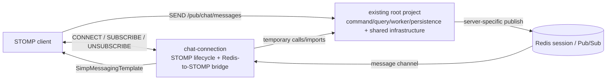

# TASK-001: chat-connection 책임 경계 분리

## Status

- 상태: Active
- 유형: 동작 보존형 모듈 경계 분리
- 기준 문서: `docs/architecture/current-chat.md`, `docs/architecture/target-chat.md`, `docs/invariants.md`
- 구현 원칙: 이 Task에서는 클래스 이동과 빌드·실행 경계 구성만 수행한다. 클래스 내부 로직 개선, 프로토콜 변경, 저장·전달 방식 변경은 수행하지 않는다.

## Goal

현재 단일 Gradle 프로젝트의 `global` 및 `chat.server` 패키지에 흩어진 WebSocket/STOMP 연결 책임을 물리적인 `chat-connection` Gradle 모듈 경계로 옮긴다.

이번 Task의 완료 상태는 다음과 같다.

- 기존 `chat` 프로필의 endpoint, destination, heartbeat, 인증, session/subscription Redis 상태, Redis Pub/Sub 구독, Redis 메시지의 STOMP user destination 전달 동작이 그대로 유지된다.
- STOMP `SEND /pub/chat/messages`의 command 처리와 persistence/worker/sequence/query 코드는 `chat-connection`의 소유가 되지 않는다.
- 이동 대상 클래스의 메서드와 데이터 계약은 바꾸지 않는다. 패키지·import·Gradle·실행 artifact 조정 외의 내부 구현 변경은 후속 Task로 분리한다.
- 현재 단일 모듈 결합 때문에 필요한 역방향 의존성은 명시적인 임시 의존성으로 기록하고, 이를 해소하기 위한 리팩터링을 이 Task에 섞지 않는다.

## Target Boundary

### `chat-connection`이 소유할 책임

- WebSocket endpoint와 STOMP broker 설정
- STOMP CONNECT, SUBSCRIBE, UNSUBSCRIBE 및 disconnect event 처리
- STOMP session attribute와 subscription ID-to-room mapping의 생명주기 orchestration
- 연결/구독 상태를 Redis에 기록·정리하는 기존 서비스 호출
- Connection Server가 구독할 Redis Pub/Sub channel 등록·해제
- 서버별 Redis 메시지를 STOMP user destination으로 전달하는 bridge
- `SimpMessagingTemplate`과 STOMP Simple Broker를 이용한 서버 내부 전달
- `chat` 프로필 Connection Server의 시작·종료 orchestration

### `chat-connection`이 소유하지 않을 책임

- STOMP SEND message command와 `ChatFacade` orchestration
- room membership 기반 SEND/조회 인가
- message ID 생성, worker hash ring 선택 및 Redis Stream 발행
- worker의 recipient 계산, server grouping 및 Redis Pub/Sub publish
- Redis Stream consume/ACK/recovery
- sequence 생성, 최근 메시지 cache 및 MongoDB persistence
- REST query와 향후 HTTP message command

### 현재 동작을 유지하기 위한 경계



`ChatController`는 STOMP transport annotation을 사용하지만 실제 책임은 SEND command adapter이므로 기존 root project에 남긴다. `chat-connection` 실행 artifact가 root project를 runtime dependency로 포함하고 동일한 `chat` profile/component scan을 사용하여 현재 SEND 경로를 계속 노출한다.

## Current Class / Package Classification

분류 의미는 다음과 같다.

- **Move**: 구현을 바꾸지 않고 `chat-connection`으로 이동한다.
- **Keep**: 최종 책임이 `chat-connection`이 아니므로 기존 root project에 둔다.
- **Boundary**: 연결 경계가 사용하지만 책임이 혼합되거나 다른 프로필도 사용한다. 이번 Task에서는 이동 또는 분해하지 않고 임시 의존성을 명시한다.

| 분류 | 현재 위치 | 계획 위치/역할 | 근거 |
|---|---|---|---|
| Move | `global.config.StompConfig` | `chat-connection`의 STOMP configuration | `/stomp-chat`, `/pub`, `/sub`, `/queue`, `/user`, Simple Broker heartbeat와 inbound interceptor를 구성한다. |
| Move | `global.inspector.StompChannelInterceptor` | `chat-connection`의 connection lifecycle adapter | CONNECT/SUBSCRIBE/UNSUBSCRIBE와 `SessionDisconnectEvent`, principal/session attribute/subscription map을 직접 처리한다. |
| Move | `chat.server.listener.ChatMessageListener` | `chat-connection`의 Redis-to-STOMP bridge | 서버별 Redis message를 역직렬화하고 `SimpMessagingTemplate.convertAndSendToUser()`로 전달한다. |
| Move | `global.manager.MessageListenerManager` | `chat-connection`의 Redis subscription manager | `RedisMessageListenerContainer`에 channel listener를 등록·해제하고 local channel-to-listener 상태를 관리한다. |
| Move (temporary mixed boundary) | `chat.server.initializer.ChatServerNodeInitializer` | `chat-connection`의 profile lifecycle/composition root | Pub/Sub 구독, session cleanup과 서버 시작·종료뿐 아니라 worker hash ring refresh 및 worker event subscription도 포함한다. 이 routing 상태는 기존 STOMP SEND → worker Stream 경로를 유지하는 데 필요하므로 통째로 이동한다. 최종 connection 책임은 아니며, 향후 HTTP command/Kafka dispatcher 전환으로 제거될 가능성이 높은 legacy 구조이므로 이번 Task에서 별도 initializer나 port로 분리하지 않는다. |
| Move | `global.inspector.StompChannelInterceptorTest` | `chat-connection` test source | 이동한 interceptor의 disconnect 특성 테스트를 같은 모듈로 옮긴다. |
| Boundary | `chat.common.service.ChatSessionService` | root project에 유지, `chat-connection`이 임시 사용 | connection lifecycle의 Redis write/cleanup뿐 아니라 `chat-worker`의 online member 조회와 session key 생성에도 사용된다. 통째로 이동하면 worker/root와의 순환 의존이 생기며, 역할 분리는 내부 구현 변경이므로 후속 Task로 미룬다. |
| Boundary | `global.config.RedisConfig` | root project의 shared infrastructure | `RedisMessageListenerContainer` bean은 connection에 필요하지만 같은 설정이 모든 profile의 connection factory/templates와 worker Stream container도 구성한다. 설정 클래스 분해는 이번 이동 Task에 포함하지 않는다. |
| Boundary | `global.constant.RedisKeys` | root project의 기존 Redis key contract | session/presence key와 message/cache/worker key가 한 클래스에 섞여 있고 worker와 connection이 함께 사용한다. 상수 재편은 하지 않는다. |
| Boundary | `global.constant.RedisTopicNames` | root project의 기존 topic contract | connection subscriber와 worker publisher, worker topology listener가 같은 상수를 공유한다. fan-out/topic 변경 없이 그대로 사용한다. |
| Boundary | `global.security.JwtService` | root project의 authentication dependency | CONNECT 인증에 필요하지만 채팅 연결 전용 구현이 아니다. interceptor가 임시로 직접 의존한다. |
| Boundary | `global.manager.TraceContextManager` | root project의 observability dependency | Redis-to-STOMP bridge가 trace/MDC 전달을 위해 사용한다. 연결 모듈 소유로 옮기지 않는다. |
| Boundary | `chat.common.dto.ChatMessageDispatchDto`, `ChatResponse.ChatMessageResponse` | root project의 기존 bridge payload contract | worker publisher와 connection subscriber가 공유한다. DTO 재설계나 새 공통 모듈 생성 없이 현재 직렬화 계약을 유지한다. |
| Keep | `chat.server.controller.ChatController` | root project의 legacy STOMP SEND adapter | `@MessageMapping`을 사용하지만 message command를 `ChatFacade`로 전달한다. 최종 connection 책임이 아니며 HTTP 전환도 이번 범위가 아니다. |
| Keep | `chat.server.facade.ChatFacade`, `ChatService`, `ChatServerMessageIdService`, `ChatMessageRoutingService` | root project command/routing | membership, ID, worker routing 및 Stream 발행 책임이다. |
| Keep | `chat.server.controller.ChatRoomController`, `ChatMessageQueryService`, `ChatMessageCacheLockService` | root project query | HTTP 조회, cache/DB fallback 책임이다. |
| Keep | `chat.server.listener.ChatWorkerEvenetMessageListener` | root project worker-topology adapter | Redis Pub/Sub listener이지만 메시지 Push가 아니라 worker hash ring 갱신 책임이다. 이동한 initializer가 임시로 이 bean을 사용한다. |
| Keep | `chat.server.route.ChatWorkerLocalHashRing` | root project routing | SEND를 worker Stream으로 보내기 위한 topology/routing 책임이다. |
| Keep | `chat.worker.listener.ChatWorkerStreamListener` | root project realtime dispatcher/worker | session 위치를 조회해 server별 recipient를 계산하고 Pub/Sub publish한다. Redis-to-STOMP subscriber가 아니므로 이동하지 않는다. |
| Keep | `global.manager.StreamListenerManager`, `RedisStreamGroupManager` | root project Redis Stream infrastructure | Redis Stream listener/group 책임으로 Pub/Sub connection boundary와 다르다. |
| Keep | `chat.persister.*`, `chat.worker.*`, sequence/cache/entity/repository packages | root project | persistence, worker routing, Redis Stream, sequence 영역이며 명시적 Out of Scope다. |
| Keep | `global.config.SecurityConfig` | root project HTTP/security configuration | CONNECT parsing은 `JwtService`를 사용하지만 전체 security filter chain을 connection 전용으로 옮기지 않는다. |

## Module Dependency Analysis

### 현재 상태

- `settings.gradle`에는 root project 하나만 있고 모든 production source가 `src/main/java`에 있다.
- 하나의 `build.gradle`과 `bootJar`가 `chat`, `chat-worker`, `chat-persister` 프로필을 모두 실행한다.
- Dockerfile도 root `bootJar` 하나만 만들며 Compose의 모든 backend process가 같은 image와 jar를 사용한다.

### 단순한 `root -> chat-connection`이 불가능한 이유

이동 후보는 기존 root 타입을 직접 사용한다.

- `StompChannelInterceptor` → `JwtService`, `ChatSessionService`
- `ChatMessageListener` → `ChatMessageDispatchDto`, `ChatMessageResponse`, `TraceContextManager`
- `ChatServerNodeInitializer` → `ChatSessionService`, `ChatWorkerLocalHashRing`, `ChatWorkerEvenetMessageListener`, Redis constants

새 모듈이 독립적으로 compile되려면 위 타입의 module이 필요하다. 동시에 root application이 이동된 bean을 compile/runtime에 의존하도록 `root -> chat-connection`을 추가하면 `chat-connection -> root`와 순환한다. 이를 한 Task에서 해결하려면 shared contract/port 추출이나 initializer/session service 분해가 필요하지만, 이는 클래스 이동이 아닌 내부 구조 변경이며 “새 공통 모듈 생성 금지”에도 어긋난다.

### 이번 Task에서 허용할 임시 방향

```text
chat-connection executable module
    -> root project plain jar (temporary legacy dependency)
```

- root project는 기존 command/query/worker/persistence와 shared infrastructure를 담은 legacy dependency로 유지한다.
- `chat-connection`은 기존 `WebtoonReviewApplication` bootstrap과 `chat` profile/component scan을 재사용하는 실행 artifact로 구성한다.
- root project는 `chat-connection`에 의존하지 않는다. 따라서 Gradle cycle을 만들지 않는다.
- `chat` 서버만 `chat-connection` artifact로 실행하고 `chat-worker`/`chat-persister`는 기존 root artifact를 계속 실행한다.
- child module이 직접 import하는 Spring WebSocket, Redis, Jackson, Lombok 및 test dependency는 child build에 명시한다. root의 `implementation` dependency가 자동으로 API처럼 노출된다고 가정하지 않는다.
- root plain jar와 기존 root boot jar 산출물을 명확히 구분하고 Docker build가 wildcard로 잘못된 jar를 선택하지 않도록 artifact 경로를 고정한다.

이 방향은 최종 목표 dependency가 아니다. `chat-connection`이 root 전체를 볼 수 있어 compile-time 접근 제한이 약하지만, 기존 구현을 건드리지 않고 최초의 물리적 실행/소스 경계를 만드는 과도기 선택이다.

### 후속 Task로 남길 dependency debt

- `ChatSessionService`를 connection lifecycle write/cleanup과 dispatcher lookup contract로 분리한다.
- HTTP command/Kafka dispatcher 전환 이후 worker Stream, hash ring과 worker event 처리의 제거 여부를 결정한다. 삭제 가능성이 높은 legacy routing을 미리 별도 initializer나 port로 분리하지 않는다.
- Redis Pub/Sub payload와 auth/session port의 최소 계약을 어디에 둘지 결정한다.
- 위 계약이 안정된 뒤 `chat-connection -> root`를 제거하고 application/composition module이 필요한 모듈을 조립하는 방향을 검토한다.

이 항목들은 TASK-001의 구현 범위가 아니다.

## In Scope

- `chat-connection` Gradle subproject와 필요한 build/test 설정 추가
- root plain jar 및 connection executable artifact가 공존하도록 최소 build wiring 구성
- 위 표의 Move 클래스와 해당 테스트의 물리적 source 이동 및 package/import 수정
- `chat` profile이 connection artifact에서 기존 root bean과 이동 bean을 함께 scan하도록 실행 구성
- Docker/Compose에서 `chat-1`, `chat-2`만 connection artifact를 사용하고 worker/persister는 기존 artifact를 사용하도록 packaging 조정
- 기존 endpoint/destination/header/principal/Redis key/topic/payload/profile 값을 그대로 유지
- 기존 테스트 실행, context/profile wiring, Gradle build 및 smoke 검증
- 실제 구현 후 `current-chat.md`의 물리 module/package 위치와 build/run 설명 갱신

## Out of Scope

- Redis Stream에서 Kafka로의 전환
- HTTP 메시지 command API 추가 또는 STOMP SEND 제거
- persistence-first, Transactional Outbox, DB schema/index 변경
- sequence 생성·조회·읽음 계약 변경
- Redis Pub/Sub fan-out 단위, channel 이름 또는 payload 변경
- session/subscription 알고리즘, TTL, cleanup, validation 또는 authorization 개선
- `StompChannelInterceptor`, `ChatSessionService`, `ChatServerNodeInitializer`, `ChatMessageListener`의 내부 책임 분해
- DTO/entity/repository 전면 재설계
- 새로운 common/shared module 생성
- MSA, gRPC 또는 독립 host/service 전환
- 기존 `chat`, `chat-worker`, `chat-persister` profile 의미 변경
- 새로운 characterization test 또는 새로운 동작 검증 테스트 작성
- 범위 밖 Findings의 수정

## Implementation Plan

각 단계는 내부 구현 변경 없이 작은 이동 단위로 수행한다.

1. **Gradle module skeleton 추가**
   - `settings.gradle`에 `chat-connection`을 포함한다.
   - root의 plain jar를 project dependency로 사용할 수 있게 하되 기존 root boot artifact와 테스트 실행은 유지한다.
   - `chat-connection/build.gradle`에 `implementation project(':')`와 직접 필요한 dependency를 명시한다.
   - 기존 `WebtoonReviewApplication`을 main class로 재사용해 별도의 중복 bootstrap logic을 만들지 않는다.

2. **STOMP configuration/lifecycle 이동**
   - `StompConfig`, `StompChannelInterceptor`와 interceptor test를 connection package/source set으로 이동한다.
   - package/import만 수정하고 endpoint, prefixes, heartbeat, headers, principal format, session attributes와 switch 처리 로직은 변경하지 않는다.
   - root와 connection module test compile을 각각 확인한다.

3. **Redis-to-STOMP bridge와 subscription manager 이동**
   - `ChatMessageListener`와 `MessageListenerManager`를 connection package/source set으로 이동한다.
   - serializer, trace/MDC, destination, `convertAndSendToUser()` 호출 및 channel listener map 동작을 그대로 둔다.
   - `ChatMessageDispatchDto`와 response DTO는 root dependency에서 그대로 사용한다.

4. **Connection Server lifecycle composition 이동**
   - `ChatServerNodeInitializer`를 통째로 이동하고 import만 조정한다.
   - node registration, hash ring refresh, message/worker-event channel 구독, session cleanup, chat event broadcast 순서와 값을 변경하지 않는다.
   - worker event와 local hash ring은 기존 STOMP SEND → worker Stream routing을 유지하기 위한 현재 chat server의 runtime 상태이므로 함께 이동한다.
   - 이 부분은 `temporary mixed boundary`이며 최종 connection 책임으로 확정하지 않는다. 향후 HTTP command/Kafka dispatcher 전환으로 제거될 수 있는 legacy routing을 이번 Task에서 별도 initializer나 port로 리팩터링하지 않는다.

5. **Artifact와 profile 실행 경로 분리**
   - build output 이름과 Docker copy 경로를 명시적으로 지정한다.
   - `chat-1`/`chat-2`는 connection artifact, `chat-worker-*`/`chat-persister`는 root artifact를 실행한다.
   - 환경 변수, profile, port, healthcheck, Nginx 설정은 유지한다.

6. **회귀 검증 및 문서 갱신**
   - 아래 Verification을 수행한다.
   - production 동작 변경이 발견되면 이 Task 안에서 로직을 재설계하지 않고 이동을 수정하거나 되돌린다.
   - 실제 이동 결과와 검증 결과를 Work Log에 기록하고 `current-chat.md`의 위치 정보만 갱신한다. 목표 architecture나 invariants의 아직 활성화되지 않은 계약을 완료 처리하지 않는다.

## Acceptance Criteria

- `chat-connection`이 별도 Gradle module/source boundary와 executable artifact로 존재한다.
- Move로 분류한 5개 production class와 interceptor test가 root source tree에 중복 없이 connection module에 존재한다.
- `chat` profile에서 `/stomp-chat` endpoint, allowed origin pattern `*`, application prefix `/pub`, broker prefixes `/sub`·`/queue`, user prefix `/user`, heartbeat `10000/10000`이 동일하다.
- CONNECT는 `Authorization`, `X-Client-Id`를 사용하고 principal `{userId}_{clientId}` 및 기존 session attributes/Redis calls를 동일하게 만든다.
- SUBSCRIBE/UNSUBSCRIBE/DISCONNECT는 기존 destination 판별, subscription map, Redis session/online/joined-room cleanup 동작을 그대로 유지한다.
- 서버 시작 시 `chat:{serverName}:message`와 `chat:worker:events`를 구독하고 종료 시 동일 channel을 해제한다.
- Redis dispatch payload는 기존 DTO/JSON 계약으로 역직렬화된다. 서버 코드는 각 principal에 `convertAndSendToUser(..., "/queue/room/{roomId}", ...)`를 호출하고, 클라이언트는 최종 user destination `/user/queue/room/{roomId}`를 구독하는 기존 동작을 유지한다.
- `ChatController`의 STOMP SEND, REST query, worker, persister가 기존 profile에서 계속 활성화되고 기존 Redis Stream/sequence/persistence 경로가 바뀌지 않는다.
- Gradle dependency cycle이 없고, 임시 `chat-connection -> root` dependency가 build file과 이 문서에 드러난다.
- root와 connection module의 관련 test 및 packaging 검증이 통과한다.
- 구현 diff에 로직 개선, payload/key/topic 변경, 새 common module, Kafka/Outbox/HTTP API 작업이 포함되지 않는다.

## Verification

구현 시 실제 task/module 이름을 확인한 뒤 다음 순서로 검증한다.

1. 정적 경계 확인
   - `rg`로 Move 클래스가 root source에 중복되지 않는지 확인한다.
   - `rg`로 `SimpMessagingTemplate`, `EnableWebSocketMessageBroker`, `WebSocketMessageBrokerConfigurer`의 production 사용 위치가 connection module로 수렴했는지 확인한다.
   - `ChatController`, `ChatWorkerStreamListener`, Stream/sequence/persistence 클래스가 root에 남았는지 확인한다.

2. 기존 테스트
   - `./gradlew :chat-connection:test`
   - `./gradlew test --tests "com.hymin.webtoon_review.chat.*"`
   - 기존 root test가 package/module 이동으로 깨지면 동작 의미를 바꾸지 않는 범위에서 package, import와 test configuration만 수정한다.
   - 이 Task를 위해 새로운 characterization test나 새로운 동작 검증 테스트를 작성하지 않는다. 새 테스트는 각 모듈의 내부 구조를 목표 구조로 개선하는 후속 Task에서 작성한다.

3. context/profile wiring
   - connection artifact를 `chat` profile로 기동해 STOMP configuration, interceptor, initializer, Redis listener와 bridge bean이 한 번씩 생성되는지 확인한다.
   - root artifact의 `chat-worker`, `chat-persister` profile을 기동해 WebSocket/connection bean이 로드되지 않고 기존 non-web 설정이 유지되는지 확인한다.
   - 기존 `ChatProcessProfileTest`를 실행한다.

4. build/package
   - `./gradlew clean test :chat-connection:bootJar bootJar`
   - Gradle project dependency에 cycle이 없는지 확인한다.
   - root plain jar, root boot jar, connection boot jar의 이름과 내용이 의도대로인지 확인한다.
   - Docker image build가 wildcard 선택에 의존하지 않고 각 process에 맞는 artifact를 포함하는지 확인한다.

5. smoke test
   - Compose에서 Redis/MySQL/MongoDB와 chat 2대, worker, persister를 실행한다.
   - 두 chat server 중 어느 곳에 연결해도 CONNECT와 room SUBSCRIBE가 성공하는지 확인한다.
   - 기존 STOMP SEND가 worker Stream → worker → server Pub/Sub → connection bridge → STOMP client로 전달되는지 확인한다.
   - UNSUBSCRIBE, 정상 disconnect, chat server 정상 종료 후 기존 Redis session/online/connected-user cleanup 결과를 비교한다.

## Related Invariants

- **INV-002 Durable/ephemeral authority 구분**: session, presence, subscription 및 Pub/Sub 상태는 계속 ephemeral 파생 상태로 취급한다. 이번 이동은 Source of Truth를 변경하지 않는다.
- **INV-003 authoritative membership 인가**: STOMP SEND와 조회의 기존 membership 검증 경로를 유지한다. SUBSCRIBE 인가를 새로 추가하지 않는다.
- **INV-004 Realtime Push best-effort**: Redis Pub/Sub과 STOMP Push의 의미와 실패 특성을 바꾸지 않는다.
- **INV-005 Ordering 범위**: worker/sequence/Push 순서 계약을 변경하지 않는다.
- **INV-010 Room subscription 인가**: 목표 단계 invariant이며 현재 미충족 상태를 유지·기록한다. 이 Task의 완료로 활성화 또는 충족되었다고 판단하지 않는다.
- **INV-011 Session/subscription lifecycle 수렴**: 목표 단계 invariant이며 TTL/비정상 종료 복구를 개선하지 않는다. 현재 정상 disconnect/정상 shutdown 동작만 회귀 검증한다.
- **INV-012 Partial failure**: 목표 persistence 단계의 계약을 도입하지 않는다. 기존 durable/realtime 경로의 성공 의미를 변경하지 않는다.

## Findings

1. **물리 모듈 추출 시 즉시 순환 의존 가능성이 있다.** 이동 후보가 root의 auth, DTO, tracing, session, worker-routing 타입을 사용하고 root initializer가 이동 후보를 사용한다. 내부 port/contract 분리를 금지한 이번 Task에서는 connection executable이 root plain jar에 의존하는 임시 방향이 가장 작은 동작 보존 경계다.
2. **`ChatSessionService`는 connection과 worker 책임이 혼합되어 있다.** CONNECT/SUBSCRIBE/DISCONNECT write/cleanup과 worker의 online member/session lookup이 같은 concrete service와 Redis key helper를 공유한다. 이번 Task에서 이동하면 root/connection cycle이 생기므로 Boundary로 남긴다.
3. **`ChatServerNodeInitializer`는 connection lifecycle 외 책임을 포함한다.** message channel 구독과 session cleanup뿐 아니라 active node TTL 등록, worker hash ring refresh, worker event listener 구독, `chat:events` publish를 함께 수행한다. worker event와 hash ring은 현재 STOMP SEND → worker Stream routing을 유지하는 데 필요하므로 전체를 `temporary mixed boundary`로 이동한다. 향후 HTTP command/Kafka dispatcher 전환으로 제거될 가능성이 높은 legacy routing이므로 이번 Task에서는 별도 initializer나 port로 분리하지 않는다.
4. **`RedisConfig`가 profile 공통이며 여러 Redis 역할을 묶는다.** Pub/Sub listener container와 일반 template, worker Stream container가 같은 configuration에 있다. connection module이 listener container bean을 root에서 공급받는 임시 결합이 남는다.
5. **현재 SUBSCRIBE에는 authoritative room membership 검증이 없다.** destination에 `/room`이 포함되면 마지막 segment를 room ID로 해석해 online/subscription 상태를 기록한다. INV-010은 아직 활성화·충족되지 않았으며 이번 Task에서 수정하지 않는다.
6. **session/presence cleanup의 복구 계약이 제한적이다.** session mapping에 TTL이 없고 interceptor disconnect 또는 정상 `ContextClosedEvent` cleanup에 의존한다. 강제 종료/비정상 종료 수렴 개선은 INV-011 관련 후속 작업이다.
7. **connection 식별 문자열 parsing이 구현 세부에 결합돼 있다.** `{userId}_{clientId}`를 principal/Redis set member로 만들고 worker와 cleanup이 `_` split으로 해석한다. client ID validation과 delimiter 안전성은 이번 Task에서 변경하지 않는다.
8. **`ChatMessageListener`는 bridge payload와 serializer/trace 구현에 직접 결합돼 있다.** `RedisTemplate` serializer, concrete DTO와 `TraceContextManager`를 직접 사용하므로 connection module이 root에 의존한다. payload/port 재설계는 별도 Task다.
9. **현재 Docker build는 단일 root `bootJar`와 wildcard copy를 전제로 한다.** 두 artifact가 생기면 잘못된 jar 선택 또는 모든 profile에 connection code가 누락될 수 있으므로 artifact별 명시적 packaging 검증이 필요하다.
10. **Simple Broker는 각 chat process 내부 local broker다.** 이번 분리는 broker relay나 fan-out 방식을 바꾸지 않으며 기존 principal별 `convertAndSendToUser()` 동작을 그대로 유지해야 한다.

## Work Log

### 2026-08-31 — Task 문서 작성

- `AGENTS.md`, `current-chat.md`, `target-chat.md`, `invariants.md`를 확인했다.
- Gradle/settings, Docker/Compose profile 실행 구조와 실제 connection/session/Pub/Sub/worker 코드를 대조했다.
- Move/Keep/Boundary 분류와 임시 `chat-connection -> root` dependency를 정리했다.
- production code는 수정하지 않았다.
- 구현 및 검증 결과는 실제 작업 시 이 절에 추가한다.

### 2026-08-31 — 검증 범위 조정

- 새로운 characterization test 작성 계획을 제거하고 기존 테스트, build, profile/context wiring과 smoke test만 검증 범위로 유지했다.
- `ChatServerNodeInitializer` 전체 이동의 runtime 보존 이유와 `temporary mixed boundary` 성격을 명확히 했다.
- 서버의 `convertAndSendToUser()` destination과 클라이언트의 최종 user destination을 구분했다.
- production code와 `ACTIVE.md`는 수정하지 않았다.
