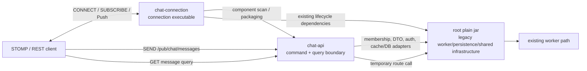

# TASK-002: chat-api 책임 경계 분리

## Status

- 상태: Completed
- 유형: 동작 보존형 모듈 경계 분리
- 선행 Task: `TASK-001-chat-connection-boundary`
- 기준 문서: `docs/architecture/current-chat.md`, `docs/architecture/target-chat.md`, `docs/invariants.md`
- 구현 원칙: 기존 `chat` runtime의 STOMP SEND, REST 조회, Redis worker routing, cache/DB fallback 동작을 유지하면서 message command/query 책임의 물리적 source/module 경계만 만든다.

## Goal

현재 root project의 `chat.server` 패키지에 남아 있는 message command와 query 책임을 물리적인 `chat-api` Gradle module로 옮긴다.

이번 Task의 완료 상태는 다음과 같다.

- STOMP `SEND /pub/chat/messages`는 그대로 유지하며 기존 `ChatController`가 command adapter 역할을 계속한다.
- SEND orchestration은 기존 순서인 authoritative room membership 확인 → Redis 기반 server message ID 확정 → DTO 변환 → 기존 worker routing 호출을 유지한다.
- REST message query는 기존 endpoint와 membership 확인, recent cache 조회, lock, MongoDB fallback, cache fill 순서를 유지한다.
- `chat-connection`의 WebSocket/STOMP lifecycle 및 Redis-to-STOMP bridge는 다시 이동하거나 재설계하지 않는다.
- worker, sequence, cache 구현, MongoDB persistence, persister와 fan-out 구현은 root에 남는다.
- 클래스 내부 책임 분해나 새로운 port/shared module 도입 없이 현재 클래스 단위를 우선 사용한다.

## Target Boundary

### `chat-api`가 소유할 책임

- STOMP message SEND command adapter
- 현재 message command orchestration과 trace/MDC 범위
- MySQL authoritative membership을 사용하는 SEND/조회 권한 확인
- 현재 Redis `SET NX` + TTL 기반 server message ID/idempotency 처리
- 기존 `ChatMessageRoutingService`를 호출하는 command-side 경계
- message query REST endpoint
- recent cache 우선 조회, distributed lock, MongoDB fallback과 cache fill을 포함한 현재 query orchestration
- 현재 하나의 facade/service에 결합된 room 목록·상세·참여 API orchestration
- query cache miss metric

마지막 항목의 room API는 이번 Task의 주된 목표는 아니지만 `ChatRoomController`, `ChatFacade`, `ChatService`가 message membership/query와 물리적으로 결합되어 있다. 이를 분리하려면 facade/service 재설계가 필요하므로 기존 클래스 전체를 동작 보존 단위로 이동한다. 이 이동은 세 클래스의 최종 module ownership을 확정하지 않는다.

### `chat-api`가 소유하지 않을 책임

- WebSocket endpoint, STOMP broker/configuration, CONNECT/SUBSCRIBE/UNSUBSCRIBE/DISCONNECT lifecycle
- Redis-to-STOMP bridge와 connection server의 session/subscription lifecycle
- `ChatWorkerStreamListener` 및 worker consume/ACK/recovery
- worker hash ring 구현, worker topology event listener와 Redis Stream 발행 구현 자체
- sequence 생성과 recent message cache 구현
- MongoDB entity/repository 및 persistence 구현
- persister와 저장 Stream 처리
- recipient/server grouping 및 Redis Pub/Sub fan-out

### 현재 동작을 유지하기 위한 경계



`chat-api`는 독립 실행 서비스가 아니라 현재 `chat-connection` executable이 조립하는 library module로 둔다. `WebtoonReviewApplication`과 `chat` profile component scan을 재사용하며 endpoint, profile, artifact 실행 주체를 바꾸지 않는다.

## Current Class / Package Classification

분류 의미는 다음과 같다.

- **Move to chat-api**: 내부 동작을 바꾸지 않고 source와 해당 기존 test를 `chat-api` module로 이동한다.
- **Move (temporary mixed boundary)**: 현재 클래스 결합 때문에 전체 source를 이동하지만 최종 module ownership은 확정하지 않으며, 후속 application boundary 재정의 시 책임과 소유권을 다시 검토한다.
- **Keep in root**: 최종 책임이 `chat-api`가 아니거나 worker/persister가 소유하므로 root에 둔다.
- **Boundary / temporary dependency**: `chat-api`가 현재 구현을 호출하거나 타입을 공유하지만 이번 Task에서 분해·이동하지 않는다.

| 분류 | 현재 클래스/패키지 | 계획 위치/역할 | 근거 |
|---|---|---|---|
| Move to chat-api | `chat.server.controller.ChatController` | STOMP SEND command adapter | `@MessageMapping("/chat/messages")`에서 session의 `userId`, `nickname`을 읽어 facade에 위임한다. STOMP transport를 사용하지만 connection lifecycle 책임은 아니다. |
| Move (temporary mixed boundary) | `chat.server.controller.ChatRoomController` | REST room/message query adapter | message query뿐 아니라 방 목록·상세·참여 endpoint가 같은 controller에 결합되어 있어 이번 Task에서는 분해하지 않고 전체를 이동한다. 이는 최종 module ownership을 확정하지 않으며 후속 application boundary 재정의 시 다시 검토한다. |
| Move (temporary mixed boundary) | `chat.server.facade.ChatFacade` | command/query application orchestration | message command/query orchestration 외에 room API와 `UserService`/`WebtoonService` 의존성도 함께 가지고 있어 이번 Task에서는 분해하지 않고 전체를 이동한다. HTTP command 또는 persistence-first 구조 개선과 application boundary 재정의 시 책임과 소유권을 다시 검토한다. |
| Move (temporary mixed boundary) | `chat.server.service.ChatService` | membership 및 현재 room application service | authoritative membership 확인은 `chat-api`에 필요하지만 room CRUD와 `connect()`/`disconnect()` 책임도 같은 클래스에 결합되어 있다. 이번 Task에서는 분해하지 않고 전체를 이동하며 최종 ownership은 후속 단계에서 재검토한다. |
| Move to chat-api | `chat.server.service.ChatServerMessageIdService` | 현재 command idempotency/message ID service | `chat:message:server-id:{roomId}:{userId}:{clientMessageId}`에 UUID를 `SET NX`, TTL 2시간으로 등록·재조회하는 현재 계약을 유지한다. |
| Move to chat-api | `chat.server.service.ChatMessageQueryService` | message query orchestration | recent cache hit 우선, lock 경쟁 중 cache 재확인, timeout/lock-disabled 시 MongoDB fallback, DB 결과 cache fill을 그대로 유지한다. |
| Move to chat-api | `chat.server.service.ChatMessageCacheLockService` | query cache-fill lock | room별 Redis lock key, 5초 TTL과 token 비교 Lua unlock을 query orchestration과 함께 이동한다. |
| Move to chat-api | `chat.server.metrics.ChatMessageQueryMetrics` | query metric | MongoDB fallback 횟수 metric은 query 경계 전용이며 worker/persister에서 사용하지 않는다. |
| Move to chat-api | 위 Move 클래스의 기존 unit tests | `chat-api/src/test` | `ChatFacadeTest`, `ChatServiceTest`, `ChatServerMessageIdServiceTest`, `ChatMessageQueryServiceTest`, `ChatMessageCacheLockServiceTest`를 package/import/config만 조정해 함께 이동한다. 새로운 characterization test는 추가하지 않는다. |
| Boundary / temporary dependency | `chat.server.service.ChatMessageRoutingService` | root의 기존 worker Stream routing adapter | SEND가 계속 호출해야 하지만 hash ring 선택, JSON 직렬화와 worker Stream `XADD`는 `chat-api`의 최종 책임이 아니다. 이번 Task에서는 service/port를 재설계하지 않고 concrete bean을 직접 의존한다. |
| Keep in root | `chat.server.route.ChatWorkerLocalHashRing` | 기존 worker routing topology | `ChatMessageRoutingService`와 `chat-connection`의 initializer가 사용한다. hash ring 구현 자체는 명시적 제외 대상이다. |
| Keep in root | `chat.server.listener.ChatWorkerEvenetMessageListener` | worker topology refresh adapter | `chat-connection` initializer가 구독하고 local hash ring을 refresh하는 기존 temporary mixed boundary를 유지한다. |
| Keep in root | `chat.worker.listener.ChatWorkerStreamListener`, `chat.worker.*` | worker consume/realtime dispatch | Stream consume/ACK/recovery, sequence, recipient 계산, Pub/Sub 및 persistence Stream 발행은 이동하지 않는다. |
| Boundary / temporary dependency | `chat.common.repository.UserChatRoomRepository` | root의 authoritative membership persistence adapter | `ChatService`가 membership/room API에 사용하고 worker가 participant fallback에 직접 사용한다. worker 공유 때문에 root에 둔다. |
| Boundary / temporary dependency | `chat.common.repository.ChatRoomRepository` | root의 room persistence adapter | 이동한 `ChatService`가 사용하지만 entity/repository 재배치는 이번 Task의 목적이 아니다. |
| Boundary / temporary dependency | `chat.common.repository.ChatMessageRepository` | root의 MongoDB query adapter | `ChatMessageQueryService`의 DB fallback에 사용한다. MongoDB persistence/schema/index/repository 재설계 없이 root에 둔다. |
| Boundary / temporary dependency | `chat.common.service.ChatRecentMessageCacheService` | root의 shared recent cache implementation | query read/fill뿐 아니라 worker의 sequence 생성/cache write가 같은 concrete service를 사용한다. 통째로 이동하면 worker 경계를 침범하므로 root에 둔다. |
| Boundary / temporary dependency | `chat.common.dto.*`, `chat.common.entity.*`, `chat.common.mapper.ChatMapper`, projection types | root의 기존 data contract | API, worker, persister가 공유한다. DTO/entity/repository 전면 재설계와 새 common module은 하지 않는다. |
| Boundary / temporary dependency | `global.constant.RedisKeys`, `global.config.RedisConfig` | root의 Redis contract/configuration | message ID와 query lock/cache key, Redis template bean을 제공한다. key/config 분리는 하지 않는다. |
| Boundary / temporary dependency | `global.annotation.Auth`, `global.response.*`, `global.config.SecurityConfig` | root의 HTTP auth/response boundary | REST controller가 기존 인증 컨텍스트와 응답 envelope를 그대로 사용한다. security filter chain은 이동하지 않는다. |
| Boundary / temporary dependency | `global.manager.TraceContextManager`, `UserService`, `WebtoonService` | root의 observability 및 기존 room API dependency | `ChatFacade`가 직접 사용한다. facade를 분해하지 않으므로 임시 root dependency로 유지한다. |
| Keep in root | `chat.common.metrics.ChatMessageMetrics` | shared pipeline metric | routing, worker와 persister 단계 metric이 한 클래스에 묶여 있어 API 전용이 아니다. |
| Keep in root | `chat.common.service.ChatSessionService` | connection/worker shared session service | TASK-001의 temporary boundary를 유지하며 TASK-002에서 변경하지 않는다. |
| Keep in root | `chat.persister.*`, Mongo persistence implementation | persister | batch consume, MongoDB write와 pending 처리는 `chat-api` 책임이 아니다. |
| Keep in chat-connection | `chat.connection.*` | connection lifecycle/bridge | TASK-001에서 만든 물리 경계를 되돌리거나 재설계하지 않는다. |

`ChatMessageRoutingServiceTest`는 routing implementation이 root에 남으므로 root test source에 유지한다.

## Module Dependency Analysis

### TASK-001 이후 현재 상태

```text
chat-connection executable
    -> root project plain jar
```

- root에는 command/query/worker/persistence/shared infrastructure가 함께 있다.
- `chat-connection`은 root의 `WebtoonReviewApplication`을 main class로 재사용하고 root plain jar를 포함한다.
- root는 `chat-connection`을 참조하지 않아 현재 Gradle cycle은 없다.

### 단순한 `root -> chat-api`가 만드는 문제

이동 대상은 다수의 root 타입과 bean을 직접 사용한다.

- `ChatFacade` → `ChatMessageRoutingService`, `TraceContextManager`, `UserService`, `WebtoonService`, root DTO/entity/mapper
- `ChatService` → JPA repositories와 projection/entity
- `ChatMessageQueryService` → `ChatRecentMessageCacheService`, `ChatMessageRepository`
- controllers → root auth/response/DTO types
- Redis ID/lock services → root `RedisKeys`와 Redis configuration이 공급하는 template

따라서 내부 port나 공통 계약을 새로 추출하지 않는 한 `chat-api -> root`가 필요하다. 이때 root application이 이동 bean을 다시 포함하려고 `root -> chat-api`를 추가하면 즉시 Gradle cycle이 생긴다.

### 이번 Task에서 사용할 가장 단순한 방향

```text
chat-connection executable
    -> chat-api library (new)
    -> root project plain jar (temporary legacy dependency)

chat-connection executable
    -> root project plain jar (existing direct dependency)
```

- `chat-api`는 `implementation project(':')`로 root plain jar에 의존한다.
- `chat-connection`은 packaging/component scan에 `chat-api`가 포함되도록 `implementation project(':chat-api')`를 추가한다.
- `chat-connection`은 initializer와 bridge가 root 타입을 직접 import하므로 기존 direct root dependency도 유지한다.
- root는 `chat-api`나 `chat-connection`에 의존하지 않는다. 따라서 구조는 diamond-shaped DAG이며 Gradle cycle이 없다.
- root boot artifact는 계속 `chat-worker`/`chat-persister`를 실행하고, `chat` 서버는 기존과 같이 `chat-connection` artifact를 실행한다.
- `chat-api`는 별도 executable/배포 artifact를 만들지 않는다. Docker/Compose process topology를 바꾸지 않는다.
- child module이 직접 사용하는 Spring Web/Messaging/Validation/Redis, Micrometer, Lombok/test dependency는 Gradle의 `implementation` 비전이성을 고려해 `chat-api` build에 명시한다.

### Dependency debt

1. `chat-api -> root` 때문에 새 module이 worker/persister/shared implementation 전체를 compile/runtime에서 볼 수 있어 경계 강제가 약하다.
2. `chat-api`가 concrete `ChatMessageRoutingService`를 직접 호출하므로 command 경계와 legacy worker Stream/hash ring routing이 결합되어 있다.
3. `ChatRecentMessageCacheService`는 query read/fill과 worker sequence/cache write를 함께 제공해 API와 worker가 같은 구현을 공유한다.
4. `UserChatRoomRepository`는 API membership과 worker participant fallback에서 공유된다.
5. `ChatFacade`와 `ChatService`가 message command/query 외 room CRUD 및 user/webtoon dependency를 포함하므로 `chat-api` 경계가 순수 message API보다 넓다.
6. `chat-connection`이 root와 `chat-api`를 함께 조립하는 composition root 역할을 하지만 별도 application/composition module은 없다.

이 debt는 이번 Task에서 새 common/shared/core module이나 port를 만들어 해소하지 않는다. persistence-first, HTTP command 전환 또는 worker transport 교체와 함께 안정된 계약이 생긴 뒤 후속 Task에서 다룬다.

## In Scope

- `chat-api` Gradle library subproject와 최소 build/test 설정 추가
- 위 표의 Move production class 및 기존 unit test의 물리적 source 이동
- package/import와 test configuration의 동작 비의미적 수정
- `chat-connection` executable이 root와 `chat-api` bean을 동일 `chat` profile에서 조립하도록 dependency wiring 추가
- 기존 endpoint, annotation, request/response DTO, auth extraction, transaction annotation, profile과 metric 이름 유지
- 기존 membership, Redis message ID, routing call, cache/lock/MongoDB fallback 순서 유지
- 기존 테스트, Gradle build, dependency cycle, profile/context 및 runtime smoke 검증
- 실제 구현 후 `current-chat.md`, 이 Task의 Work Log와 `ACTIVE.md` 상태 갱신

## Out of Scope

- STOMP SEND를 HTTP message command로 변경하거나 HTTP command endpoint 추가
- persistence-first, DB idempotency 또는 Transactional Outbox 도입
- Kafka 도입, Redis Stream 제거, hash ring 제거 또는 변경
- `ChatWorkerStreamListener`, worker consume/ACK/recovery 수정
- sequence 생성 또는 recent message cache 구현 변경
- MongoDB persistence, persister, schema/index/repository 변경
- Redis Pub/Sub fan-out 또는 payload/topic 변경
- 새로운 catch-up/recovery 계약 구현
- DTO/entity/repository 전면 재설계
- `ChatFacade`, `ChatService`, shared cache/repository의 내부 책임 분해
- 새로운 common/shared/core/application module 생성
- MSA, gRPC 또는 process topology 변경
- `chat-connection` module의 lifecycle/bridge 클래스 재이동 또는 재설계
- 새로운 characterization test 또는 새로운 동작 검증 테스트 작성
- 범위 밖 Findings 수정

## Implementation Plan

1. **`chat-api` module skeleton 추가**
   - `settings.gradle`에 `chat-api`를 포함한다.
   - library jar와 test를 만들되 독립 `bootJar`/main class는 만들지 않는다.
   - root project dependency와 이동 source가 직접 사용하는 dependency를 명시한다.

2. **Command adapter와 orchestration 이동**
   - `ChatController`, `ChatFacade`, `ChatService`, `ChatServerMessageIdService` 및 대응 기존 tests를 이동한다.
   - `@MessageMapping`, session attribute, trace/MDC, membership, Redis key/TTL/UUID, DTO mapping과 예외 동작을 바꾸지 않는다.
   - `ChatMessageRoutingService`는 root에 남기고 facade의 기존 concrete 호출을 temporary dependency로 유지한다.

3. **Query adapter와 orchestration 이동**
   - `ChatRoomController`, `ChatMessageQueryService`, `ChatMessageCacheLockService`, `ChatMessageQueryMetrics` 및 대응 기존 tests를 이동한다.
   - REST path/parameter/auth/response, transaction annotation, cache-first/lock/DB fallback/cache fill과 metric을 그대로 유지한다.
   - repository, cache implementation, entities/DTO/mapper는 root에서 주입받는다.

4. **Connection executable 조립**
   - `chat-connection`에 `chat-api` project dependency를 추가한다.
   - 기존 `WebtoonReviewApplication`의 package scan과 `chat` profile로 connection, API와 root boundary bean이 각각 한 번 생성되는지 확인한다.
   - root는 child module을 참조하지 않으며 worker/persister artifact와 profile wiring을 유지한다.

5. **회귀 검증 및 문서 갱신**
   - 아래 Verification을 수행한다.
   - package/module 이동으로 기존 test가 깨질 때만 import/package/test configuration을 수정한다.
   - runtime 의미 차이가 발견되면 새 설계를 추가하지 않고 이동/wiring을 바로잡는다.
   - 실제 결과를 Work Log에 기록하고 `current-chat.md`의 물리 위치/dependency 설명 및 `ACTIVE.md` 상태만 갱신한다.

## Acceptance Criteria

- `chat-api`가 별도 Gradle module/source boundary로 존재하고 독립 executable은 만들지 않는다.
- Move 및 Move (temporary mixed boundary)로 분류한 production class와 기존 tests가 root source에 중복 없이 `chat-api`에 존재한다.
- `/pub/chat/messages`와 `@MessageMapping("/chat/messages")`가 유지되며 HTTP message command endpoint는 추가되지 않는다.
- SEND는 기존 session `userId`/`nickname`, `ChatService.getRoomMemberId()`, Redis server message ID, `ChatMapper`, `ChatMessageRoutingService.route()` 순서를 유지한다.
- message ID key format, UUID 값, `SET NX`, 2시간 TTL 및 재조회/실패 의미가 동일하다.
- `/chat/room/{roomId}/messages?messageSequence=...`와 기존 room REST endpoints/auth/response 계약이 동일하다.
- query는 authoritative membership 확인 후 기존 cache-first, lock, MongoDB fallback, cache fill 및 DB-load metric 동작을 유지한다.
- worker Stream consumer/ACK/recovery, hash ring, sequence, cache implementation, MongoDB persistence, persister와 Redis Pub/Sub fan-out production code가 변경되지 않는다.
- TASK-001의 `chat-connection` lifecycle/bridge source와 동작이 변경되지 않는다.
- Gradle dependency가 `chat-connection -> chat-api -> root` 및 기존 `chat-connection -> root`의 비순환 DAG다.
- `chat` profile은 connection/API/root boundary bean을 정상 조립하고 `chat-worker`/`chat-persister` profile은 API/connection bean 없이 기존 root artifact에서 실행된다.
- 구현 diff에 새 characterization test, common/shared module, protocol/persistence/schema/ordering 변경이 포함되지 않는다.

## Verification

새 characterization test는 작성하지 않고 기존 검증 자산만 사용한다.

1. **정적 경계 확인**
   - `rg`로 Move production/test class가 root에 중복되지 않는지 확인한다.
   - root production source에서 `ChatController`, `ChatRoomController`, `ChatFacade`, `ChatService`, `ChatServerMessageIdService`, `ChatMessageQueryService`, `ChatMessageCacheLockService`, `ChatMessageQueryMetrics`를 import/reference하는 코드가 남아 있는지 확인한다.
   - 역참조가 있으면 `root -> chat-api` dependency를 추가하지 않는다. dependency cycle 가능성과 Boundary 문제를 기록하고 이번 Task 범위에서 안전하게 이동 가능한지 먼저 판단한다.
   - `ChatController`와 `ChatRoomController`가 `chat-api`에, `chat.connection.*`가 `chat-connection`에, worker/routing/persistence 구현이 root에 남았는지 확인한다.
   - `ChatMessageRoutingService`, `ChatWorkerLocalHashRing`, `ChatWorkerStreamListener`, `ChatRecentMessageCacheService`, repositories와 persister의 production diff가 없는지 확인한다.

2. **기존 테스트 실행**
   - `./gradlew :chat-api:test`
   - `./gradlew :chat-connection:test`
   - `./gradlew :test --tests "com.hymin.webtoon_review.chat.*"`
   - 기존 `ChatProcessProfileTest`를 실제 이동 후 위치에 맞춰 실행한다.
   - package/module 이동 때문에 test compile/context가 깨지면 동작 의미를 바꾸지 않는 import/package/test configuration 수정만 허용한다.

3. **Gradle build와 dependency cycle**
   - `./gradlew clean test :chat-api:jar :chat-connection:bootJar bootJar`
   - `./gradlew projects`와 dependency report/build task로 project dependency cycle이 없는지 확인한다.
   - connection boot jar에 `chat-api` jar와 root plain jar가 포함되고 Move class가 중복되지 않는지 확인한다.
   - root boot jar가 worker/persister 실행에 필요한 기존 class를 유지하며 API/connection class에 역의존하지 않는지 확인한다.

4. **Spring context/profile wiring**
   - `chat-connection` artifact를 `chat` profile로 기동해 STOMP configuration, `ChatController`, `ChatRoomController`, facade/query/ID/routing boundary bean이 한 번씩 생성되는지 확인한다.
   - root artifact를 `chat-worker`, `chat-persister` profile로 기동해 `chat-api`와 `chat-connection` bean이 로드되지 않고 `web-application-type: none`이 유지되는지 확인한다.
   - JPA/Mongo repositories, Redis templates, auth argument resolution와 metric bean 주입을 확인한다.

5. **기존 runtime smoke**
   - 기존 STOMP client/scenario로 CONNECT/SUBSCRIBE 후 `SEND /pub/chat/messages`가 membership → message ID → worker Stream → worker → Redis Pub/Sub → connection bridge → STOMP 수신까지 이어지는지 확인한다.
   - 동일 `clientMessageId` 재시도가 기존 Redis message ID로 수렴하는지 기존 smoke 범위에서 확인한다.
   - 기존 REST query로 membership이 있는 사용자의 `/chat/room/{roomId}/messages` cache hit와 cache miss/MongoDB fallback 경로를 확인한다.
   - worker consume/ACK, sequence/cache write, persistence Stream과 MongoDB 저장 경로가 이전과 동일하게 동작하는지 로그/Redis/MongoDB probe로 확인한다.

## Related Invariants

- **INV-001 재시도 수렴**: 현재 Redis server message ID 동작을 그대로 유지한다. DB idempotency로 강화하거나 현재 한계를 해결하지 않는다.
- **INV-002 Durable/ephemeral authority 구분**: membership은 MySQL repository를 사용하고 recent cache는 조회 가속/worker 파생 상태로 유지한다. Source of Truth를 변경하지 않는다.
- **INV-003 authoritative membership 인가**: SEND와 durable history 조회 전에 `ChatService.getRoomMemberId()`가 호출되는 현재 경로를 보존한다.
- **INV-004 Realtime Push best-effort**: worker와 Redis Pub/Sub, connection bridge 의미를 변경하지 않는다.
- **INV-005 Ordering 범위**: current sequence와 query 정렬 계약을 변경하지 않는다.
- **INV-006~009, INV-012**: persistence-first/outbox/catch-up 단계에서 활성화될 목표 invariant다. 이번 Task에서 구현·충족 처리하지 않는다.
- **INV-010 Room subscription 인가**: connection subscription 책임이며 현재 미충족 상태를 유지한다. TASK-002에서 수정하지 않는다.
- **INV-011 Session/subscription lifecycle 수렴**: TASK-001 경계를 그대로 유지하고 session TTL/cleanup을 변경하지 않는다.

## Findings

1. **`ChatFacade`가 message API와 room API를 함께 조립한다.** SEND와 message query만 물리적으로 떼려면 facade/controller/service 분해가 필요하다. 이번 Task는 내부 재설계가 아니므로 `ChatRoomController`, `ChatFacade`, `ChatService` 전체를 temporary mixed boundary로 이동하는 것이 가장 작은 동작 보존 단위이며, 최종 책임과 소유권은 후속 application boundary 재정의 시 다시 검토한다.
2. **현재 membership service와 repository의 module 귀속이 다를 수밖에 없다.** `ChatService`는 API orchestration이지만 `UserChatRoomRepository`는 worker participant fallback에서도 직접 사용된다. repository/entity를 root에 두고 API가 임시 의존하는 방향이 cycle을 피한다.
3. **SEND command는 legacy worker routing concrete service에 직접 결합되어 있다.** `ChatMessageRoutingService`는 local hash ring으로 Stream을 고르고 `XADD`한다. worker/hash ring을 API로 이동하지 않고 facade가 root service를 호출하는 temporary boundary가 필요하다.
4. **TASK-001의 connection initializer도 같은 routing topology를 사용한다.** `ChatServerNodeInitializer`는 root의 `ChatWorkerLocalHashRing`과 `ChatWorkerEvenetMessageListener`를 직접 사용한다. 따라서 `chat-connection -> root` direct dependency는 `chat-api` 추가 후에도 제거할 수 없다.
5. **Query cache service는 API와 worker가 공유한다.** `ChatRecentMessageCacheService`의 read/cache fill은 query가, sequence 생성/cache write는 worker가 사용한다. 이 클래스를 API로 옮기거나 분해하는 것은 worker/sequence 범위를 침범한다.
6. **현재 cache miss 판별은 단순히 빈 결과다.** `ChatMessageQueryService`는 cache에서 빈 list가 반환되면 coverage 여부와 무관하게 DB로 fallback한다. 이는 현재 동작이며 새로운 catch-up/coverage 계약은 이번 Task에서 만들지 않는다.
7. **현재 message ID 멱등성은 Redis TTL 범위다.** ID는 `(roomId, userId, clientMessageId)` key와 2시간 TTL에 의존하며 payload 충돌이나 DB unique constraint를 검사하지 않는다. INV-001의 최종 durable 보장은 후속 persistence/idempotency Task의 과제다.
8. **`ChatService.connect()`/`disconnect()`는 production 호출자가 확인되지 않았다.** 클래스 이동 시 제거하거나 정리하지 않고 그대로 이동한다.
9. **REST auth/response와 room join은 채팅 전용이 아닌 root 서비스에 결합되어 있다.** `@Auth`, security configuration, `UserService`, `WebtoonService` 때문에 `chat-api -> root`가 필요하다.
10. **전체 root test suite는 범위 밖 기존/환경 실패로 green이 아니다.** `clean test`에서 user 영역 11건, 로컬 datasource 값이 없는 `WebtoonReviewApplicationTests` 1건, 전체 suite의 logging 초기화 상태에서 `ChatProcessProfileTest` 2건이 실패했다. 범위 관련 module test와 profile test 단독 실행은 통과했으며 범위 밖 테스트를 수정하지 않았다.
11. **root production source의 이동 대상 역참조는 없었다.** 이동 전 참조는 8개 Move 클래스 내부에서만 확인됐고 함께 이동한 뒤 root production source의 import/reference는 0건이다. 따라서 `root -> chat-api` 없이 계획한 비순환 dependency로 구현할 수 있었다.
12. **Docker builder는 새 module 입력을 명시적으로 복사해야 했다.** 기존 Dockerfile은 root와 `chat-connection`만 복사했으므로 `chat-api/build.gradle`과 `chat-api/src`를 추가하지 않으면 image build가 불가능했다. target/process topology는 변경하지 않았다.
13. **기존 장기 유지 room으로 persistence smoke를 실행하면 stale sequence와 MongoDB unique index가 충돌할 수 있다.** 최초 idempotency smoke에서 worker/Stream/persister 처리는 실행됐지만 기존 room sequence 충돌로 새 문서가 duplicate 처리됐다. 새 room fixture로 재실행하면 idempotency/persistence 시나리오가 통과했다.
14. **기존 gap recovery 시나리오가 기대하는 Pub/Sub 생략 주입은 현재 production source에서 확인되지 않았다.** REST query 자체는 정상 응답했지만 `skippedMessageNotReceived` assertion이 실패했다. TASK-002와 무관한 기존 검증 자산 문제로 수정하지 않았다.

## Remaining Risks

1. 임시 `chat-api -> root`는 물리 source 경계는 만들지만 compile-time 의존성 통제를 충분히 제공하지 않는다.
2. command가 root routing bean을 직접 호출하므로 향후 persistence-first/HTTP command 전환 시 module 간 계약을 다시 정의해야 한다.
3. `ChatRoomController`, `ChatFacade`, `ChatService` 전체 이동으로 `chat-api`가 순수 message command/query보다 넓은 room API 및 user/webtoon 의존성을 갖는다. 이 temporary mixed boundary가 최종 ownership으로 고착되지 않도록 후속 HTTP command/persistence-first/application boundary 단계에서 재검토해야 한다.
4. cache/DB fallback이 cache coverage를 표현하지 않는 현재 한계와 Redis TTL 기반 message ID의 durable idempotency 한계는 그대로 남는다.
5. connection artifact가 connection, API와 legacy root 세 계층을 조립하므로 profile/component scan 및 중복 class packaging 검증이 중요하다.
6. 전체 root suite의 범위 밖/환경 실패 14건 때문에 전체 build 결과만으로 TASK-002 회귀 여부를 판단하기 어렵다. 범위 module test와 profile test를 분리해 계속 확인해야 한다.
7. 장기 유지된 MongoDB history와 만료·초기화된 Redis room sequence가 충돌하면 persistence smoke가 duplicate로 처리될 수 있다. 이는 현재 sequence/persistence 경로의 잔여 운영 리스크다.

## Work Log

### 2026-08-31 — Task 문서 작성

- `AGENTS.md`, `current-chat.md`, `target-chat.md`, `invariants.md`, `ACTIVE.md`, 완료된 `TASK-001`을 확인했다.
- TASK-001 이후 Gradle dependency, root/connection artifact와 `chat`/`chat-worker`/`chat-persister` profile 구조를 대조했다.
- controllers, facade, command/query services, membership repositories, Redis ID/lock/cache, MongoDB query repository, routing/hash ring, worker와 connection initializer의 실제 호출 관계를 확인했다.
- Move/Keep/Boundary 분류와 비순환 임시 dependency `chat-connection -> chat-api -> root` 및 기존 `chat-connection -> root`를 정리했다.
- production code, Gradle, Docker, architecture/invariant 문서는 수정하지 않았다.
- 구현 및 검증 결과는 실제 작업 시 이 절에 추가한다.

### 2026-08-31 — TASK-002 구현 완료

#### What Changed

- `settings.gradle`에 `chat-api` subproject를 추가했다.
- `chat-api`를 독립 executable이 아닌 library module로 구성하고 `webtoon-review-chat-api.jar`를 생성하도록 했다. root project dependency와 source가 직접 사용하는 Web/Messaging/Validation/Security/JPA/MongoDB/Redis/Micrometer dependency를 명시했다.
- `ChatController`, `ChatRoomController`, `ChatFacade`, `ChatService`, `ChatServerMessageIdService`, `ChatMessageQueryService`, `ChatMessageCacheLockService`, `ChatMessageQueryMetrics`를 package/내부 로직 변경 없이 `chat-api` production source로 이동했다.
- 기존 `ChatFacadeTest`, `ChatServiceTest`, `ChatServerMessageIdServiceTest`, `ChatMessageQueryServiceTest`, `ChatMessageCacheLockServiceTest`를 같은 package의 `chat-api` test source로 이동했다. 새 테스트는 작성하지 않았다.
- `chat-connection`에 `implementation project(':chat-api')`를 추가하고 기존 direct root dependency를 유지했다.
- Docker builder가 새 library build/source를 포함하도록 copy 입력만 추가했다. runtime target과 Compose process topology는 변경하지 않았다.
- `ChatMessageRoutingService`, hash ring, worker, Redis Stream, sequence/cache, persistence와 TASK-001 connection source는 이동하거나 수정하지 않았다.

#### Why

- 기존 STOMP SEND와 REST query 동작을 유지하면서 command/query 책임을 물리적인 library module 경계로 분리하기 위해서다.
- root production source에 Move 클래스 역참조가 없었으므로 `root -> chat-api`를 추가하지 않고 계획한 비순환 구조를 사용할 수 있었다.

#### Verification

- 구현 전 Verification에 root production 역참조 검사와 cycle 발생 시 처리 원칙을 추가했다.
- 정적 경계: Move production class 8개가 `chat-api`에만 존재하고 root production source의 해당 class import/reference가 0건임을 확인했다. routing/hash ring/worker/cache/persistence 구현은 root에 남아 있다.
- `./gradlew projects`: 성공. root, `:chat-api`, `:chat-connection` project를 확인했다.
- runtime dependency report: `chat-api -> root`, `chat-connection -> root`, `chat-connection -> chat-api -> root`를 확인했다. root의 child module dependency와 Gradle cycle은 없다.
- `./gradlew :chat-api:test`: 성공.
- `./gradlew :chat-connection:test`: 성공.
- `./gradlew :test --tests "com.hymin.webtoon_review.chat.*"`: 성공.
- `./gradlew :test --tests "com.hymin.webtoon_review.chat.config.ChatProcessProfileTest" --rerun-tasks`: 단독 실행 성공. `chat-worker`, `chat-persister`의 `web-application-type: none`을 확인했다.
- `./gradlew clean test :chat-api:jar :chat-connection:bootJar bootJar`: compilation과 root artifacts 생성 후 전체 root test의 범위 밖/환경 failure 14건으로 실패했다. 상세는 Findings 10에 기록했다.
- 실패한 전체 suite와 분리해 `./gradlew :chat-api:test :chat-connection:test :chat-api:jar :chat-connection:bootJar bootJar`와 profile test를 재실행해 성공했다. `:chat-api:bootJar`는 비활성화 상태임을 확인했다.
- artifact 검사: chat-api jar에 Move class 8개가 한 번씩 있고 root plain/root boot jar에는 없었다. connection boot jar에는 `webtoon-review-chat-api.jar`와 `webtoon-review-root-plain.jar`가 각각 한 번 포함됐다.
- `docker compose up -d --build`: root/connection image build는 성공했다. 전체 command는 host의 기존 9090 port 점유로 Prometheus 시작에서 종료됐으나 채팅 관련 service는 별도로 정상 기동했다.
- runtime profile: chat-1/chat-2와 load balancer는 healthy, worker 3대와 persister는 각각 `chat-worker`/`chat-persister` profile로 실행됐고 background process log에 Tomcat 기동은 없었다.
- 기존 `ChatCrossServerSendReceiveScenarioTest`: 새 room fixture로 성공. 두 chat server의 STOMP CONNECT/SUBSCRIBE/SEND와 worker Stream → worker → server Pub/Sub → connection bridge → client 경로를 확인했다.
- 기존 REST message query: 인증된 기존 member로 `/chat/room/{roomId}/messages?messageSequence=0`을 호출해 HTTP 성공과 12건 응답을 확인했다.
- 기존 `ChatMessageIdempotencyPersistenceScenarioTest`: 새 room fixture로 성공. 동일 `clientMessageId`의 server message ID 수렴과 worker/Stream/sequence/persister/MongoDB 저장 경로를 확인했다.
- 기존 gap recovery scenario는 REST query를 수행했지만 현재 source에 Pub/Sub 생략 주입이 없어 별도 assertion이 실패했다. 상세는 Findings 14에 기록했다.

#### Findings

- root production 역참조가 없어 계획한 dependency DAG로 안전하게 이동할 수 있었다.
- 전체 root suite, 장기 유지 room의 sequence 충돌, gap recovery failure-injection 부재와 Prometheus host port 충돌은 각각 위 Findings에 기록했으며 범위 밖이므로 수정하지 않았다.

#### Remaining Risks

- 위 `Remaining Risks` 절과 같다.
