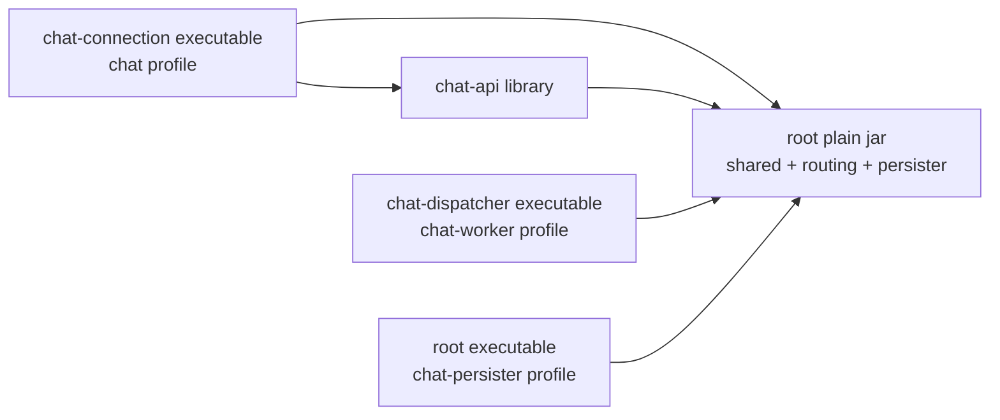

# TASK-003: chat-dispatcher 책임 경계 분리

## Status

- 상태: Completed
- 유형: 동작 보존형 executable module 경계 분리
- 기준 문서: `docs/architecture/current-chat.md`, `docs/architecture/target-chat.md`, `docs/invariants.md`
- 선행 Task: `TASK-001-chat-connection-boundary`, `TASK-002-chat-api-boundary`
- 구현 원칙: 현재 `chat-worker` profile의 Redis Stream consume, sequence/cache, recipient 계산, Redis Pub/Sub fan-out, persistence Stream 발행, ACK/recovery와 worker lifecycle을 그대로 유지한 채 물리적인 `chat-dispatcher` Gradle module과 executable artifact로 옮긴다. Kafka, persistence-first 또는 내부 알고리즘 변경은 수행하지 않는다.

## Goal

현재 root project에 남아 있는 `chat-worker` 실행 책임을 별도 `chat-dispatcher` Gradle module 경계로 분리한다.

`chat-dispatcher`는 장기적으로 durable message event를 소비해 realtime fan-out을 수행하는 영역이지만, 이번 Task에서 소비 입력의 의미나 transport는 바꾸지 않는다. 즉 이번 단계의 dispatcher는 여전히 다음 현재 동작을 수행한다.

1. chat server가 worker hash ring으로 선택한 `chat-worker:stream:{workerName}`을 소비한다.
2. Redis Lua 기반 room sequence 생성과 recent message cache write를 호출한다.
3. room participant와 online session 위치를 조회해 recipient를 계산하고 chat server별로 grouping한다.
4. `chat:{serverName}:message` Redis Pub/Sub channel에 기존 payload를 발행한다.
5. `chat-message-batch:stream`에 기존 persistence payload를 발행한다.
6. 위 단계가 끝난 뒤 입력 worker Stream record를 ACK한다.
7. 기존 heartbeat, hash ring registration, pending claim, dead worker recovery를 유지한다.

이번 Task의 완료는 최종 target dispatcher가 완성됐다는 뜻이 아니다. 현재 worker process의 source/build/run boundary를 먼저 분리해 이후 Kafka 또는 durable event 입력 전환을 독립적인 Task로 수행할 수 있게 하는 단계다.

## Target Boundary

### `chat-dispatcher`가 이번 Task에서 소유할 책임

- `chat-worker` profile의 application lifecycle과 executable composition
- worker별 Redis Stream listener 등록과 consume
- worker Stream payload parsing 및 current trace/MDC propagation
- sequence 생성/recent cache write 호출 orchestration
- participant, online member와 session-to-server 위치를 이용한 current recipient 계산
- recipient의 chat server별 grouping
- server-specific Redis Pub/Sub publish
- persistence Redis Stream 발행
- 정상 처리 마지막의 worker Stream ACK
- worker heartbeat, registration/unregistration와 hash ring vnode 등록/삭제
- dead worker 감지, recovery lock, pending `XCLAIM`, remaining record drain과 stream delete
- worker 전용 listener container/executor/profile resource와 직접 대응하는 기존 test source

### `chat-dispatcher`가 이번 Task에서 소유하지 않을 책임

- STOMP SEND command 수신과 worker Stream 선택/생산
- `ChatMessageRoutingService`, chat server local worker hash ring과 worker topology event subscription
- WebSocket/STOMP connection/session lifecycle write와 Redis-to-STOMP bridge
- message query와 cache miss/MongoDB fallback
- recent message cache, session/presence, repository, DTO/entity, Redis infrastructure 전체의 최종 소유권
- persistence Stream consume, MongoDB batch insert와 persister pending 처리
- durable message 생성, Outbox relay 또는 Kafka consume

### 예상 build/run 경계

```text
chat-connection executable
├── chat-api library
└── root plain jar

chat-dispatcher executable
└── root plain jar

root executable
└── chat-persister 및 기존 잔여 runtime
```



- `chat-dispatcher`는 기존 `WebtoonReviewApplication` bootstrap과 `chat-worker` profile을 재사용하는 별도 executable subproject로 만든다.
- `chat-dispatcher`는 root plain jar에 임시로 의존한다. `chat-api`나 `chat-connection`에는 의존하지 않는다.
- root project는 `chat-dispatcher`를 참조하지 않는다.
- worker 3대만 dispatcher artifact를 실행한다. chat server는 connection artifact, persister는 root artifact를 계속 사용한다.
- root `bootJar`는 persister 등 잔여 runtime을 위해 유지한다. dispatcher source를 포함하거나 dispatcher artifact에 의존하지 않는다.

## Current Class / Package Classification

분류 의미는 다음과 같다.

- **Move to chat-dispatcher**: 현재 호출자가 worker 경계 안에만 있어 source와 대응 test/config를 dispatcher module로 이동한다.
- **Move (temporary mixed boundary)**: 현재 worker 실행에는 필요하지만 최종 realtime dispatcher 책임과 다른 sequence/cache/persistence 또는 legacy worker transport 책임이 섞여 있다. 이번 Task에서는 동작 보존을 위해 통째로 이동한다.
- **Keep in root**: API, connection, persister 또는 여러 profile이 공유하거나 dispatcher의 최종 소유가 아니므로 root에 유지한다.
- **Boundary / temporary dependency**: dispatcher가 root의 concrete class/contract를 직접 사용한다. 이번 Task에서 port/common module로 분해하지 않고 `chat-dispatcher -> root` dependency로 드러낸다.

### Move to `chat-dispatcher`

| 현재 class/resource | 현재 책임 | 이동 근거와 보존 사항 |
|---|---|---|
| `application-chat-worker.yml` | non-web process와 instance name default 설정 | dispatcher executable의 profile resource로 이동한다. `web-application-type: none`, `chat.role`, `server.instance.name` 계약은 유지한다. |
| `chat.worker.service.ChatMessageSequenceGeneratorTest` | sequence/cache delegation과 null result 실패 검증 | 이동 production class에 대응하는 기존 test를 함께 이동한다. 새 시나리오는 추가하지 않는다. |

### Move (temporary mixed boundary)

| 현재 class | 혼합 책임 | 이번 Task의 처리 |
|---|---|---|
| `chat.worker.initializer.ChatWorkerServerNodeInitializer` | worker별 Redis Stream 구독, health/vnode 등록과 topology event를 조립하는 legacy worker lifecycle | 기존 worker runtime 보존을 위해 dispatcher로 통째로 이동하되 최종 durable-event/Kafka dispatcher의 본질적 책임으로 확정하지 않는다. Kafka consumer-group 기반 구조로 전환할 때 삭제·대체될 수 있으며, 이번 Task에서는 lifecycle 순서, key/topic, vnode 이름·hash, event payload를 내부 분해하거나 재설계하지 않는다. |
| `chat.worker.scheduler.ChatWorkerHeartbeatScheduler` | health ZSET을 갱신하는 legacy worker heartbeat | 기존 worker runtime 보존을 위해 dispatcher로 이동하되 최종 durable-event/Kafka dispatcher 책임으로 확정하지 않는다. Kafka consumer-group 기반 lifecycle로 전환할 때 삭제·대체될 수 있으며, 이번 Task에서는 10초 주기와 timestamp/key 동작을 재설계하지 않는다. |
| `chat.worker.scheduler.ChatWorkerRecoveryMonitor` | dead-worker recovery를 호출하는 legacy worker scheduler | 기존 worker runtime 보존을 위해 dispatcher로 이동하되 최종 durable-event/Kafka dispatcher 책임으로 확정하지 않는다. Kafka consumer-group 기반 recovery로 전환할 때 삭제·대체될 수 있으며, 이번 Task에서는 5초 scheduling과 async 호출을 분해하거나 재설계하지 않는다. |
| `chat.worker.service.ChatWorkerRecoverService` | worker health, vnode, recovery lock, `XCLAIM`, remaining drain와 Stream delete에 결합된 legacy transport recovery | 기존 worker runtime 보존을 위해 dispatcher로 통째로 이동하되 최종 durable-event/Kafka dispatcher 책임으로 확정하지 않는다. Kafka consumer-group 기반 구조로 전환할 때 삭제·대체될 수 있으며, 이번 Task에서는 health timeout, 검사 범위, claim/drain/delete 순서와 lock Lua를 내부 분해하거나 재설계하지 않는다. |
| `global.manager.StreamListenerManager` | worker별 Redis Stream/group과 `lastConsumed` subscription에 결합된 legacy listener 관리 | 기존 worker runtime 보존을 위해 dispatcher로 이동하되 최종 durable-event/Kafka dispatcher 책임으로 확정하지 않는다. Kafka consumer-group listener로 전환할 때 삭제·대체될 수 있으며, 이번 Task에서는 listener/group 생성과 local subscription 관리를 내부 분해하거나 재설계하지 않는다. |
| `RedisConfig.streamMessageListenerContainer(...)` worker bean fragment | batch size 10, poll timeout 1초와 worker Stream listener lifecycle에 결합된 legacy Redis consume configuration | 기존 worker runtime 보존을 위해 dispatcher-owned configuration으로 이동하되 최종 durable-event/Kafka dispatcher의 본질적 configuration으로 확정하지 않는다. Kafka consumer 기반 구조로 전환할 때 삭제·대체될 수 있으며, 이번 Task에서는 설정값, bean name, profile, container type과 start/lifecycle semantics를 변경하지 않는다. |
| `AsyncConfig.chatWorkerRecoverExecutor()` worker bean fragment | dead-worker Redis recovery와 `XCLAIM`/drain/delete 흐름을 실행하는 legacy recovery executor | 기존 worker runtime 보존을 위해 dispatcher-owned configuration으로 이동하되 최종 dispatcher ownership으로 확정하지 않는다. Kafka consumer-group 기반 recovery로 전환할 때 삭제·대체될 수 있으며, 이번 Task에서는 core/max pool size, queue capacity, `CallerRunsPolicy`, bean name과 async 호출 의미를 변경하지 않는다. |
| `chat.worker.listener.ChatWorkerStreamListener` | Redis Stream consume/parse/ACK와 realtime recipient/server fan-out뿐 아니라 sequence/cache write, participant DB fallback, persistence Stream 발행까지 한 class에 결합 | 현재 worker 처리 순서와 failure/ACK 의미를 보존하기 위해 통째로 dispatcher module로 이동한다. 최종 durable-event dispatcher 책임으로 오해하지 않으며 이번 Task에서 listener를 분해하지 않는다. |
| `chat.worker.service.ChatMessageSequenceGenerator` | worker orchestration class지만 실제 sequence와 cache write를 공유 `ChatRecentMessageCacheService`에 위임 | 현재 listener가 호출하는 최소 단위로 이동한다. sequence 알고리즘이나 cache service ownership은 변경하지 않는다. |
| 기존 `ChatProcessProfileTest`의 `chat-worker` case | 한 parameterized test가 root의 `chat-worker`와 `chat-persister` non-web profile을 함께 검증 | profile resource 이동으로 깨지는 경우에만 기존 assertion을 dispatcher의 worker case와 root의 persister case로 재배치한다. 이는 기존 test 의미의 이동이며 새 characterization scenario를 만들지 않는다. |

### Keep in root

| class/package | 사용 관계와 유지 근거 |
|---|---|
| `chat.server.service.ChatMessageRoutingService` | `chat-api`의 `ChatFacade`가 직접 호출하는 legacy SEND routing producer다. dispatcher consumer가 아니며 root에 남긴다. |
| `chat.server.route.ChatWorkerLocalHashRing` | `ChatMessageRoutingService`와 `chat-connection`의 `ChatServerNodeInitializer`가 직접 사용한다. 이동 시 API/connection이 dispatcher를 역참조하게 되므로 root에 남긴다. |
| `chat.server.listener.ChatWorkerEvenetMessageListener` | `chat-connection`의 initializer가 worker event subscription listener로 직접 사용한다. dispatcher로 옮기지 않는다. 클래스명의 기존 `Evenet` 오타도 이번 Task에서 고치지 않는다. |
| `chat.common.service.ChatRecentMessageCacheService` | worker의 sequence/cache write와 `chat-api` query의 cache read/fill이 공유한다. root에 유지한다. |
| `chat.common.service.ChatSessionService` | dispatcher의 online/session lookup뿐 아니라 `chat-connection` interceptor와 initializer의 session write/cleanup이 사용한다. root에 유지한다. |
| `global.manager.RedisStreamGroupManager` | worker listener group 생성과 persister의 batch Stream/group 초기화가 공유한다. root에 유지한다. |
| `global.config.RedisConfig`의 connection factory, Redis templates, Pub/Sub listener container | 모든 실행 artifact가 사용하는 shared Redis infrastructure다. worker-only Stream container bean fragment만 이동하고 나머지는 root에 둔다. |
| `global.config.AsyncConfig`의 general/persister executors와 `global.config.SchedulerConfig` | 다른 runtime도 사용하거나 scheduling/async 기반을 제공한다. worker-only recovery executor bean fragment 외에는 root에 둔다. |
| `global.constant.RedisKeys`, `RedisStreamKeys`, `RedisGroupNames`, `RedisTopicNames` | routing producer, dispatcher, connection subscriber와 persister가 같은 key/group/topic contract를 공유한다. 상수 분해나 이름 변경을 하지 않는다. |
| `chat.common.metrics.ChatMessageMetrics` | `received`는 routing, `worker`는 dispatcher, `persisted`는 persister가 한 component를 공유한다. worker counter만 분리하지 않는다. |
| `chat.common.dto.*`, `ChatResponse`, `chat.common.mapper.ChatMapper` | API/routing producer, dispatcher, connection subscriber와 persister 사이의 현재 JSON/object contract다. root에 유지한다. |
| `chat.common.entity.*`, `chat.common.repository.*`, projections | API/query/persister와 dispatcher의 participant fallback이 공유한다. `UserChatRoomRepository`와 `ChatRoomParticipantGroups`를 dispatcher로 옮기지 않는다. |
| `global.manager.TraceContextManager`, `util.Time` | 여러 runtime이 사용하는 observability/time utility다. root에 유지한다. |
| `chat.persister.*` | persistence Stream consume, MongoDB batch insert와 persister pending recovery는 root executable의 책임으로 유지한다. |
| `ChatMessageRoutingServiceTest`, `ChatRecentMessageCacheServiceTest`, `ChatMessageMetricsTest`, persister tests | production ownership이 root에 남는 class들의 기존 tests다. dispatcher로 이동하지 않는다. |

### Boundary / temporary dependency

| boundary | 현재 concrete dependency | 이번 Task의 원칙 |
|---|---|---|
| input payload | `ChatWorkerStreamListener` -> `ChatMessageDto`, `ChatMapper`, `ChatResponse.ChatMessageResponse` | root contract를 그대로 사용하고 payload/version을 변경하지 않는다. |
| sequence/cache | `ChatMessageSequenceGenerator` -> `ChatRecentMessageCacheService` | `chat-dispatcher -> root`로 사용한다. service 분해나 interface 추출을 하지 않는다. |
| membership | `ChatWorkerStreamListener` -> `UserChatRoomRepository`, `ChatRoomParticipantGroups` | participant cache miss 시 기존 MySQL query와 2시간 cache를 유지한다. repository/entity 이동을 하지 않는다. |
| session/presence | `ChatWorkerStreamListener` -> `ChatSessionService`, Redis templates | connection과 공유하는 key/lookup contract를 root에서 사용한다. TTL 또는 stale state 개선을 하지 않는다. |
| realtime payload | dispatcher publisher -> `ChatMessageDispatchDto` -> connection subscriber | root DTO와 기존 Redis Pub/Sub topic/payload를 그대로 공유한다. connection은 dispatcher module을 compile dependency로 보지 않는다. |
| persistence payload | dispatcher -> `ChatMessage`, `ChatMapper`, `RedisStreamKeys.CHAT_MESSAGE_BATCH` -> root persister | persistence Stream과 MongoDB schema/index/consumer를 변경하지 않는다. |
| Stream group infrastructure | moved `StreamListenerManager` -> root `RedisStreamGroupManager` | persister 공유 때문에 group manager는 root에 남고 dispatcher가 임시 사용한다. |
| metrics/observability | moved listener -> root `ChatMessageMetrics`, `TraceContextManager` | shared component를 재설계하지 않고 root에서 주입받는다. |

## Module Dependency Analysis

### 현재 project dependency

```text
chat-connection -> chat-api -> root
chat-connection ------------> root
root                         (worker + routing + persister + shared)
```

현재 worker 3대와 persister는 같은 root boot artifact를 사용한다.

### 이동 대상의 production 역참조 확인

실제 `src/main`, `chat-api/src/main`, `chat-connection/src/main` reference를 확인한 결과는 다음과 같다.

- `ChatWorkerStreamListener`는 `ChatWorkerRecoverService`와 `ChatWorkerServerNodeInitializer`만 참조한다. 두 caller도 함께 이동 대상이다.
- `ChatWorkerRecoverService`는 `ChatWorkerRecoveryMonitor`만 참조하며 함께 이동한다.
- `ChatMessageSequenceGenerator`는 `ChatWorkerStreamListener`만 참조하며 함께 이동한다.
- `ChatWorkerServerNodeInitializer`, `ChatWorkerHeartbeatScheduler`, `ChatWorkerRecoveryMonitor`의 외부 production caller는 없다.
- `StreamListenerManager`는 `ChatWorkerServerNodeInitializer`만 참조한다.
- worker-only Redis container bean과 recovery executor bean은 concrete moved class를 type reference하지 않고 profile/name으로 제공되므로 해당 bean fragment를 이동해도 root production source가 dispatcher type을 참조하지 않는다.

따라서 위 Move 집합을 함께 이동하면 root, `chat-api`, `chat-connection` production source에 moved type import/reference가 남지 않으며 `root -> chat-dispatcher` project dependency는 필요하지 않다.

### 이동하면 안 되는 역참조 경계

- `ChatMessageRoutingService`를 이동하면 `chat-api -> chat-dispatcher`가 필요해지고 legacy SEND producer가 consumer executable에 결합한다.
- `ChatWorkerLocalHashRing`을 이동하면 root routing service와 `chat-connection` initializer가 dispatcher를 참조해야 한다.
- `ChatWorkerEvenetMessageListener`를 이동하면 `chat-connection -> chat-dispatcher`가 필요하다.
- `ChatRecentMessageCacheService`를 이동하면 `chat-api -> chat-dispatcher`가 필요하고 query cache와 sequence/cache write가 consumer executable에 결합한다.
- `ChatSessionService`를 이동하면 `chat-connection -> chat-dispatcher`가 필요하다.
- `RedisStreamGroupManager`를 이동하면 root persister가 dispatcher를 역참조해야 한다.
- `ChatMessageMetrics`를 이동하면 root routing과 persister가 dispatcher를 역참조해야 한다.

이 역방향 dependency들은 추가하지 않는다. 해당 class는 root의 temporary shared/boundary type으로 유지한다.

### 목표 dependency DAG

```text
chat-connection -> chat-api -> root
chat-connection ------------> root
chat-dispatcher ------------> root
root                         (routing/shared/persister; no child dependency)
```

- Gradle에 `chat-dispatcher -> root`만 추가한다.
- `root -> chat-dispatcher`, `chat-api -> chat-dispatcher`, `chat-connection -> chat-dispatcher`는 금지한다.
- `chat-dispatcher`는 executable `bootJar`와 필요한 test를 만들고, root는 plain jar와 기존 root boot jar를 유지한다.
- `chat-dispatcher`가 직접 사용하는 Spring Data Redis, JPA, Jackson, Micrometer, Guava, Lombok 등의 compile dependency는 child build에 명시한다. root의 `implementation` dependency가 transitive API로 노출된다고 가정하지 않는다.
- Docker builder는 dispatcher build/source를 명시적으로 포함하고 dispatcher artifact를 별도 runtime target에 복사해야 한다. wildcard jar 선택은 사용하지 않는다.

## In Scope

- `chat-dispatcher` Gradle subproject, source/test/resource boundary와 executable artifact 추가
- root plain jar를 사용하는 단방향 `chat-dispatcher -> root` dependency 구성
- Move 및 Move (temporary mixed boundary) class/resource/test의 물리적 이동
- shared config class에서 worker-only Redis listener container와 recovery executor bean definition의 동작 보존형 이동
- 기존 `WebtoonReviewApplication`, `chat-worker` profile name과 component scan을 재사용한 dispatcher executable 조립
- Docker에 dispatcher artifact/runtime target을 추가하고 worker 3대만 해당 artifact를 사용하도록 packaging 조정
- current worker Redis Stream key/group/consumer, listener settings, ACK/pending/recovery, sequence/cache, recipient/grouping, Pub/Sub와 persistence Stream 동작 보존
- 기존 worker 관련 tests, build, dependency, context/profile, artifact와 runtime smoke 검증
- package/module 이동 때문에 기존 test가 깨질 때만 import/package/test configuration을 동작 의미 없이 수정
- 구현 완료 시 `current-chat.md`와 Task/ACTIVE 상태를 실제 결과에 맞게 갱신하는 작업

## Out of Scope

- Kafka 또는 다른 durable broker 도입
- worker Redis Stream 제거, key/group/consumer/retention 변경
- worker hash ring 제거 또는 routing/topology algorithm 변경
- worker health timeout, heartbeat, recovery 대상 선택, lock, claim/drain 방식 변경
- HTTP message command, persistence-first, DB idempotency 또는 Transactional Outbox
- sequence 알고리즘, counter, Lua script 또는 ordering 계약 변경
- recent message cache key/TTL/size/serialization/trim/fallback 변경
- participant lookup, recipient 계산, offline member 처리 또는 server grouping algorithm 변경
- Redis Pub/Sub fan-out unit, topic 이름, publish 횟수 또는 payload 변경
- persistence Stream 제거, payload/ACK/pending 또는 MongoDB 저장 방식 변경
- MongoDB schema/index/database 변경
- session/presence key, TTL, authorization, cleanup 또는 stale state 개선
- DTO/entity/repository/metrics의 전면 재설계나 worker 전용 type 분리
- 새로운 common/shared/core module 또는 port/interface 계층 생성
- MSA, gRPC, 별도 repository/host 전환
- TASK-001의 connection 경계 또는 TASK-002의 API 경계 재설계/되돌림
- 새로운 characterization test 작성
- 범위 밖 Findings 수정

## Implementation Plan

1. **Gradle module과 artifact skeleton 추가**
   - `settings.gradle`에 `chat-dispatcher`를 포함한다.
   - `chat-dispatcher/build.gradle`은 `implementation project(':')`, 직접 필요한 dependency, test 설정과 executable `bootJar` 이름/main class를 정의한다.
   - 기존 `WebtoonReviewApplication`을 main class로 재사용하고 별도 bootstrap logic을 만들지 않는다.
   - root plain/root boot, chat-api library와 chat-connection boot artifact 설정은 유지한다.

2. **worker consume/orchestration source 이동**
   - Current Class / Package Classification에서 **Move to chat-dispatcher** 또는 **Move (temporary mixed boundary)**로 명시한 production class/resource만 dispatcher source로 이동하며, `chat.worker.*` 패키지 전체를 일괄 이동하지 않는다.
   - **Keep in root** 또는 **Boundary / temporary dependency**로 분류한 class는 현재 위치를 유지한다.
   - 구현 중 추가 이동 후보가 발견되면 임의로 이동하지 않고 Findings 또는 Boundary 문제로 기록한다.
   - class/package 이름은 불필요하게 바꾸지 않고, 이동에 필요한 package/import만 최소 수정한다.
   - listener의 parse -> sequence/cache -> dispatch -> persistence Stream -> ACK 순서, 예외 재throw와 metric 기록을 변경하지 않는다.

3. **worker Stream/lifecycle configuration 이동**
   - `StreamListenerManager`를 dispatcher로 이동한다.
   - temporary legacy transport boundary로 분류한 `RedisConfig`의 worker-only `StreamMessageListenerContainer` bean과 `AsyncConfig`의 worker-only recovery executor bean을 dispatcher-owned configuration으로 옮긴다.
   - 이 worker-only bean definition 추출은 물리적인 module boundary 생성에 필요한 최소 configuration extraction이며 runtime behavior 개선이나 configuration 재설계로 취급하지 않는다. 설정값, bean name, profile, lifecycle과 executor/stream container semantics를 그대로 유지한다.
   - shared connection factory/templates, Pub/Sub container, general/persister executors, `RedisStreamGroupManager`는 root에 둔다.
   - `application-chat-worker.yml`을 dispatcher resource로 이동하고 모든 property value를 유지한다.

4. **기존 test ownership 조정**
   - `ChatMessageSequenceGeneratorTest`를 production class와 함께 이동한다.
   - 기존 mixed `ChatProcessProfileTest`가 resource 이동으로 깨지는 경우 기존 worker non-web assertion은 dispatcher에서, persister assertion은 root에서 유지되도록 재배치한다.
   - routing/cache/session/metrics/persister tests는 root에 유지한다.
   - 새 characterization scenario는 추가하지 않는다.

5. **executable/Docker 실행 경계 전환**
   - Docker builder에 dispatcher build/source 입력과 명시적 dispatcher jar copy를 추가한다.
   - 별도 `chat-dispatcher-runtime` target을 만든다.
   - `chat-worker`, `chat-worker-2`, `chat-worker-3`만 dispatcher target/artifact를 사용한다.
   - `chat-1`/`chat-2`의 connection artifact와 `chat-persister`의 root artifact는 유지한다.
   - profile, instance names, process count, environment, volumes와 non-web 실행 의미를 바꾸지 않는다.

6. **경계 및 회귀 검증**
   - 아래 Verification을 수행한다.
   - moved type에 대한 root/API/connection 역참조가 발견되면 `root -> chat-dispatcher`를 추가하지 않고 Boundary로 기록한 뒤 이동 집합을 재검토한다.
   - package/module 이동으로 인한 wiring 차이만 수정하며 runtime algorithm 차이가 생기면 새 설계를 넣지 않고 기존 동작으로 맞춘다.
   - 실제 결과를 Work Log, Findings, Remaining Risks와 관련 current architecture 문서에 기록한다.

## Acceptance Criteria

- `chat-dispatcher`가 별도 Gradle subproject/source boundary와 executable artifact로 존재한다.
- worker 3대는 `chat-dispatcher` artifact를 `chat-worker` profile로 실행하고, root artifact를 worker process로 사용하지 않는다.
- Move class/resource와 대응 test가 root에 중복 없이 dispatcher module에 존재한다.
- root production source, `chat-api`, `chat-connection`에 moved dispatcher type import/reference가 없고 `root -> chat-dispatcher` dependency가 없다.
- dependency DAG가 `chat-dispatcher -> root`, `chat-connection -> chat-api -> root`, `chat-connection -> root`의 비순환 구조다.
- `ChatMessageRoutingService`, `ChatWorkerLocalHashRing`, `ChatWorkerEvenetMessageListener`는 root에 남아 기존 API/connection routing topology를 유지한다.
- `ChatRecentMessageCacheService`, `ChatSessionService`, `RedisStreamGroupManager`, Redis constants/config의 shared 부분, DTO/entity/repository/metrics와 persister는 root에 남는다.
- worker input Stream key/group/consumer, batch size 10, poll timeout 1초와 `lastConsumed` consume가 동일하다.
- normal processing은 기존 payload parsing, Stream ID 기반 `createdAt`, sequence/cache, recipient/server grouping, Pub/Sub, persistence Stream 발행 후 입력 ACK 순서를 유지한다.
- 처리 예외는 worker failure metric 후 재throw되고 ACK 이전 실패는 기존 pending 의미를 유지한다.
- heartbeat 10초, recovery monitor 5초, dead threshold 20초, recovery lock 30초, pending claim/remaining drain와 topology event 동작이 동일하다.
- server-specific Redis topic/payload와 persistence Stream payload/consumer/MongoDB 저장 구조가 동일하다.
- `chat-worker` dispatcher context는 web server 없이 뜨며 worker beans가 한 번씩 조립된다.
- dispatcher boot jar에 dispatcher classes와 root plain jar가 한 번씩 포함되고 chat-api/chat-connection artifact는 포함되지 않는다.
- chat server는 connection artifact, persister는 root artifact로 기존 profile과 동작을 유지한다.
- 구현 diff에 Kafka, 새 command/persistence 설계, algorithm/schema/key/topic/payload 변경, 새 common module 또는 새 characterization test가 없다.

## Verification

새 characterization test는 작성하지 않고 기존 test와 build/runtime 검증 자산만 사용한다.

1. **정적 class/source 경계 확인**
   - `rg`로 Move production/test/resource가 dispatcher에만 존재하고 root에 중복되지 않는지 확인한다.
   - root, `chat-api`, `chat-connection` production source에서 `ChatWorkerStreamListener`, `ChatWorkerRecoverService`, `ChatMessageSequenceGenerator`, worker initializer/schedulers와 `StreamListenerManager` import/reference가 없는지 확인한다.
   - `ChatMessageRoutingService`, `ChatWorkerLocalHashRing`, `ChatWorkerEvenetMessageListener`, cache/session/group manager/constants/DTO/repository/metrics/persister가 root에 남았는지 확인한다.
   - worker-only container/executor bean이 dispatcher에서 한 번만 정의되는지 확인한다.

2. **기존 테스트 실행**
   - `./gradlew :chat-dispatcher:test`
   - `./gradlew :chat-api:test`
   - `./gradlew :chat-connection:test`
   - `./gradlew :test --tests "com.hymin.webtoon_review.chat.*"`
   - 기존 `ChatMessageSequenceGeneratorTest`, `ChatRecentMessageCacheServiceTest`, `ChatMessageRoutingServiceTest`, `ChatMessageMetricsTest`, `ChatMessagePersistenceServiceTest`를 실제 이동 후 module 위치에 맞춰 실행한다.
   - 기존 worker pending/recovery 전용 test는 현재 저장소에서 확인되지 않았다. 구현 시 새 test를 만들지 않고 runtime recovery smoke와 기존 관련 test가 새로 확인되는 경우에만 실행한다.

3. **Gradle build와 dependency cycle**
   - `./gradlew projects`
   - `./gradlew clean test :chat-dispatcher:bootJar :chat-api:jar :chat-connection:bootJar bootJar`
   - dependency report로 dispatcher가 root만 project dependency로 가지며 root/API/connection이 dispatcher를 역참조하지 않는지 확인한다.
   - dispatcher boot jar의 class/nested jar 목록으로 moved class 중복, root plain jar 포함, chat-api/chat-connection 미포함을 확인한다.
   - root boot jar가 persister를 유지하고 dispatcher production class를 포함하지 않는지 확인한다.

4. **Spring context/profile와 artifact packaging**
   - dispatcher artifact를 `chat-worker` profile로 기동해 `web-application-type: none`과 worker listener/initializer/scheduler/recovery/config bean 조립을 확인한다.
   - `ChatWorkerServerNodeInitializer`가 ready 시 health, Stream/group/listener, vnode와 joined event를 기존 순서로 구성하는지 로그/Redis로 확인한다.
   - root artifact의 `chat-persister` profile이 API/connection/dispatcher bean 없이 기존처럼 non-web으로 기동하는지 확인한다.
   - connection artifact의 `chat` profile에서 API, routing/hash ring/topology listener, connection bridge가 계속 조립되는지 확인한다.

5. **worker 3대 기존 방식 기동**
   - Compose/build 결과로 dispatcher artifact를 사용하는 worker 3대가 기존 instance name과 `chat-worker` profile로 기동되는지 확인한다.
   - health ZSET에 3개 worker가 등록되고 heartbeat score가 갱신되는지 확인한다.
   - hash ring ZSET과 각 worker Stream/group/consumer가 기존 key/name으로 생성되는지 확인한다.

6. **기존 end-to-end smoke**
   - 기존 STOMP client/scenario로 CONNECT/SUBSCRIBE 후 `SEND /pub/chat/messages`를 수행한다.
   - `chat-connection/chat-api`의 SEND -> `ChatMessageRoutingService` -> worker Stream -> dispatcher listener -> sequence/recent cache -> participant/session lookup -> server-specific Redis Pub/Sub -> connection bridge -> STOMP client 수신 경로를 확인한다.
   - recipient와 server grouping, topic/payload 및 client destination이 기존 결과와 같은지 확인한다.
   - `chat-message-batch:stream` -> root persister -> MongoDB 저장 경로를 로그/Redis/MongoDB probe로 확인한다.
   - chat-api message query와 chat-connection CONNECT/SUBSCRIBE/DISCONNECT 및 Redis-to-STOMP 동작이 그대로인지 확인한다.

7. **ACK/pending/recovery 확인**
   - recovery smoke 검증을 위해 production source에 failure injection hook, debug-only branch, test endpoint, artificial exception 등의 코드를 추가하지 않으며, recovery 전용 characterization/integration test도 새로 작성하지 않는다.
   - 현재 존재하는 production 동작과 worker 중단·Redis 상태 관찰 등 외부 runtime 조작만으로 안전하게 재현 가능한 범위에서 검증한다.
   - 실패 record, pending 또는 `XCLAIM` 상황을 안전하게 재현할 수 없다면 검증 편의를 위해 production behavior를 변경하거나 억지로 재현하지 않는다.
   - 재현하지 못한 항목은 실패나 성공으로 숨기지 않고 Work Log, Findings와 Remaining Risks에 `미검증 항목`, `재현하지 못한 이유`, `후속 검증 필요성`을 명시한다.
   - 정상 메시지는 persistence Stream 발행 뒤 worker input record가 ACK되는지 확인한다.
   - 기존 검증 방식으로 처리 실패 record가 pending에 남고 recovery가 claim해 같은 listener 경로로 처리하는지 확인한다.
   - worker 한 대를 기존 방식으로 중단해 health timeout, recovery lock, vnode 제거/event, pending 및 미소비 record drain, stream delete와 나머지 worker 처리 지속을 확인한다.
   - recovery 과정의 재처리가 sequence/cache, Pub/Sub, persistence Stream과 ACK 순서를 바꾸지 않는지 확인한다.

## Related Invariants

- **INV-001 재시도 수렴**: 현재 Redis message ID와 recent ZSET 기반 sequence 재사용 및 MongoDB duplicate 처리의 현재 한계를 그대로 유지한다. durable idempotency를 새로 구현하지 않는다.
- **INV-002 Durable/ephemeral authority 구분**: MongoDB/MySQL과 Redis cache/session의 현재 역할을 변경하지 않는다. 단, 현재 worker 입력은 durable persistence 이후의 event가 아니라는 사실을 유지·기록한다.
- **INV-003 authoritative membership 인가**: SEND 전 API membership 확인과 worker participant fallback을 변경하지 않는다. subscription authorization은 이번 범위가 아니다.
- **INV-004 Realtime Push best-effort**: Redis Pub/Sub과 WebSocket push의 best-effort 의미를 유지한다. dispatcher module 분리는 전달 보장 강화로 해석하지 않는다.
- **INV-005 Ordering 범위**: current room sequence와 hash ring topology 변경 시의 기존 ordering 한계를 그대로 유지한다.
- **INV-006~009, INV-012**: persistence-first/outbox/Kafka/catch-up 단계의 target invariant다. 이번 Task에서 활성화하거나 충족 처리하지 않는다.
- **INV-010 Room subscription 인가**: connection의 후속 과제이며 이번 Task에서 변경하지 않는다.
- **INV-011 Session/subscription lifecycle 수렴**: `ChatSessionService`와 worker session lookup을 그대로 공유한다. TTL/stale cleanup 개선을 하지 않는다.

## Findings

1. **현재 worker 입력은 durable message event가 아니다.** `ChatMessageRoutingService`가 STOMP SEND 처리 중 `ChatMessageDto`를 worker별 Redis Stream에 먼저 발행하고, worker가 realtime fan-out 뒤 별도 persistence Stream을 발행한다. 따라서 이번 `chat-dispatcher` 이름은 목표 책임을 향한 source/run boundary이며, durable-event/Kafka dispatcher로의 의미 전환은 아니다.
2. **`ChatWorkerStreamListener`가 current pipeline의 가장 큰 mixed boundary다.** consume/ACK, sequence/cache, participant DB fallback, session routing, Pub/Sub와 persistence publication이 한 class에 있다. 이를 분해하면 failure/ACK 의미가 달라질 수 있으므로 통째로 이동해야 한다.
3. **legacy SEND routing trio는 dispatcher로 이동할 수 없다.** `ChatMessageRoutingService`는 `chat-api`의 `ChatFacade`, `ChatWorkerLocalHashRing`과 `ChatWorkerEvenetMessageListener`는 TASK-001의 `chat-connection` initializer에서 실제로 참조된다. 이들을 이동하면 child executable 간 역방향 dependency가 생긴다.
4. **sequence/cache/session은 명확한 공유 경계다.** `ChatRecentMessageCacheService`는 API query와 worker write가, `ChatSessionService`는 connection lifecycle과 worker lookup이 공유한다. 이번 Task에서 분해하지 않고 root temporary dependency로 남긴다.
5. **Stream group infrastructure도 worker 전용이 아니다.** `RedisStreamGroupManager`는 worker와 persister가 모두 사용하므로 root에 남는다. 반면 `StreamListenerManager`는 worker initializer만 사용하므로 현재 runtime 보존을 위해 이동하지만, worker별 Redis Stream에 결합된 temporary mixed boundary이며 최종 Kafka dispatcher 책임으로 확정하지 않는다.
6. **metrics는 stage별 method가 한 component에 결합돼 있다.** `ChatMessageMetrics`의 received/worker/persisted counter를 routing, dispatcher, persister가 각각 사용한다. worker metric만 옮기려면 component 계약을 분해해야 하므로 root에 둔다.
7. **worker 전용 configuration은 shared class 안에 method 단위로 섞여 있다.** `RedisConfig`의 Stream listener container와 `AsyncConfig`의 recovery executor만 worker 전용이다. shared config 전체를 이동하지 않고 bean definition만 동일 설정으로 dispatcher에 옮기는 것이 역참조 없이 가능한 최소 경계다. 두 bean은 각각 worker별 Redis Stream consume와 dead-worker Redis recovery에 결합된 temporary legacy transport boundary이며 최종 Kafka dispatcher configuration으로 확정하지 않는다.
8. **Move production class에 대한 root/API/connection 역참조는 함께 이동하는 worker class 내부에만 있다.** 분석 시점 기준으로 `ChatWorkerStreamListener`, recovery/sequence/initializer/schedulers와 `StreamListenerManager`를 한 집합으로 옮기면 root production에서 dispatcher type을 요구하지 않는다.
9. **worker recovery 전용 자동화 test는 현재 root test source에서 확인되지 않았다.** 기존 worker 관련 unit test는 주로 sequence/cache/routing/metrics/profile에 집중되어 있다. 새 characterization test 금지 원칙 때문에 recovery는 기존 runtime 방식과 smoke로 검증해야 한다.
10. **기존 process profile test는 worker와 persister를 한 class에서 함께 다룬다.** worker profile resource를 dispatcher가 소유하게 되면 기존 assertion의 module ownership 조정이 필요하지만, 새 동작을 정의하지 않고 기존 non-web assertion만 재배치해야 한다.
11. **Docker build는 새 module 입력과 artifact target을 명시적으로 추가해야 한다.** 현재 builder는 root, chat-api와 chat-connection만 복사/build하며 worker와 persister가 같은 root runtime target을 사용한다.
12. **현재 recipient 계산에는 사용되지 않는 `offlineMembers` 계산이 남아 있다.** 이는 현 동작의 일부이며 이번 Task에서 제거하거나 알림 기능으로 연결하지 않는다.
13. **현재 server grouping map과 publish 반복 단위가 다르다.** recipient는 `userServerMap`에 server별로 모으지만 실제 publish는 unique server map이 아니라 `multiGet()`의 `serverNames` list를 그대로 순회한다. 같은 server에 여러 online session이 있으면 동일 grouped payload가 같은 topic으로 여러 번 publish될 수 있고, null mapping도 `chat:null:message` 계산에 도달할 수 있다. 이는 현재 runtime behavior이므로 이번 이동에서 정리하지 않고 그대로 보존하며 후속 fan-out algorithm Task의 Finding으로 남긴다.
14. **dispatcher의 직접 Guava dependency에는 버전 명시가 필요했다.** root의 versionless Guava는 Firebase transitive dependency가 `33.1.0-jre`로 해석해 주지만 child compile classpath에서는 해석되지 않았다. dispatcher가 직접 사용하는 `Hashing`을 위해 현재 root runtime 해석 버전 `33.1.0-jre`를 child build에 명시했다.
15. **전체 root suite는 기존 baseline/environment failure 13건으로 green이 아니다.** datasource port 값 부재의 `WebtoonReviewApplicationTests` 1건, 전체 suite logging 초기화 영향의 root persister profile test 1건, user 영역 11건이 실패했다. dispatcher/API/connection module test와 root chat test는 분리 실행 시 통과했으며 범위 밖 assertion이나 설정을 수정하지 않았다.
16. **기존 장기 유지 room의 persistence smoke는 stale sequence와 Mongo unique index 충돌을 재현했다.** 최초 idempotency smoke는 realtime 10회 수신과 batch Stream 발행까지 성공했지만 persister가 모든 record를 duplicate로 ACK해 새 `clientMessageId` 문서를 만들지 못했다. 기존 smoke의 `CHAT_TEST_WEBTOON_NAME`으로 새 room fixture를 만든 재실행은 통과했다.
17. **기존 gap recovery scenario는 REST query/cache 복구는 성공하지만 Pub/Sub 생략 assertion은 실패한다.** 새 room에서 sequence gap 조회, Redis cache 응답 `[3, 4]`, 중복 제거와 정렬은 성공했다. 그러나 현재 production에 해당 생략 주입이 없어 `skippedMessageNotReceived` 의미의 기존 assertion이 실패했으며 이번 범위에서 수정하지 않았다.
18. **관측 stack을 제외한 runtime smoke에서는 OTLP/Loki 전송 경고가 발생했다.** worker/connection/persister process, health와 채팅 경로에는 영향이 없었고 이는 smoke 기동 범위의 환경 경고다.

## Remaining Risks

1. `chat-dispatcher -> root`는 dispatcher가 routing, API-support, persister와 전체 shared infrastructure를 compile classpath에서 볼 수 있게 하는 과도기 dependency다.
2. module 이름과 달리 current input은 pre-persistence worker Stream이고 dispatcher가 persistence Stream까지 발행한다. 이 temporary mixed boundary가 최종 durable-event dispatcher 설계로 고착될 수 있다.
3. sequence/cache write, Pub/Sub publish와 persistence Stream 발행 사이가 원자적이지 않고 ACK 전 재처리 시 duplicate Push/publication이 가능하다. 이번 Task는 이를 변경하지 않는다.
4. worker recovery가 기존 listener를 재호출하므로 module 이동 후 async executor, proxy, profile/component scan과 listener bean identity 검증이 중요하다.
5. root의 shared DTO/constants/repository/config 변경은 connection/API/dispatcher/persister 모두에 영향을 줄 수 있다. 물리 module 분리만으로 compile-time isolation이 충분하지 않다.
6. worker recovery 전용 기존 test 부재로 pending/claim/drain 회귀는 runtime smoke와 운영형 검증 의존도가 높다.
7. dispatcher artifact와 root plain jar의 resource/component scan 중복 또는 누락이 생기면 worker bean이 두 번 생성되거나 전혀 생성되지 않을 수 있다.
8. root boot artifact에는 dispatcher classes가 없어야 하므로 기존 운영/스크립트가 root jar를 `chat-worker` profile로 직접 실행하는 숨은 경로가 있다면 배포 전에 dispatcher artifact로 전환해야 한다.
9. 현재 topology change 구간 ordering, stale session/null grouping, Stream retention과 recovery delete 위험은 기존 구조의 잔여 리스크로 남는다.
10. 정상 record의 batch Stream 발행 후 ACK와 dead worker의 빈 pending/drain 경로는 확인했지만, 실패 record를 안전하게 만들 수 없어 pending 유지, `XCLAIM` idle 조건과 동일 listener 재처리 후 ACK는 미검증이다. production hook이나 새 recovery test 없이 후속 운영형 검증이 필요하다.
11. 장기 유지 room에서 Redis sequence가 MongoDB history보다 뒤처지면 persistence smoke가 duplicate로 끝날 수 있다. 새 room에서는 저장이 성공했으나 기존 sequence/persistence 운영 리스크는 남는다.

## Work Log

### 2026-08-31 — Task 문서 작성

- `AGENTS.md`, `current-chat.md`, `target-chat.md`, `invariants.md`, `ACTIVE.md`, 완료된 TASK-001과 TASK-002를 확인했다.
- 현재 Gradle dependency, root/chat-api/chat-connection artifact, Docker/Compose process target과 `chat-worker` profile resource를 확인했다.
- `ChatWorkerServerNodeInitializer`에서 listener 등록, hash ring/health lifecycle을 추적하고 `ChatWorkerStreamListener`의 parse -> sequence/cache -> recipient/server grouping -> Pub/Sub -> persistence Stream -> ACK 순서를 확인했다.
- `ChatWorkerRecoverService`의 health 검사, lock, pending claim, remaining drain, stream delete와 동일 listener 재사용 경로를 확인했다.
- Move 후보의 root production, chat-api, chat-connection 역참조를 class별로 검색했다.
- routing/hash ring/topology listener, cache/session, Redis group/config/constants, DTO/entity/repository/metrics와 persister의 공유 사용 관계를 확인해 Move/Keep/Boundary를 분류했다.
- 목표 dependency를 `chat-dispatcher -> root` 단방향으로 정리하고 root/API/connection의 dispatcher 역참조 금지를 명시했다.
- production code, Gradle, Docker, architecture/invariant 문서는 수정하지 않았다.
- 구현 및 검증 결과는 실제 작업 시 이 절에 추가한다.

### 2026-08-31 — TASK-003 구현 완료

#### What Changed

- `chat-dispatcher` executable Gradle subproject를 추가하고 기존 `WebtoonReviewApplication`, `chat-worker` profile과 root plain jar를 재사용하도록 구성했다.
- 분류표의 production class 7개(`ChatWorkerServerNodeInitializer`, heartbeat/recovery scheduler 2개, `ChatWorkerRecoverService`, `StreamListenerManager`, `ChatWorkerStreamListener`, `ChatMessageSequenceGenerator`)를 package와 내부 로직 변경 없이 dispatcher source로 이동했다.
- `application-chat-worker.yml`, `ChatMessageSequenceGeneratorTest`와 기존 `ChatProcessProfileTest`의 worker case를 dispatcher로 이동했다. persister case는 root test에 유지했다.
- root `RedisConfig`의 worker Stream container와 `AsyncConfig`의 recovery executor bean definition만 동일 값/이름/profile/lifecycle로 dispatcher-owned configuration에 추출했다.
- Docker builder에 dispatcher build/source와 고정 jar copy를 추가하고 `chat-dispatcher-runtime` target을 만들었다. worker 3대만 dispatcher image를 사용하며 connection 2대와 persister artifact는 유지했다.

#### Why

- 현재 Redis Stream worker의 처리·ACK·recovery 의미를 바꾸지 않고 독립적인 source/build/run 경계를 만들기 위해서다.

#### Verification

- 정적 경계: Move production/test/resource는 dispatcher에만 존재하고 root/API/connection의 moved type reference는 0건이었다. Keep/Boundary class와 shared Redis/async configuration은 root에 남았고 worker-only bean은 각각 한 번만 정의됐다.
- `./gradlew projects`: 성공. root, `chat-api`, `chat-connection`, `chat-dispatcher`를 확인했다.
- dependency report: project dependency는 `chat-dispatcher -> root` 하나이며 기존 `chat-connection -> chat-api -> root`, `chat-connection -> root`와 비순환 DAG를 이룬다.
- `./gradlew :chat-dispatcher:test`: 성공. 이동한 sequence test와 worker profile non-web case가 통과했다.
- `./gradlew :chat-api:test :chat-connection:test :test --tests "com.hymin.webtoon_review.chat.*"`: 성공. 기존 routing/cache/metrics/persistence 및 root persister profile case를 포함한 chat test가 통과했다.
- `./gradlew clean test :chat-dispatcher:bootJar :chat-api:jar :chat-connection:bootJar bootJar --continue`: module test와 artifact 생성은 성공했으나 root 전체 test는 기존 baseline/environment failure 13건으로 실패했다. 상세는 Findings 15와 같다.
- artifact 검사: dispatcher boot jar에 Move class 7개와 worker resource가 있고 root plain jar가 정확히 한 번 포함됐다. chat-api/chat-connection jar는 없고 root boot jar의 dispatcher production class는 0개였다.
- Docker build/runtime: root, connection, dispatcher 고정 jar copy와 세 runtime target build가 성공했다. worker 3대는 dispatcher image, chat-1/chat-2는 connection image, persister는 root image로 기동했다.
- dispatcher runtime: non-web `chat-worker` profile로 세 worker가 기동했고 initializer 1/4~4/4 로그, health 3개, vnode 300개, 각 worker Stream의 group/consumer 1개, pending 0/lag 0을 확인했다.
- `ChatCrossServerSendReceiveScenarioTest`: 성공. connection/API/routing -> worker Stream -> dispatcher sequence/cache/PubSub -> connection/STOMP 경로를 확인했다.
- `ChatMessageIdempotencyPersistenceScenarioTest`: 기존 room 실행은 stale sequence duplicate로 실패했고, 새 room fixture 재실행은 성공해 dispatcher -> batch Stream -> root persister -> MongoDB 저장과 server message ID 수렴을 확인했다.
- `ChatMessageGapRecoveryScenarioTest`: query/cache 복구와 정렬은 성공했으나 production에 없는 Pub/Sub 생략을 기대하는 기존 assertion이 실패했다. 상세는 Findings 17과 같다.
- 정상 worker 로그에서 persistence Stream 발행 다음 ACK와 최종 처리 완료 순서를 확인했고, Redis group pending은 0이었다.
- worker-3 중단 후 20초 threshold를 지나 worker-1이 recovery lock 획득, health/vnode 제거, topology event, pending/remaining drain, stream delete와 lock 해제를 1/8~8/8 순서로 실행했다. health 2개, vnode 200, dead stream 부재와 두 connection의 hash-ring refresh를 확인했다. worker-3 재기동 후 health 3개, vnode 300, group/consumer 1개로 복원됐다.
- 실패 record/pending/`XCLAIM` 재처리는 현재 pending이 0이고 production failure injection이나 새 test를 추가하지 않는 제약 때문에 안전하게 재현하지 못했다. 성공으로 기록하지 않으며 후속 운영형 검증이 필요하다.

#### Findings

- 구현 중 확인한 범위 밖 사항은 위 Findings 14~18에 추가했고 수정하지 않았다.

#### Remaining Risks

- 위 Remaining Risks 10~11을 포함한 기존 잔여 리스크가 유지된다.
