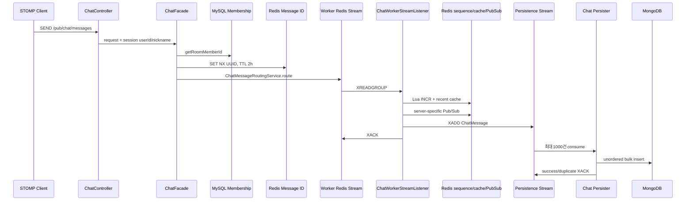
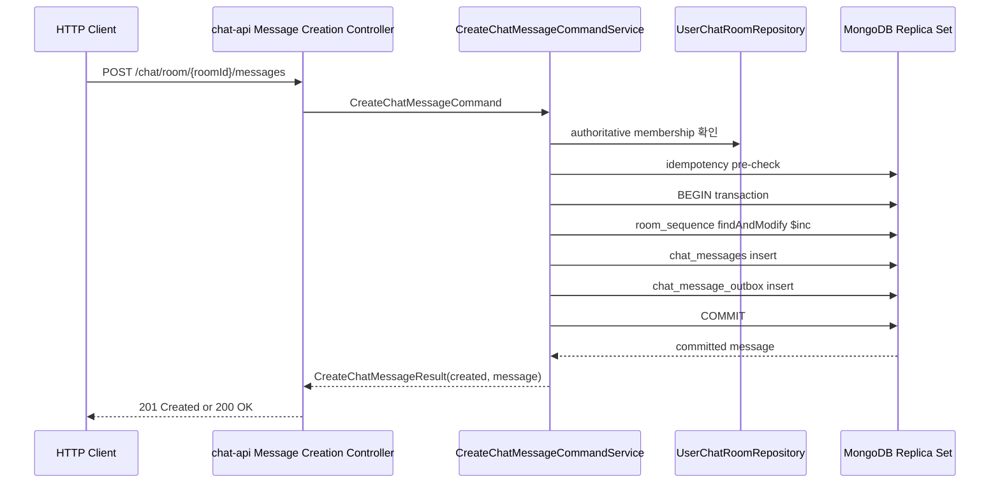

# TASK-004: Chat Message Persistence-First

## Status

- 상태: Completed
- 유형: 메시지 command 영속성·트랜잭션 경계 전환
- 선행 Task: `TASK-001-chat-connection-boundary`, `TASK-002-chat-api-boundary`, `TASK-003-chat-dispatcher-boundary`
- 기준 문서: `docs/architecture/current-chat.md`, `docs/architecture/target-chat.md`, `docs/invariants.md`
- 구현 원칙: TASK-004는 새 HTTP message creation API, transaction-capable single-node MongoDB replica set, 해당 API의 transaction correctness/concurrency/performance 검증에만 집중한다. 기존 STOMP/Redis worker/realtime/persister path는 수정하거나 새 API에 연결하지 않으며 Kafka와 Outbox Relay는 구현하지 않는다.
- 구현 상태: production code와 필수 correctness/concurrency/performance test 구현 및 실행 완료. Review와 Test가 승인되어 완료 처리한다.

## Goal

`chat-api`에 새로운 HTTP message creation API와 protocol-independent command boundary를 추가한다.

```text
Client
↓
HTTP Message Creation API
↓
CreateChatMessageCommandService
↓
MongoDB Transaction
├─ room_sequence atomic increment
├─ chat_messages insert
└─ chat_message_outbox MessageCreated insert
↓
COMMIT
↓
HTTP Success Response
```

API의 성공 응답은 `RoomSequence + ChatMessage + MessageCreated Outbox`가 모두 commit됐거나, 동일 idempotency key의 기존 committed 결과가 확인됐다는 의미다. Kafka 발행, WebSocket 전달, Redis Pub/Sub, worker 또는 persister 처리 여부는 성공 조건이 아니다.

`CreateChatMessageCommandService`는 STOMP, WebSocket, Redis Pub/Sub와 worker routing을 알지 않는다. 기존 STOMP SEND path를 대체하거나 연결하지 않으며, TASK-004 완료를 legacy/new writer의 production cutover 또는 안전한 coexistence 완료로 해석하지 않는다.

완료 후 보장은 다음과 같다.

- 성공한 메시지는 command 완료 시점에 MongoDB에 존재한다.
- `ChatMessage`와 `MessageCreated` Outbox는 항상 함께 commit되거나 함께 rollback된다.
- transaction 실패 시 room counter 증가, message, outbox가 모두 rollback된다.
- `roomSequence`는 room 단위 canonical ordering이며 global ordering은 보장하지 않는다.
- 동일 `(roomId, senderId, clientMessageId)` 재시도는 하나의 durable message와 하나의 outbox로 수렴한다.
- `messageId`는 identity, `clientMessageId`는 idempotency, `roomSequence`는 ordering만 담당한다.
- Kafka 발행과 WebSocket 수신은 command 성공 조건이 아니다.

## Current Flow

실제 production code의 현재 SEND 경로는 다음과 같다.



현재 성공한 `ChatFacade.sendMessage()`는 worker Stream `XADD`까지 완료됐다는 의미일 뿐 MongoDB 저장 완료를 뜻하지 않는다. worker는 realtime publish 후 persistence Stream을 발행하며, persister가 나중에 MongoDB에 저장한다.

## Target Flow

TASK-004의 target flow는 HTTP request부터 MongoDB commit과 HTTP response까지다.



HTTP response는 MongoDB authoritative state만 표현한다. outbox를 실제 broker에 발행하거나 realtime delivery를 시도하지 않는다.

## Design Decisions

### 1. HTTP API contract

현재 chat REST convention과 기존 message query URI를 따라 다음 계약을 사용한다.

- endpoint: `POST /chat/room/{roomId}/messages`
- authentication: 기존 `@Auth Authentication`; `senderId`는 `authentication.getDetails()`에서 얻고 request body를 신뢰하지 않는다.
- request body: `clientMessageId`(`@NotBlank`, 최대 36자), `messageBlocks`. `roomId`는 path variable로 한 번만 받는다.
- initial create: 실제 HTTP `201 Created`와 `ApiResponse<CreateChatMessageResponse>`
- idempotent existing result: 실제 HTTP `200 OK`와 동일 response type
- response data: 최소 `messageId`, `roomId`, `messageSequence`, `clientMessageId`, `createdAt`
- failure: validation/membership/transaction 실패는 기존 `GlobalExceptionHandler`/`ErrorResponse` convention을 사용하며 2xx를 반환하지 않는다.

body의 `status` 값만 201로 두고 실제 HTTP status가 200인 현재 일부 controller 패턴에 기대지 않는다. 생성 여부에 맞는 `ResponseEntity` status와 response envelope status를 일치시킨다.

### 2. Application boundary

- `chat-api`에 HTTP controller, `CreateChatMessageRequest/Response`, transport-neutral `CreateChatMessageCommand/Result`와 `CreateChatMessageCommandService`를 추가한다.
- HTTP controller는 인증/request mapping과 HTTP status 변환만 담당한다.
- command service는 기존 `UserChatRoomRepository`, concrete `ChatMessageCommandRepository`, Mongo 전용 `TransactionTemplate`에만 의존한다. 1:1 custom port/adapter를 추가하지 않으며 STOMP/WebSocket type, Redis template/Pub/Sub, `ChatMessageRoutingService`, worker DTO를 import하거나 호출하지 않는다.
- membership은 Mongo transaction 전에 기존 authoritative MySQL source로 확인한다. 두 저장소를 하나의 분산 transaction으로 취급하지 않는다.
- 기존 `ChatController`, `ChatFacade`, `ChatService`, `ChatServerMessageIdService`, `ChatMessageRoutingService`, worker와 persister production code는 TASK-004에서 수정·이동·삭제하지 않는다.
- `chat-api`는 현재 library이고 `chat-connection` executable이 이를 runtime에 포함하므로 새 HTTP controller는 기존 `chat` profile web process에서 노출된다. 별도 executable/service는 만들지 않는다.

### 3. 식별자 책임

| 값 | 책임 | 최종 근거 |
|---|---|---|
| `messageId` | durable message identity | 최초 message 생성 시 서버가 만든 UUID와 MongoDB `_id` |
| `clientMessageId` | client retry idempotency | `(roomId, senderId, clientMessageId)` unique index |
| `roomSequence` | room 단위 canonical ordering | MongoDB `room_sequence` counter와 `ChatMessage.messageSequence` |

새 HTTP path는 현재 STOMP path의 `ChatServerMessageIdService`를 호출하지 않는다. MongoDB unique constraint와 durable message 조회를 최종 근거로 사용하며 legacy Redis ID key의 동작은 변경하지 않는다.

### 4. 기존 데이터 계약의 최소 변경

- 현재 `ChatMessage.messageSequence` 필드명과 `(roomId, messageSequence)` unique partial index는 유지한다. 문서와 코드에서 의미를 `roomSequence`로 명확히 하되 API/DTO rename은 이번 Task에 포함하지 않는다.
- `createdAt`은 worker Redis Stream ID에서 만들지 않고 최초 command 시 한 번 생성해 message와 outbox payload에 동일 값으로 저장한다. 기존 response의 문자열 계약을 바꾸지 않는 범위에서 UTC 기준 생성 규칙을 한 곳으로 모은다.
- HTTP response는 MongoDB에 저장된 `messageId`, `messageSequence`, `clientMessageId`, `createdAt`을 그대로 반환한다.

## Transaction Boundary

### 현재 배포 전제

저장소의 `compose.yml`은 `mongo:8.0.28`을 replica set 옵션 없이 단일 `mongod`로 실행한다. `application.yml`은 host/port만 설정하고 database 및 replica set 이름을 명시하지 않는다. production source 검색 결과 `MongoTransactionManager`, `ReactiveMongoTransactionManager`, `TransactionTemplate` 기반 Mongo transaction 설정은 없다. 현재 repository-defined deployment에서는 multi-document transaction을 사용할 수 없다.

따라서 다음은 TASK-004 구현의 선행 조건이자 In Scope다.

1. Compose MongoDB를 single-node replica set으로 실행하고 idempotent 초기화 절차를 추가한다.
2. healthcheck가 단순 `ping`뿐 아니라 writable primary 준비 상태를 확인하게 한다.
3. database 이름과 replica set 이름을 애플리케이션 설정/환경 변수에 명시한다.
4. `MongoTransactionManager` bean을 등록하고 persistence-first service가 명시적으로 이 transaction manager를 사용하게 한다. 기존 JPA transaction manager와 암묵적으로 혼용하지 않는다.
5. integration test와 runtime smoke에서 `hello`/replica set 상태와 실제 commit/rollback을 확인한다.

이 구성은 transaction을 활성화하기 위한 최소 개발/테스트 topology다. secondary 추가, failover/election 검증과 HA 테스트는 TASK-004에 포함하지 않는다.

repository 밖의 실제 운영 MongoDB topology는 이 저장소만으로 확인할 수 없다. 구현 배포 전 운영 환경도 replica set 또는 sharded cluster transaction 요구사항을 충족하는지 별도로 확인해야 한다.

### 원자적 작업

하나의 Mongo transaction attempt 안에서 다음 순서를 수행한다.

1. `room_sequence`의 room document를 atomic increment하고 증가된 값을 받는다.
2. 그 sequence와 새 `messageId`를 가진 `ChatMessage`를 insert한다.
3. 동일 message를 가리키는 `MessageCreated` Outbox를 insert한다.
4. commit한다.

repository `save()`의 upsert 의미에 기대지 않고 신규 message/outbox는 insert semantics를 사용한다. Mongo retry는 error label별로 다음처럼 구분한다.

- `TransientTransactionError`: 같은 room counter contention 등 실제 transaction conflict를 대상으로 bounded whole-transaction retry를 수행한다. sequence increment, message insert, outbox insert 전체를 새 transaction으로 다시 실행하며 retry 횟수는 제한하고 retry count/소진을 기록한다.
- `UnknownTransactionCommitResult`: transaction body를 blind retry하지 않는다. 가능한 범위에서 `(roomId, senderId, clientMessageId)`로 durable message/outbox를 조회해 이미 commit된 결과를 확인한다. durable 결과가 확인되면 그 결과를 반환하고, 확인되지 않으면 성공으로 가장하지 않고 non-2xx/error로 처리한다. 정교한 commit retry, session recovery, network/commit uncertainty 처리는 follow-up reliability Task에서 다룬다.

duplicate key race는 위 두 label과 별도로 처리한다. loser transaction을 abort한 뒤 durable idempotency key로 winner 결과를 조회한다. 한 transaction의 일부 write만 독립 재시도하지 않는다.

## RoomSequence

- collection: `room_sequence`
- document cardinality: room당 1개
- `_id`: `roomId`
- counter field: `sequence`
- 새 room의 최초 committed message sequence: `1`
- allocation: transaction 내부 `findAndModify({ _id: roomId }, { $inc: { sequence: 1 } }, upsert=true, returnNew=true)` 후보

같은 room의 write는 counter document에서 경합하고, 서로 다른 room은 서로 다른 counter document를 갱신한다. 같은 room transaction의 충돌은 전체 transaction retry 대상으로 처리한다. rollback된 attempt의 counter 증가는 message/outbox와 함께 rollback되어야 한다.

`roomSequence`는 room 내부 정렬만 제공한다. 서로 다른 room 간 sequence 비교, transaction commit의 global order, realtime 도착 순서는 보장하지 않는다.

TASK-004의 correctness/concurrency test는 legacy writer가 사용하지 않는 격리된 room을 사용한다. 기존 room history에 counter를 seed하는 migration과 Redis/Mongo 두 writer의 동시 사용 정책은 이번 범위가 아니며, 해당 follow-up 전에는 새 HTTP API를 legacy-active room의 production traffic에 개방할 수 있다고 주장하지 않는다.

## Idempotency

durable idempotency key는 기존 unique index와 동일한 `(roomId, senderId, clientMessageId)`다.

처리 규칙은 다음과 같다.

1. transaction 시작 전 같은 key의 message를 조회한다.
2. 존재하면 sequence/messageId/outbox를 새로 만들지 않고 기존 durable message를 `created=false` 결과로 반환한다.
3. pre-check에서 없으면 transaction으로 sequence/message/outbox를 생성한다.
4. 동시 요청으로 unique key 충돌이 발생하면 loser transaction 전체를 abort하고 winner의 durable message/outbox를 bounded 조회로 확인해 같은 결과로 수렴한다.

동일 retry는 새 sequence, 새 messageId 또는 새 outbox를 만들지 않는다. commit 성공 후 응답 유실도 같은 clientMessageId 재요청으로 기존 durable message를 확정할 수 있어야 한다.

TASK-004에서는 request fingerprint를 추가하거나 기존 document를 backfill하지 않는다. 동일 idempotency key에 다른 payload가 들어온 경우에도 두 번째 durable message를 만들지 않는 것까지만 보장한다. payload mismatch 탐지, 응답/Conflict semantics와 fingerprint 도입 여부는 Open Question이며 follow-up으로 남긴다.

## Outbox

TASK-004는 outbox record 생성까지만 구현한다. relay, Kafka producer/consumer와 published 상태 전이는 포함하지 않는다.

권고 collection은 `chat_message_outbox`이며 최소 필드는 다음과 같다.

- `_id` / `eventId`: event identity
- `eventType`: `MessageCreated`
- `schemaVersion`
- `messageId` (unique)
- `roomId`
- `roomSequence`
- `senderId`, `roomMemberId`, `clientMessageId`
- `messageBlocks`를 포함해 후속 relay가 DB 재조회 없이 발행할 수 있는 immutable event payload
- `messageCreatedAt`, `occurredAt`
- relay용 상태/시각 필드의 초기값(`publishedAt = null` 등). claim/retry 정책은 후속 Task에서 확정

message 한 건에는 outbox 한 건만 대응하도록 `messageId` unique index를 둔다. acceptance test는 key만 비교하지 않고 message identity, room, sequence, payload, createdAt의 대응까지 검증한다. outbox cleanup/retention index와 relay polling index는 후속 Relay 설계에서 실제 query를 기준으로 확정한다.

## In Scope

- `chat-api`의 `POST /chat/room/{roomId}/messages` HTTP API와 request/response DTO
- `CreateChatMessageCommand`, `CreateChatMessageResult`, `CreateChatMessageCommandService`
- authoritative membership의 transaction 이전 확인
- MongoDB single-node replica set 개발 배포 구성과 명시적 database/replica set 설정
- Spring `MongoTransactionManager`, `TransientTransactionError` bounded retry/metric 경계, `UnknownTransactionCommitResult`의 보수적 결과 처리
- `room_sequence` document/repository 또는 `MongoTemplate` atomic increment adapter
- transaction 내부 RoomSequence increment + Message insert + MessageCreated Outbox insert
- DB unique index 기반 durable idempotency와 concurrent duplicate 수렴
- HTTP success/failure와 commit/rollback을 검증하는 API/integration test
- same-key 및 same-room/different-room concurrency test
- RoomSequence 포함 전후 A/B transaction performance test

## Out of Scope

- Kafka 도입
- Outbox Relay 구현 또는 outbox publish/claim/retry/cleanup 동작
- Kafka consumer
- 기존 `ChatController`의 chat-connection 이동
- `LegacyRealtimeCompatibilityBridge` 또는 HTTP-to-realtime 연결
- committed worker payload와 worker sequence/cache 분기
- Redis Pub/Sub realtime 변경
- 새 HTTP message의 persistence Stream 차단 또는 persister 변경/제거
- realtime regression test와 STOMP E2E test
- legacy writer/new writer production cutover 또는 coexistence 완성
- 기존 room의 room sequence migration/seed와 rollback 전환 절차
- Redis worker Stream 전면 제거
- worker hash ring 제거
- dispatcher redesign 또는 fan-out 알고리즘 개선
- session sequence
- client polling/catch-up 구현
- STOMP SEND 제거
- request fingerprint 및 기존 message fingerprint backfill
- same idempotency key + different payload의 상세 conflict/response 계약
- Redis Pub/Sub fan-out 전략 변경
- persister/Redis persistence Stream source와 group의 즉시 삭제
- 정교한 `UnknownTransactionCommitResult` commit retry, session recovery, network/commit uncertainty 복구
- MSA/gRPC
- unrelated refactor

## Implementation Plan

1. **Mongo transaction 기반 마련**
   - Compose MongoDB를 idempotently initialized single-node replica set으로 바꾸고 writable primary healthcheck를 구성한다.
   - Mongo database/replica set 환경 변수를 명시하고 `MongoTransactionManager`를 등록한다.
   - JPA transaction manager와 Mongo transaction manager의 선택이 코드에서 명시적인지 context test로 확인한다.

2. **Schema와 index 추가**
   - `RoomSequence` document와 atomic increment adapter를 추가한다.
   - `MessageCreatedOutbox` document/repository와 messageId unique index를 추가한다.
   - 기존 `ChatMessage`의 idempotency/sequence index와 query 계약을 유지하고 transaction insert에 필요한 생성 메타데이터만 정리한다. fingerprint는 추가하지 않는다.
   - auto-index-creation에만 기대지 않고 runtime/index 검증 절차를 둔다.

3. **Protocol-independent command boundary 구현**
   - `chat-api`에 `CreateChatMessageCommandService`와 transport-neutral command/result를 추가한다.
   - service는 authoritative membership의 최소 contract를 호출한 뒤 idempotency pre-check와 Mongo transaction을 수행한다.
   - `TransientTransactionError`에는 제한된 whole-transaction retry를 적용하고 retry count/소진을 기록한다.
   - `UnknownTransactionCommitResult`에서는 transaction body를 blind retry하지 않는다. 가능한 durable idempotency 결과 조회로 commit을 확인하고, 결과를 확정하지 못하면 non-2xx/error로 처리한다. commit retry/session recovery/network uncertainty 복구는 구현하지 않는다.
   - Redis/STOMP/worker type이 command service dependency에 들어오지 않는지 정적 검증한다.

4. **HTTP adapter 구현**
   - `chat-api`에 `POST /chat/room/{roomId}/messages` controller와 request/response DTO를 추가한다.
   - `@Auth Authentication`에서 sender identity를 얻고 controller는 command/result와 `201 Created`/`200 OK`를 mapping한다.
   - response status와 `ApiResponse` envelope status를 일치시키고 transaction/membership 실패는 기존 exception response convention을 따른다.

5. **Correctness/concurrency/performance 검증**
   - 아래 Test Plan과 Performance Test Plan을 수행한다.
   - transaction test는 single-node replica set과 legacy writer가 사용하지 않는 격리 room에서 실행한다.
   - production debug endpoint나 test-only production branch를 추가하지 않는다.

6. **문서 갱신**
   - 구현 완료 시 `current-chat.md`, 관련 invariant 적용 상태, Work Log와 `ACTIVE.md`를 실제 결과로 갱신한다.

## Acceptance Criteria

- repository-defined MongoDB deployment가 multi-document transaction을 실제 지원하고 Spring이 명시적 Mongo transaction manager를 사용한다.
- `POST /chat/room/{roomId}/messages`가 기존 auth/response convention으로 노출되고 request의 roomId가 아니라 path/auth context를 신뢰한다.
- 최초 command 성공 시 정확히 하나의 room counter 증가, `ChatMessage`, `MessageCreatedOutbox`가 같은 transaction으로 commit된다.
- sequence/message/outbox 사이 어느 단계에서 실패해도 세 변경이 모두 rollback되고 성공으로 처리되지 않는다.
- 동일 idempotency key의 순차·동시 retry는 같은 messageId/roomSequence를 반환하며 durable message/outbox는 각각 한 건이다.
- 동일 key/different payload도 두 번째 durable message/outbox를 만들지 않는다. mismatch 탐지와 상세 conflict semantics는 TASK-004 완료 조건이 아니다.
- 같은 room의 성공 메시지는 unique하고 단조 증가하는 canonical sequence를 가지며 rollback/idempotent retry가 영구 gap을 만들지 않는다.
- 서로 다른 room은 독립 counter를 사용하고 global ordering을 표방하지 않는다.
- 모든 committed message에 정확히 하나의 내용상 대응하는 outbox가 있고 orphan message/outbox가 없다.
- Redis message ID TTL과 Redis room sequence는 새 command의 correctness 근거가 아니다.
- 최초 생성 HTTP `201 Created` 직후 MongoDB에서 response의 Message와 Outbox를 조회할 수 있다.
- idempotent retry는 HTTP `200 OK`로 기존 durable message를 반환하고 sequence/message/outbox를 추가 생성하지 않는다.
- transaction/membership/validation 실패는 non-2xx이며 counter/message/outbox partial state가 없다.
- `TransientTransactionError`는 제한된 whole-transaction retry로 처리하며 retry 횟수는 무한하지 않다.
- `UnknownTransactionCommitResult`에서 transaction body를 blind retry하거나 결과 불명확 상태를 성공으로 응답하지 않는다. durable 결과를 확인할 수 없으면 non-2xx/error를 반환한다.
- `CreateChatMessageCommandService`의 production dependency/import에 STOMP, WebSocket, Redis Pub/Sub/template, `ChatMessageRoutingService`와 worker DTO가 없다.
- 기존 STOMP/worker/Redis Pub/Sub/persistence Stream/persister production code와 test는 변경되지 않는다.
- TASK-004 완료 문서가 legacy/new path의 production cutover, coexistence 또는 realtime 전달을 완료했다고 주장하지 않는다.
- Kafka/Relay/consumer, worker Stream/hash ring 제거, client catch-up, request fingerprint 작업이 diff에 포함되지 않는다.

## Test Plan

### API / component

- `POST /chat/room/{roomId}/messages`가 authenticated sender와 request를 command로 mapping하는지 검증한다.
- validation과 비회원 요청이 non-2xx이고 command/transaction이 실행되지 않는지 검증한다.
- command service에 STOMP/Redis/worker routing dependency가 없음을 정적 경계 test로 확인한다.

### 필수 Mongo replica-set integration

다음 integration test는 single-node replica set과 legacy writer가 사용하지 않는 격리 room에서 실행한다. failure 재현에는 test fixture, controllable ID generator 또는 index conflict를 사용하며 production debug endpoint나 test-only production branch를 추가하지 않는다.

1. **정상 생성**
   - HTTP `201 Created`를 반환한다.
   - RoomSequence가 증가하고 `ChatMessage` 1건과 `MessageCreated` Outbox 1건이 생성된다.
   - 세 결과가 하나의 transaction으로 함께 commit됐음을 별도 Mongo 조회로 확인한다.
2. **transaction 실패**
   - Message 또는 Outbox 저장을 실패시킨다.
   - HTTP는 non-2xx를 반환한다.
   - counter, message, outbox 어느 것도 partial state로 남지 않는다.
3. **동일 `clientMessageId` 순차 retry**
   - 기존 durable message를 반환하며 HTTP `200 OK`를 반환한다.
   - 새 sequence, message, outbox를 만들지 않는다.
4. **동일 `clientMessageId` 동시 요청**
   - barrier로 동시에 시작한 요청이 하나의 durable message와 하나의 outbox로 수렴한다.
5. **동일 room의 동시 메시지 생성**
   - 성공한 메시지의 roomSequence가 중복되지 않는다.
   - 성공 메시지를 기준으로 canonical sequence가 일관되고 연속 범위인지 확인한다.
6. **서로 다른 room 동시 생성**
   - room별 counter가 독립적으로 증가한다.
   - room 사이의 global ordering이나 불필요한 cross-room conflict를 전제하지 않는다.
7. **HTTP 성공 응답 직후 durable visibility**
   - HTTP `201 Created` 직후 별도 Mongo probe에서 response의 Message와 Outbox를 조회할 수 있다.

동일 key/different payload는 두 번째 durable message/outbox가 생성되지 않는지만 위 idempotency test에서 확인하며, payload mismatch의 상세 conflict status나 payload 비교는 assertion하지 않는다.

### Retry policy와 optional / follow-up reliability test

Mongo retry 구현 정책은 production 설계에 유지한다.

- `TransientTransactionError`: bounded whole-transaction retry
- `UnknownTransactionCommitResult`: transaction body blind retry 금지; 가능한 durable idempotency 결과 확인, 미확정 시 non-2xx/error

필수 integration test는 앞 절의 correctness/concurrency 항목으로 유지한다. `TransientTransactionError`의 bounded whole-transaction retry와 retry exhaustion은 구현 난이도가 크지 않은 unit/component test 또는 단순 fixture로 검증할 수 있는 범위에서 수행한다. `UnknownTransactionCommitResult` 강제 주입, 실제 network/commit uncertainty 재현, commit retry/session recovery의 retry semantics 검증은 TASK-004 필수 test에 포함하지 않으며 optional 또는 follow-up reliability test로 남긴다.

Realtime/WebSocket/Redis Pub/Sub/worker/persister regression과 STOMP E2E는 TASK-004에서 실행하거나 수정하지 않는다.

## Performance Test Plan

### 비교 대상

- **A — Message + Outbox transaction**: 성능 비교 전용 variant에서 room counter update 없이 message와 outbox만 같은 transaction으로 저장한다.
- **B — RoomSequence + Message + Outbox transaction**: TASK-004 production 경로다.

A는 제품 대안이나 production feature flag로 남기지 않는다. 동일 schema/payload/index/write concern을 사용하고 counter operation 유무만 다르게 한 test-only benchmark fixture로 비교한다.

### 도구와 실행 위치

현재 저장소에는 별도 Gatling/k6가 없고 `../chat-test-client`에 JUnit 5 기반 성능 scenario, Mongo sync driver, Docker process controller와 environment property 패턴이 이미 있다. 가장 단순한 방법은 이 module에 별도 tag/Gradle task(예: `messageCommandTransactionPerformanceTest`)를 추가하고 concurrency 크기의 executor로 동시 command load를 생성하는 것이다.

benchmark는 realtime/WebSocket을 완전히 제외하고 transaction boundary의 commit latency를 측정한다. A/B를 위해 production endpoint나 feature flag를 추가하지 않고, test source의 동일 harness에서 schema/payload/index/write concern을 같게 유지한 채 counter operation 유무만 바꾼다. HTTP API latency는 별도 correctness 대상이며 RoomSequence 비용 A/B 수치에 섞지 않는다.

### 부하 패턴

각 A/B variant에 동일한 warm-up, payload 크기, 총 요청 수, concurrency, database/index 상태와 replica-set write concern을 적용한다.

1. **Single hot room**
   - 모든 요청을 하나의 room에 보낸다.
   - concurrency를 단계적으로 증가시켜 counter document contention과 transaction retry 포화점을 찾는다.
2. **Multiple distributed rooms**
   - 동일 요청 수를 충분한 room에 균등 분배한다.
   - hot-room 결과와 비교해 room counter contention과 Mongo 공통 비용을 분리한다.

최소 1회 warm-up 후 각 조합을 여러 번 반복하고 median run과 분산을 함께 기록한다. A와 B의 실행 순서를 교차해 cache/열 상태에 따른 편향을 줄인다.

### 측정값

- committed throughput(messages/sec)
- end-to-end transaction latency p50 / p95 / p99
- error rate
- transaction conflict count / transaction retry count

Mongo CPU, I/O, operation latency와 WiredTiger 내부 지표는 필수 비교값이 아니라 이상 현상이 있을 때만 수집하는 optional 원인 분석 metric으로 둔다.

성능 acceptance threshold는 측정 전에 임의로 정하지 않는다. 결과로 A 대비 B의 hot-room 비용과 distributed-room 비용을 수치화하고, 허용 가능한 contention 한계를 후속 ADR 또는 sequence 재검토 Task의 입력으로 남긴다.

## Related Invariants

- **INV-001 재시도 수렴**: DB unique constraint와 duplicate race 처리로 동일 key의 durable history가 하나의 logical message로 수렴한다. 다만 INV-001의 same-key/different-payload 비수락 세부 계약은 fingerprint/conflict follow-up 전까지 미완료 상태로 명시한다.
- **INV-002 Durable/ephemeral authority 구분**: MongoDB message/sequence/outbox가 최종 근거다. Redis ID/sequence/cache/Stream은 correctness authority가 아니다.
- **INV-003 authoritative membership 인가**: 기존 MySQL `UserChatRoomRepository` 기반 membership 확인을 command보다 먼저 유지한다.
- **INV-004 Realtime Push best-effort**: 새 HTTP API는 realtime Push를 수행하지 않는다. 기존 STOMP/Redis Push path의 동작과 보장은 TASK-004에서 변경하거나 검증하지 않는다.
- **INV-005 Ordering 범위**: DB roomSequence가 room 내부 canonical ordering이며 Push 도착 순서나 global order를 뜻하지 않는다.
- **INV-006 수락 성공은 authoritative persistence 완료**: TASK-004에서 활성화한다.
- **INV-007 Message와 publication obligation 원자성**: TASK-004에서 MessageCreated Outbox와 함께 활성화한다.
- **INV-008 Committed event retry**: Outbox record는 생성하지만 relay가 Out of Scope이므로 재시도/발행 보장은 후속 Task에서 활성화한다.
- **INV-009 client authoritative catch-up**: 아직 활성화하지 않는다.
- **INV-010~011 subscription/session**: 변경하지 않는다.
- **INV-012 Partial failure**: HTTP command의 counter/message/outbox transaction 범위에 활성화한다. realtime delivery는 이 command의 실행 단계가 아니다.

## Findings

아래 1~15는 구현 전 baseline 분석에서 발견한 사항이다. 구현 후 달라진 repository-defined Mongo topology, HTTP command 및 index 상태는 Work Log의 구현 결과를 기준으로 읽는다.

1. `ChatController.sendMessage()`는 현재 물리적으로 `chat-api`에 있으며 STOMP session의 `userId`/`nickname`을 받아 `ChatFacade.sendMessage()`를 호출하는 void adapter다. HTTP command success contract는 아직 없다. 이 controller의 이동 또는 수정은 TASK-004 범위가 아니다.
2. `ChatFacade.sendMessage()`는 membership 확인 후 Redis 기반 `ChatServerMessageIdService.getOrCreate()`를 호출하고 곧바로 root의 `ChatMessageRoutingService.route()`를 실행한다. production caller는 현재 `ChatController`이며 MongoDB 호출은 없다. `ChatFacade`의 나머지 method는 room/query API에서 계속 사용된다.
3. `ChatServerMessageIdService`는 `(roomId, userId, clientMessageId)` Redis key에 UUID를 `SET NX`, TTL 2시간으로 저장한다. payload conflict를 확인하지 않으며 TTL 이후에는 같은 logical request에 새 messageId가 가능하다.
4. `ChatMessageRoutingService`는 local worker hash ring으로 worker-specific Redis Stream을 선택해 `ChatMessageDto`를 `XADD`한다. 이 시점의 message는 durable DB event가 아니다.
5. `ChatWorkerStreamListener`는 Redis Stream ID timestamp로 `createdAt`을 만들고, Redis Lua sequence/cache, realtime Pub/Sub, persistence Stream 발행 후 input을 ACK한다. MongoDB 저장 완료를 기다리지 않는다.
6. `ChatMessageSequenceGenerator`는 `ChatRecentMessageCacheService.generateSequenceAndCache()`에 위임한다. Lua는 recent ZSET의 같은 messageId를 확인한 뒤 room Redis counter `INCR`, ZSET/HASH cache write를 한 번에 수행한다. Redis sequence와 recent cache write가 결합돼 있다.
7. `ChatMessage`는 MongoDB `chat_messages` document이며 `_id=messageId`, `(roomId, senderId, clientMessageId)` unique index와 `(roomId, messageSequence)` unique partial index가 선언돼 있다. repository에는 idempotency key 조회 메서드가 아직 없다.
8. `ChatMessagePersistenceService`는 `chat-message-batch:stream`을 최대 1000건 읽어 unordered bulk insert한다. duplicate key는 성공처럼 ACK하고 non-duplicate bulk error만 pending으로 남긴다.
9. persistence Stream pending은 30초 scheduler가 최대 100건 검사한다. delivery count 5 이상 record는 실제 DLQ 보관 없이 claim 후 ACK하는 현재 risk가 있다.
10. repository-defined MongoDB는 replica set 없는 standalone이고 Spring Mongo transaction 설정이 없다. TASK-004 transaction을 현재 상태에 바로 적용할 수 없다.
11. `spring.data.mongodb`에는 database 이름이 명시되지 않는다. 기존 `chat-test-client` Mongo probe는 기본값 `test`를 사용하지만 운영 database 선택은 repository만으로 확정되지 않는다.
12. Redis room sequence가 만료·초기화된 장기 유지 room에서 기존 Mongo `(roomId, messageSequence)` unique index와 충돌해 persister가 새 message를 duplicate로 ACK한 사례가 TASK-002/003 smoke에서 이미 관측됐다. 따라서 기존 room에 새 HTTP writer를 개방하기 전 DB counter seed와 writer cutover/coexistence 정책이 필요하지만, 그 migration은 TASK-004 범위가 아니다.
13. `MongoIndexConfiguration`은 현재 빈 class이고 index는 document annotation과 `auto-index-creation: true`에 의존한다.
14. 현재 `chat-test-client`에는 JUnit 기반 persistence performance scenarios와 Mongo/Redis/Docker probe가 있어 새 부하 프레임워크 없이 TASK-004 A/B benchmark를 추가할 수 있다. 기존 performance test는 batch throughput 중심이므로 p50/p95/p99와 transaction conflict/retry 측정은 새로 필요하다.
15. 분석 시점 worktree에는 TASK-004와 무관한 기존 수정/미추적 파일이 있다. 구현자는 이를 덮어쓰거나 정리하지 않아야 한다.

## Remaining Risks

1. repository 밖 운영 MongoDB가 transaction-capable topology인지 확인되지 않았다. Compose 전환만으로 운영 전제가 충족됐다고 판단할 수 없다.
2. single hot room은 하나의 counter document에 write가 집중된다. A/B 측정(500건, concurrency 8, maxAttempts 50)의 median run에서 A 467.8 msg/s 대비 B 135.6 msg/s, B p95 157.14ms, conflict/retry 2,004회를 기록했다. production `maxAttempts=5` 보충 측정에서는 100/500/1000건 대표 실행의 failure/exhaustion이 각각 35/160/342건(35.0%/32.0%/34.2%)이었다. request 증가에 따라 conflict/retry 총량은 283/248에서 2,765/2,423으로 증가했지만 error rate는 약 32~35%에서 유지됐고 throughput 및 p95/p99는 run variance가 컸다. 이 local single-node 결과는 절대 용량이 아니라 production 기본값에서 실제 non-2xx가 발생한다는 contention 신호로 사용한다. counter sharding, retry tuning, maxAttempts 변경 또는 sequence 제거는 이번 작업에서 하지 않고 후속 판단으로 남긴다.
3. single-node replica set은 multi-document transaction 활성화를 위한 개발/검증 topology일 뿐 고가용성 구성이 아니다. secondary failover, election 내구성과 운영 HA 검증은 제공하지 않는다.
4. relay가 없으므로 TASK-004 직후 outbox는 계속 누적되고 새 HTTP 메시지는 realtime으로 전달되지 않는다. HTTP API를 실제 사용자 traffic에 개방하기 전 relay/realtime 전달과 backlog 운영 정책이 필요하다.
5. legacy/new writer가 같은 production room에서 동시에 sequence를 만들면 Redis와 Mongo counter가 분기하고 unique collision 또는 ordering 오류가 발생할 수 있다. TASK-004는 격리 room에서만 correctness를 검증하며 coordinated migration 전 coexistence 안전성을 주장하지 않는다.
6. membership authorization과 Mongo commit은 하나의 atomic transaction이 아니므로 두 시점 사이 membership 변경 race가 존재한다. TASK-004에서는 MySQL + Mongo distributed transaction을 도입하지 않고 기존 authorization semantics를 유지한다.
7. Mongo transaction commit 결과가 불명확한 경우 body를 blind retry하면 duplicate allocation 또는 거짓 실패를 만들 수 있다. TASK-004는 durable idempotency 결과 확인이 가능한 범위까지만 처리하며, 결과를 확정하지 못하면 non-2xx/error로 남긴다. commit retry/session recovery/network uncertainty의 정교한 recovery는 후속 reliability Task가 필요하다.
8. request fingerprint를 도입하지 않으므로 동일 key/different payload를 탐지하거나 어떤 conflict를 반환할지는 해결되지 않는다. TASK-004는 두 번째 durable message가 생기지 않는 것만 보장한다.
9. 기존 query recent cache는 빈 결과의 coverage를 증명하지 못한다. 새 HTTP API가 realtime/catch-up에 연결되지 않으므로 사용자 화면 전달과 누락 복구는 별도 follow-up 없이는 제공되지 않는다.

## Follow-up Tasks

1. **Legacy/new writer migration**: 기존 room의 DB counter seed, Redis/Mongo writer coexistence 금지 또는 전환 순서, rollback과 API traffic 개방 조건을 설계한다.
2. **Outbox Relay -> Kafka**: unpublished outbox claim/lease, roomSequence 발행 순서, broker ack, retry/backoff, published marking, backlog alert/retention을 구현한다.
3. **Kafka consumer 기반 realtime dispatcher**: `roomId` key, at-least-once consume, duplicate Push 허용, retry/DLQ를 도입하고 새 durable message를 realtime path에 연결한다.
4. **Legacy persistence path 제거**: migration 이후 old payload drain을 확인하고 worker sequence/batch, `chat-message-batch:stream`, chat-persister와 Redis server message ID key의 제거 계획을 수행한다.
5. **DB catch-up/client merge**: authoritative cursor 조회, reconnect/gap recovery와 `messageId` merge를 구현한다.
6. **Idempotency payload conflict semantics**: same key/different payload 탐지, conflict response와 필요 시 request fingerprint/canonicalization을 별도 결정한다.
7. **Membership/domain boundary 정리**: command가 직접 사용하는 기존 `UserChatRoomRepository` membership query의 장기 module ownership을 room/list/join 책임과 함께 검토한다.
8. **RoomSequence contention decision**: TASK-004 A/B 측정 결과를 바탕으로 counter 유지 한계, 최적화 또는 opaque cursor 전환 여부를 ADR로 결정한다.
9. **Commit uncertainty reliability**: `UnknownTransactionCommitResult`의 commit retry, session recovery, 실제 network/commit uncertainty 재현과 recovery semantics를 설계·검증한다.

## Work Summary

### Implementation

- 별도 HTTP command가 MySQL membership 확인 후 Mongo transaction에서 room sequence, message, outbox를 함께 기록한다.
- single-node replica set 구성, 명시적 Mongo transaction manager/index 초기화, correctness/concurrency/performance test가 추가됐다.
- Mongo database 기본값은 기존 Spring Boot 암묵 기본값인 `test`를 명시적으로 유지해 기존 compose volume의 history reader/persister와 분리되지 않게 했다.
- `UnknownTransactionCommitResult` durable 복구는 현재 attempt의 `messageId`와 조회 결과를 비교해 해당 attempt commit이면 `created=true`(HTTP 201), 선행/경합 결과면 `created=false`(HTTP 200)를 반환한다.
- `current-chat.md`의 Mongo database 기본값 설명 두 곳도 실제 `test` 설정과 history reader/persister 호환 목적에 맞췄다.
- 기존 JPA `transactionManager`를 `@Primary`로 명시하고, JPA/Mongo manager가 함께 등록된 context에서 기본 JPA 선택과 command service의 qualified Mongo 선택을 검증한다.
- 동일 idempotency key에 다른 message payload를 재전송하는 HTTP integration test를 추가해, 기존 durable identity/sequence를 `200 OK`로 반환하고 message/outbox/counter가 각각 한 건으로 유지됨을 검증한다.

### Review

- Decision: ADVANCE
- Stage Result: APPROVED
- Critical: 없음
- Important: 없음
- Minor: 없음
- Key Finding: 없음
- Confirmed Fixes: 이전 Review의 Mongo 기본 DB 문서 불일치, `UnknownTransactionCommitResult` 생성 상태 오분류, JPA/Mongo transaction manager 기본 선택 문제와 same-key/different-payload integration coverage 누락이 모두 해소된 상태를 확인했다.
- Review Evidence: 다른 payload를 사용한 동일 idempotency key의 실제 HTTP 순차 재요청이 `201 -> 200`, 동일 message identity/sequence, message/outbox/counter 각 1건으로 수렴함을 검증한다. command service의 transaction/retry/commit-uncertainty 경계, 명시적 Mongo transaction manager, authoritative membership 및 realtime/worker 비의존성도 Task 계약과 일치한다.
- Next Action: Document 단계에서 완료 상태와 검증 결과를 durable documentation에 반영한다.
- Details: None

### Verification Summary

- Decision: ADVANCE
- Stage Result: PASS
- API/component: PASS — 2026-09-04 fresh `./gradlew :chat-api:test --console=plain` 성공. 9개 test class, 27개 test가 HTTP auth/validation/status mapping, membership 선검증, transaction manager 선택, command transaction/retry/commit-uncertainty 경계와 realtime/worker dependency 부재를 검증했다.
- Mongo replica-set integration: PASS — `docker compose up -d mongodb` 후 MongoDB 8.0.28 `rs0` writable primary/healthy를 확인하고 fresh `./gradlew :chat-api:messageCommandMongoIntegrationTest --console=plain` 성공. 7개 test가 최초 201과 별도 client durable visibility, outbox 실패 시 3-write rollback, 순차 및 different-payload idempotency, 동일 key 동시 수렴, same-room gapless sequence, cross-room 독립 counter를 검증했다.
- Blocking failure: 없음.
- Next Action: 완료 처리한다.

### Result

- Review의 blocking finding이 없고, Test session에서 API/component 및 repository-defined MongoDB single-node replica set integration suites가 모두 통과했다. TASK-004 Test Plan의 필수 correctness, rollback, idempotency, ordering, cross-room independence 및 durable visibility evidence를 fresh하게 확보했다. 문서화 후 Task를 완료 처리한다.

### Remaining

- Out of Scope인 outbox relay/Kafka, legacy STOMP writer cutover/coexistence, client catch-up, request fingerprint conflict semantics와 `UnknownTransactionCommitResult`의 network/commit-uncertainty recovery는 후속 Task에서 다룬다.

## Work Log

### 2026-09-04 — TASK-004 Test 재검증 통과

- Gradle 8.8 distribution/cache와 Docker daemon socket 접근이 가능한 현재 환경에서 `:chat-api:test`를 fresh 실행해 9개 class/27개 test가 통과했다.
- 초기 Mongo integration 실행은 localhost replica set 서비스가 실행되지 않아 환경 오류로 실패했다. repository-defined `mongodb` compose service만 기동하고 healthcheck의 `rs0` writable primary를 확인한 뒤, same task를 fresh 재실행해 `:chat-api:messageCommandMongoIntegrationTest` 7개 test가 모두 통과했다.
- production/test 코드는 수정하지 않았다.

### 2026-09-04 — TASK-004 Document 완료

- 최종 구현, Review `ADVANCE`, focused API/component 27개 및 Mongo replica-set integration 7개 PASS evidence를 반영했다.
- `current-chat.md`와 `docs/invariants.md`가 실제 HTTP persistence-first command, Mongo transaction 및 outbox 적용 상태와 일치함을 확인했다.
- Task 상태를 `Completed`로 변경하고 completed registry로 이동한다.

### 2026-09-04 — TASK-004 Test 재시도 (현재 execution environment)

- writable project Gradle user home을 사용해 focused `:chat-api:test` (`ChatMessageCommandControllerTest`, `CreateChatMessageCommandServiceTest`, `CreateChatMessageCommandBoundaryTest`, `TransactionManagerConfigurationTest`)를 fresh 실행했으나, Gradle 8.8 wrapper download가 `java.net.SocketException: Operation not permitted`로 실패해 어떤 test JVM도 시작하지 못했다.
- fresh `docker version`은 client `29.2.1`을 확인했으나 `/var/run/docker.sock` 접근에서 `permission denied while trying to connect to the docker API`로 실패했다. 따라서 `:chat-api:messageCommandMongoIntegrationTest`의 single-node replica-set 전제를 충족할 수 없었다.
- production/test 코드는 수정하지 않았다. Gradle 8.8 및 의존성 캐시와 접근 가능한 Docker socket이 제공된 환경에서 같은 focused test와 Mongo integration task를 재실행해야 한다.

### 2026-09-04 — TASK-004 Test 재시도 (Docker 기동 후)

- Docker daemon 기동 후 `docker version`과 `docker compose ps`를 fresh 확인했지만, 현재 execution environment는 `/var/run/docker.sock`에 대해 `permission denied while trying to connect to the docker API`를 반환했다. daemon 기동 자체는 socket 접근 권한을 대체하지 않는다.
- Gradle wrapper 설정의 요구 버전은 8.8이며 system Gradle 또는 완전한 8.8 distribution/cache는 없었다. 기존 `/tmp` Gradle user home에는 다운로드 실패로 남은 `.part`/`.lck`만 있어 focused API/component test와 Mongo integration test를 시작할 수 없었다.
- production/test 코드는 수정하지 않았으며, Docker socket 접근 권한과 Gradle 8.8/dependency cache가 제공된 환경에서 focused `:chat-api:test`와 `:chat-api:messageCommandMongoIntegrationTest`의 fresh 결과가 필요하다.

### 2026-09-04 — TASK-004 Test 환경 차단

- Review 승인과 Test Plan을 확인한 뒤 focused API/component test (`ChatMessageCommandControllerTest`, `CreateChatMessageCommandServiceTest`, `CreateChatMessageCommandBoundaryTest`, `TransactionManagerConfigurationTest`)를 fresh 실행하려 했다.
- 기본 Gradle user home은 lock directory 생성 권한이 없었고, writable `/tmp` Gradle user home으로 재시도했으나 Gradle 8.8 distribution download가 sandbox network policy의 `java.net.SocketException: Operation not permitted`로 차단됐다.
- Mongo replica-set integration 전제 확인을 위한 `docker compose ps`도 Docker daemon socket 접근 권한 거부로 실패했다. production/test 코드는 수정하지 않았으며, 실행되지 않은 이전 결과로 PASS를 판정하지 않는다.

### 2026-09-04 — TASK-004 재Review 승인

- Task 계약, invariant, 관련 production/test diff와 이전 REWORK 수정 사항을 재검토했다. same-key/different-payload HTTP integration case가 기존 durable identity/sequence 및 message/outbox/counter 단일 수렴을 직접 검증하며, Critical/Important/Minor finding이 없어 `ADVANCE`로 판정했다. Review 환경에서는 Gradle user-home lock directory를 만들 수 없어 좁은 단위 테스트 재실행은 완료하지 못했으며 최종 실행 검증은 Test 단계로 넘긴다.

### 2026-09-04 — TASK-004 재Review (idempotency payload variant 검증)

- Task 계약, 관련 invariant, 전체 command/Mongo/HTTP 경로와 테스트 및 transaction manager 재작업을 검토했다. 이전 transaction manager 문제는 해소됐지만, 필수 Test Plan의 same-key/different-payload durable 단일 수렴을 실제로 수행하는 테스트가 없어 Important 1건, `REWORK`로 판정했다.

### 2026-09-04 — Review REWORK 수정 (idempotency payload variant)

- 동일 room/sender/clientMessageId에 content만 다른 두 번째 HTTP 요청을 보내 `200 OK` 및 최초 identity/sequence 반환을 확인하고, Mongo message/outbox와 room counter가 각각 한 건으로 유지되는 replica-set integration test를 추가했다. Gradle 8.8 배포본 다운로드가 sandbox 네트워크 제한으로 차단돼 이 좁은 integration task는 실행하지 못했다.

### 2026-09-04 — Review REWORK 수정 (transaction manager 기본 선택)

- 기존 JPA transaction manager를 primary로 지정해 unqualified `@Transactional`의 기본 선택을 보존했다. JPA와 Mongo manager가 공존하는 Spring context에서 기본 JPA manager 및 command service의 `mongoTransactionManager` qualifier 해석을 검증하는 테스트를 추가했다. 좁은 Gradle 테스트는 sandbox의 Gradle distribution 다운로드 네트워크 제한으로 실행하지 못했다.

### 2026-09-04 — TASK-004 재Review (transaction manager 공존)

- Task 계약, 관련 invariant, command/Mongo/HTTP 구현과 테스트 및 이전 Review 수정 사항을 재검토했다. 새 Mongo transaction manager와 기존 JPA manager가 함께 있을 때 unqualified `@Transactional`의 default 선택이 모호한 runtime regression 1건(Important)을 확인해 `REWORK`로 판정했다.

### 2026-09-04 — TASK-004 재Review

- 이전 Critical/Important 수정과 관련 production/test 경로를 재검토했다. 코드 수정은 확인됐지만 `current-chat.md` 두 곳의 Mongo 기본 DB 설명이 실제 `test` 설정과 불일치해 Important 1건, `REWORK`로 판정했다.

### 2026-09-04 — Review REWORK 문서 수정

- `current-chat.md`의 MongoDB database 기본값 두 곳을 실제 `test` 설정 및 기존 history reader/persister 호환 목적과 일치시켰다.

### 2026-09-04 — Review REWORK 수정

- 기존 Mongo database 기본값을 `test`로 유지하고, commit 응답 유실 뒤 durable result가 현재 attempt의 message identity와 일치할 때 최초 생성으로 반환하도록 수정했다. 해당 복구 상태와 선행 durable 결과 구분을 unit test로 보강했다.

### 2026-09-04 — TASK-004 독립 Review

- Task 명세, invariant, 관련 production/test diff와 기존 Mongo 설정·호출 경로를 검토했다. 기존 기본 DB 변경에 따른 history 비가시화 1건(Critical), `UnknownTransactionCommitResult` 복구의 최초 생성 상태 오분류 1건(Important)을 확인해 `REWORK`로 판정했다.

### 2026-09-02 — Task 문서 작성

- 지정된 architecture/invariant/ACTIVE 문서와 완료된 TASK-001~003을 확인했다.
- 실제 `ChatController -> ChatFacade -> ChatService/ChatServerMessageIdService -> ChatMessageRoutingService`, worker listener, Redis sequence/cache, persistence Stream/persister와 Mongo entity/repository/index 흐름을 추적했다.
- `compose.yml`, Spring Mongo 설정과 production transaction class 검색으로 현재 repository-defined MongoDB가 transaction-ready가 아님을 확인했다.
- 기존 `chat-test-client`의 STOMP idempotency scenario와 JUnit/Mongo/Redis/Docker 기반 persistence performance 구조를 확인했다.
- production code와 test code는 수정하지 않았다.

### 2026-09-02 — HTTP API·Mongo transaction 검증으로 범위 축소

- TASK-004를 새 HTTP message creation API, single-node MongoDB replica set 구성, transaction correctness/concurrency/performance test로 한정했다.
- 기존 `ChatController` 이동, compatibility bridge, committed worker payload, worker/persister 분기와 realtime/STOMP regression 계획을 제거했다.
- 새 HTTP API는 `CreateChatMessageCommandService`를 호출해 Mongo commit 결과만 응답하며 기존 STOMP/Redis worker path와 연결하지 않는다.
- request fingerprint/backfill과 same-key/different-payload 상세 semantics를 TASK-004에서 제외했다.
- `TransientTransactionError` whole-transaction retry와 `UnknownTransactionCommitResult`의 body blind retry 금지·durable 결과 확인 원칙을 분리했다.
- performance 측정을 transaction boundary의 A/B, hot/distributed room, throughput·p50/p95/p99·error·conflict/retry로 한정했다.
- production code와 test code는 수정하지 않았다.

### 2026-09-02 — 필수 integration test 단순화

- 필수 Mongo replica-set integration test를 정상 생성, transaction rollback, 순차·동시 idempotency, same-room/different-room concurrency, HTTP 성공 직후 durable visibility로 한정했다.
- `TransientTransactionError` retry와 `UnknownTransactionCommitResult`의 body blind retry 금지 정책은 설계에 유지하되, 강제 장애 재현·retry exhaustion·network/commit uncertainty 검증은 단순 unit/component test가 가능한 경우의 optional 항목 또는 follow-up reliability test로 분리했다.
- 기존 STOMP, Redis worker Stream, Redis Pub/Sub, realtime fan-out, persister는 테스트 대상과 변경 범위에 포함하지 않았다.
- production code와 test code는 수정하지 않았다.

### 2026-09-02 — Mongo retry 경계와 membership race 명확화

- `TransientTransactionError`는 same-room counter contention을 위한 제한된 whole-transaction retry로 유지했다.
- `UnknownTransactionCommitResult`는 durable idempotency 결과 확인과 미확정 시 non-2xx/error 처리까지만 TASK-004에 남기고, commit retry/session recovery/network uncertainty는 follow-up reliability Task로 이동했다.
- MySQL membership authorization 성공과 Mongo commit 사이의 membership 변경 race를 Remaining Risk로 명시했으며, distributed transaction은 도입하지 않는다.
- production code와 test code는 수정하지 않았다.

### 2026-09-02 — TASK-004 구현 및 correctness 검증

- Compose MongoDB를 `rs0` single-node replica set으로 변경하고 healthcheck에서 idempotent initialization과 writable primary를 확인하도록 했다. application Mongo URI에 database(`webtoon_review`)와 replica set(`rs0`)을 명시하고 `mongoTransactionManager`를 별도 bean name으로 등록했다. 실제 `db.hello()`에서 `setName=rs0`, `isWritablePrimary=true`, member 1개를 확인했다.
- `room_sequence`, `MessageCreatedOutbox`, 명시적 chat message/outbox unique index 초기화를 추가했다. message/outbox 신규 저장은 `MongoTemplate.insert`, sequence는 transaction 내부 `findAndModify($inc, upsert, returnNew)`를 사용한다.
- `CreateChatMessageCommandService`, 기존 `UserChatRoomRepository` membership 조회, concrete `ChatMessageCommandRepository`를 추가했다. service는 기존 STOMP, WebSocket, Redis 및 worker routing dependency를 가지지 않는다.
- `TransientTransactionError`는 최대 attempt가 있는 whole-transaction retry와 retry/exhaustion metric으로 처리한다. `UnknownTransactionCommitResult`와 duplicate race는 body를 blind retry하지 않고 대응 message+outbox durable 결과를 bounded 조회하며, 확정할 수 없으면 500 계열 오류로 남긴다.
- `POST /chat/room/{roomId}/messages`를 추가했다. sender ID/name은 인증 정보에서 얻고, 최초 생성은 실제 HTTP/envelope `201`, durable retry는 실제 HTTP/envelope `200`을 반환한다.
- 기존 `ChatController.sendMessage()`, Redis worker Stream/Pub/Sub, persistence Stream, chat-persister 및 realtime production source/test는 수정하지 않았다.
- unit/component test에서 HTTP auth/validation/status mapping, membership 선검증, transaction operation 순서, sequential durable result, transient retry/exhaustion, unknown commit 보수 처리 및 realtime dependency 부재를 검증했다.
- 실제 replica-set integration test 6개가 통과했다: 정상 201 및 별도 client 즉시 visibility, outbox 강제 실패 5xx 및 3-write rollback, 순차 retry 200/무추가 sequence, 동일 key 동시 수렴, 동일 room 12건 gapless unique sequence, 서로 다른 room별 6건 독립 counter.

### 2026-09-02 — Transaction A/B 성능 측정

- `chat-test-client`에 production endpoint/feature flag를 사용하지 않는 test-only sync Mongo driver benchmark와 전용 Gradle task를 추가했다.
- 환경: local Docker MongoDB 8.0.28, single-node `rs0`, majority write concern, snapshot read concern, concurrency 8, warm-up 100건, 측정 500건, A/B 순서 교차 3회, distributed pattern 50 rooms.
- A는 Message+Outbox transaction, B는 RoomSequence+Message+Outbox transaction이며 payload/index/write concern은 같고 counter operation 유무만 다르다.
- median run 결과:

| Pattern | Variant | Throughput | p50 | p95 | p99 | Error | Conflict / Retry |
|---|---|---:|---:|---:|---:|---:|---:|
| single hot room | A | 467.8 msg/s | 16.23 ms | 25.75 ms | 29.63 ms | 0.00% | 0 / 0 |
| single hot room | B | 135.6 msg/s | 42.64 ms | 157.14 ms | 215.99 ms | 0.00% | 2,004 / 2,004 |
| distributed rooms | A | 412.2 msg/s | 17.64 ms | 34.93 ms | 43.68 ms | 0.00% | 0 / 0 |
| distributed rooms | B | 414.5 msg/s | 17.60 ms | 31.31 ms | 41.28 ms | 0.00% | 0 / 0 |

- throughput range는 hot A 467.1~623.8, hot B 62.8~162.0, distributed A 402.5~800.3, distributed B 279.3~813.1 msg/s였다. single-node local 환경의 run variance가 크므로 절대 용량 수치가 아니라 hot counter contention의 방향과 후속 검토 입력으로 사용한다.

### 2026-09-02 — 구현 Findings와 미수행 범위

- 기존 `Time.now()`는 system local time 문자열을 만들기 때문에 새 command는 기존 문자열 shape를 유지하면서 UTC `Clock`에서 `createdAt`을 한 번 생성해 message/outbox에 동일하게 사용했다. 기존 realtime timestamp 코드는 변경하지 않았다.
- command repository는 Spring Data repository `save()`가 아니라 `MongoTemplate` query/findAndModify/insert를 사용해 transaction과 insert semantics를 명시했다.
- explicit index initializer와 document annotation의 `room_message_sequence_unique_idx` partial filter를 모두 `$type: number`로 일치시켰다.
- repository 밖 운영 MongoDB topology, legacy room counter seed, writer cutover/coexistence, Relay/Kafka/realtime, request fingerprint, commit session recovery는 구현하거나 완료로 주장하지 않는다.

### 2026-09-02 — 최종 검증 상태

- `:chat-api:test`, `:chat-connection:test`, `:chat-dispatcher:test`가 모두 통과했다.
- `:chat-api:messageCommandMongoIntegrationTest` 6개와 root의 TASK-004 schema/config 단위 테스트가 통과했다.
- root, chat-connection, chat-dispatcher bootJar 생성이 모두 통과했고 `docker compose config --quiet`도 통과했다.
- 전체 root `test`는 41개 중 13개가 실패했다. 확인된 원인은 테스트 환경의 MySQL port 값 파싱 실패, Loki 미기동으로 인한 기존 Logback appender 오류, 기존 `UserControllerTest` context cascade 및 `UserServiceTest` assertion/NPE다. TASK-004 관련 좁은 테스트와 세 chat module test는 별도로 통과했으며, 범위 밖 테스트/로깅/사용자 도메인 코드는 수정하지 않았다.
- worktree에 작업 시작 전부터 존재한 `SecurityConfig`, IDE/build 산출물, dev/properties/firebase 및 `MongoChatMessageProbe` 변경은 수정·정리하지 않았다.

### 2026-09-03 — Command 구조 단순화

- 기존 프로젝트의 Controller → Service → Repository 스타일에 맞춰 1:1 custom interface인 `ChatRoomMembershipReader`, `ChatMessageCommandStore`, `ChatMessageTransactionExecutor`와 각각의 adapter component를 제거했다.
- membership은 service가 기존 `UserChatRoomRepository`를 직접 사용하고, Mongo query/increment/insert는 concrete `ChatMessageCommandRepository` 하나로 모았다.
- 별도 transaction executor component는 제거했지만 Mongo 전용 `TransactionTemplate`은 service 내부에 유지했다. retry loop가 transaction body뿐 아니라 commit 시점의 `TransientTransactionError`/`UnknownTransactionCommitResult`까지 감싸야 하며 self-invocation `@Transactional`로는 같은 경계를 명확하게 만들기 어렵기 때문이다.
- 역할이 다른 클래스가 남아 있던 `server.command` 패키지를 제거했다. service는 `server.service`, command/result는 `server.dto`, metric은 `server.metrics`, commit uncertainty 예외는 `server.exception`으로 이동하고 관련 테스트도 `server.service`로 정렬했다.
- HTTP 계약, RoomSequence + Message + Outbox transaction 경계, durable idempotency, retry/commit-uncertainty semantics 및 기존 realtime/STOMP/Redis/persister 비변경 상태는 그대로 유지했다.
- 단위/controller test, 전체 `:chat-api:test`, 실제 replica-set integration test 6개가 단순화 후 통과했다.

### 2026-09-03 — Production maxAttempts=5 hot-room 보충 측정

- 기존 Variant B test-only Mongo harness를 사용해 single hot room, concurrency 8, `maxAttempts=5`, warm-up 100건 후 100/500/1000 요청을 각각 3회 측정했다. 기존 A/B와 동일하게 MongoDB 8.0.28 single-node `rs0`, snapshot read concern, majority write concern, payload와 unique index를 사용했다.
- latency에는 성공과 retry exhaustion 실패 요청을 모두 포함하고, throughput은 durable 성공 건수/측정 시간이다. 아래 값은 각 규모에서 throughput 중앙 실행이며 전체 3회 결과도 test standard output에 남겼다.

| Requests | Success | Failure | Error Rate | Throughput | p50 | p95 | p99 | Conflict | Retry | Exhaustion |
| -------: | ------: | ------: | ---------: | ---------: | --: | --: | --: | -------: | ----: | ---------: |
| 100 | 65 | 35 | 35.00% | 120.3/s | 44.99ms | 68.90ms | 73.86ms | 283 | 248 | 35 |
| 500 | 340 | 160 | 32.00% | 89.9/s | 59.59ms | 116.27ms | 157.27ms | 1,345 | 1,185 | 160 |
| 1000 | 658 | 342 | 34.20% | 139.1/s | 33.17ms | 87.34ms | 125.41ms | 2,765 | 2,423 | 342 |

- 모든 규모에서 exhaustion이 실제 message creation failure와 1:1로 발생했다. 요청 수 증가에 따라 conflict/retry/exhaustion 총량은 거의 비례해 증가했지만 error rate는 단조 증가하지 않고 약 32~35%에 머물렀다.
- 세 실행의 성공 throughput 범위는 100건 100.0~143.6/s, 500건 78.8~160.9/s, 1000건 82.0~173.1/s였다. p95/p99도 각각 100건 54.43~94.50/57.10~112.48ms, 500건 53.49~143.14/72.04~180.32ms, 1000건 60.39~148.24/101.50~190.14ms로 편차가 커서 명확한 포화 throughput이나 latency 단조 증가를 확정할 수 없다.
- 결과가 좋지 않더라도 이번 범위에서는 maxAttempts 조정, retry tuning, RoomSequence 변경 또는 counter sharding을 하지 않았다.
